# 系统架构

## 1. 架构目标

Content Factory 的系统架构目标是支撑工程化 AI 内容生产：任务可追踪、流程可复用、Agent 可替换、MCP 可治理、插件可扩展、内容资产可审查。

架构必须遵守 `docs/00-project/project-constitution.md`：业务规则属于核心领域层，不得写死在 UI、Agent、Prompt、MCP、Skill 或插件中。

## 2. 总体架构

系统采用分层与插件化组合架构：

- **表现层**：提供任务、工作流、内容资产、审查、配置和可观测界面。
- **API 层**：提供统一接口、鉴权、输入校验、错误语义和审计入口。
- **应用层**：编排用例，例如创建任务、启动工作流、执行阶段、提交审查。
- **领域层**：承载核心业务模型和规则，例如任务、阶段、产出、审查、工作流定义。
- **编排层**：根据工作流定义调度 Agent、Skill、MCP 和插件。
- **适配层**：隔离外部 Agent SDK、MCP Server、存储、消息队列、发布渠道。
- **基础设施层**：提供持久化、事件、日志、权限、配置、队列和运行时能力。

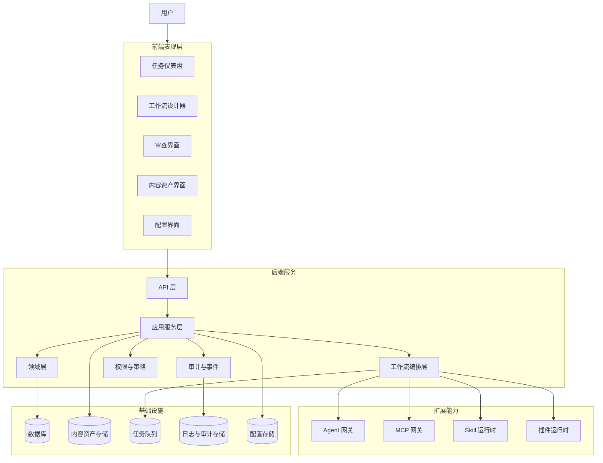

## 3. 前端架构

前端负责呈现和操作，不承载核心业务规则。

### 3.1 前端模块

- **任务中心**：创建、查看、筛选和推进内容任务。
- **工作流设计器**：查看和配置工作流模板、阶段、执行者和质量门禁。
- **执行监控**：展示阶段状态、Agent 输出、MCP 调用、失败原因。
- **审查工作台**：处理通过、退回、修订、终止等审查动作。
- **资产库**：查看研究材料、提纲、初稿、修订稿、最终稿。
- **配置中心**：管理 Agent、MCP、Skill、插件和权限配置。

### 3.2 前端原则

- 前端只调用 API，不直接访问数据库或外部 Agent。
- 前端状态用于交互体验，不作为工作流权威状态。
- 表单校验可以在前端做即时反馈，但后端必须重复校验。
- 审查、发布、外部调用等关键动作必须有确认与审计。

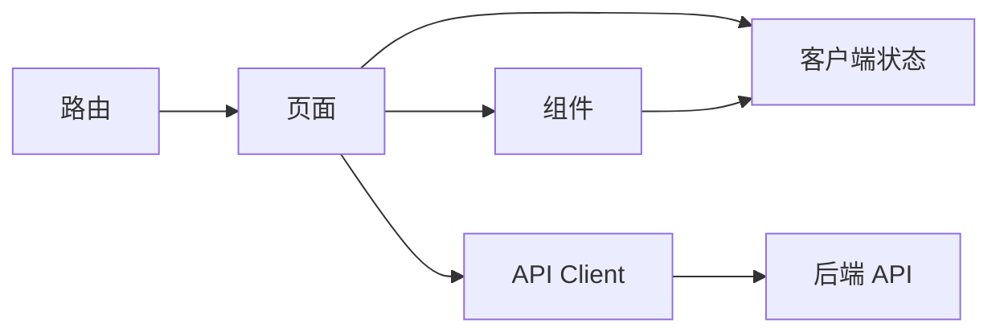

## 4. 后端架构

后端负责业务规则、状态流转、权限控制、编排调度和审计。

### 4.1 后端分层

| 层级 | 职责 |
| --- | --- |
| API 层 | 路由、鉴权、输入校验、错误映射、响应契约 |
| 应用服务层 | 组织用例，管理事务，调用领域模型和编排服务 |
| 领域层 | 任务、工作流、阶段、产出、审查、规则与状态机 |
| 编排层 | 调度 Agent、Skill、MCP、插件，处理重试、超时、失败 |
| 适配层 | 连接数据库、对象存储、Agent SDK、MCP Server、外部系统 |
| 基础设施层 | 队列、事件、日志、配置、审计、权限、运行时 |

### 4.2 后端原则

- 核心业务规则必须位于领域层。
- 应用服务只编排用例，不沉淀跨场景业务规则。
- 适配器实现外部协议转换，不反向污染领域模型。
- 所有状态变更必须经过应用服务和领域规则校验。
- 所有关键操作必须写入审计事件。

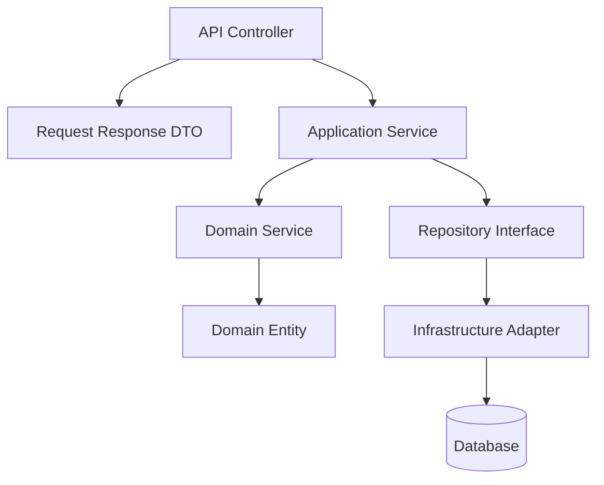

## 5. 插件架构

插件用于扩展内容类型、渠道、工具、工作流动作和审查能力，不得直接修改核心业务流程。

### 5.1 插件组成

- **插件清单**：名称、版本、能力、权限、入口、兼容性。
- **能力声明**：插件可以提供的动作、输入、输出和约束。
- **权限声明**：文件、网络、外部服务、敏感数据访问范围。
- **运行时适配器**：统一执行、超时、错误处理和审计。
- **隔离策略**：限制插件访问核心状态和内部实现。

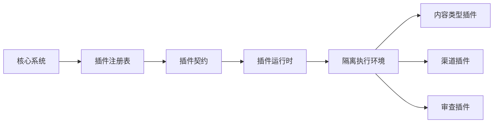

### 5.2 插件调用规则

- 调用前校验插件能力、版本、权限和输入。
- 调用中执行超时、重试、限流和隔离。
- 调用后记录输出、错误、耗时和审计事件。
- 插件失败返回标准错误，不得破坏工作流状态一致性。

## 6. Agent 架构

Agent 是能力执行者，不是业务规则所有者。

### 6.1 Agent 分层

- **Agent Registry**：登记 Agent 名称、类型、能力、限制和适用阶段。
- **Agent Gateway**：统一调用 Claude Code、Codex、Gemini、OpenCode 等 Agent。
- **Task Protocol**：定义 Agent 输入、上下文包、输出格式和错误语义。
- **Output Validator**：校验 Agent 输出结构、质量和安全边界。
- **Review Gate**：决定 Agent 输出是否进入下一阶段。

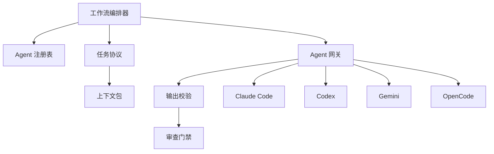

### 6.2 Agent 调用原则

- Agent 输入只包含当前阶段最小必要上下文。
- Agent 输出必须结构化保存，不能只保存在聊天记录中。
- Agent 失败必须返回可恢复状态。
- 不同 Agent 的差异由网关适配，领域层不得感知具体实现。

## 7. MCP 架构

MCP 是外部工具能力边界，用于文件、浏览器、搜索、上下文检索、第三方系统等工具调用。

### 7.1 MCP 分层

- **MCP Registry**：登记 Server、工具、权限、输入输出、风险等级。
- **MCP Gateway**：统一调用 MCP 工具，执行鉴权、限流、超时、审计。
- **Tool Contract**：定义工具调用契约和错误语义。
- **Result Normalizer**：标准化 MCP 返回结果。
- **Risk Policy**：处理网络、敏感数据、生产环境和破坏性操作授权。

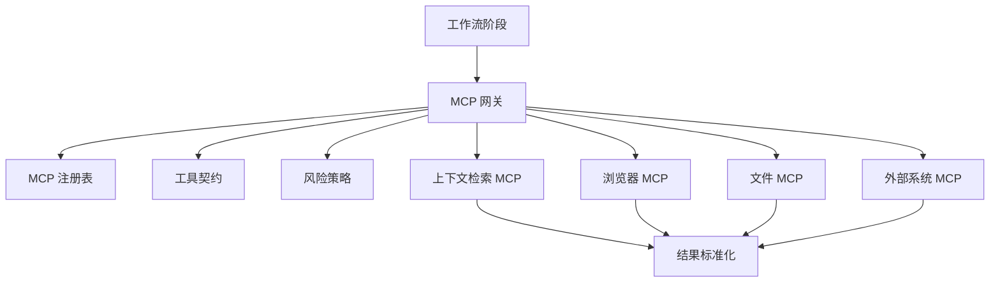

### 7.2 MCP 调用原则

- 最小权限、最小上下文、最小数据暴露。
- 外部网络、敏感数据和生产环境操作必须显式授权。
- MCP 结果作为事实输入，需要校验后进入业务流程。
- MCP Server 不得承载核心业务规则。

## 8. 工作流架构

工作流负责把内容需求转化为可执行阶段，并调度 Agent、Skill、MCP 和插件。

### 8.1 工作流模型

- **Workflow Definition**：工作流模板，定义阶段、依赖、执行者和门禁。
- **Workflow Run**：一次具体执行实例。
- **Stage Run**：阶段执行实例，包含输入、输出、状态和审查结果。
- **Task Context**：任务上下文，包含需求、约束、资产引用和历史产出。
- **Quality Gate**：质量门禁，决定是否进入下一阶段。

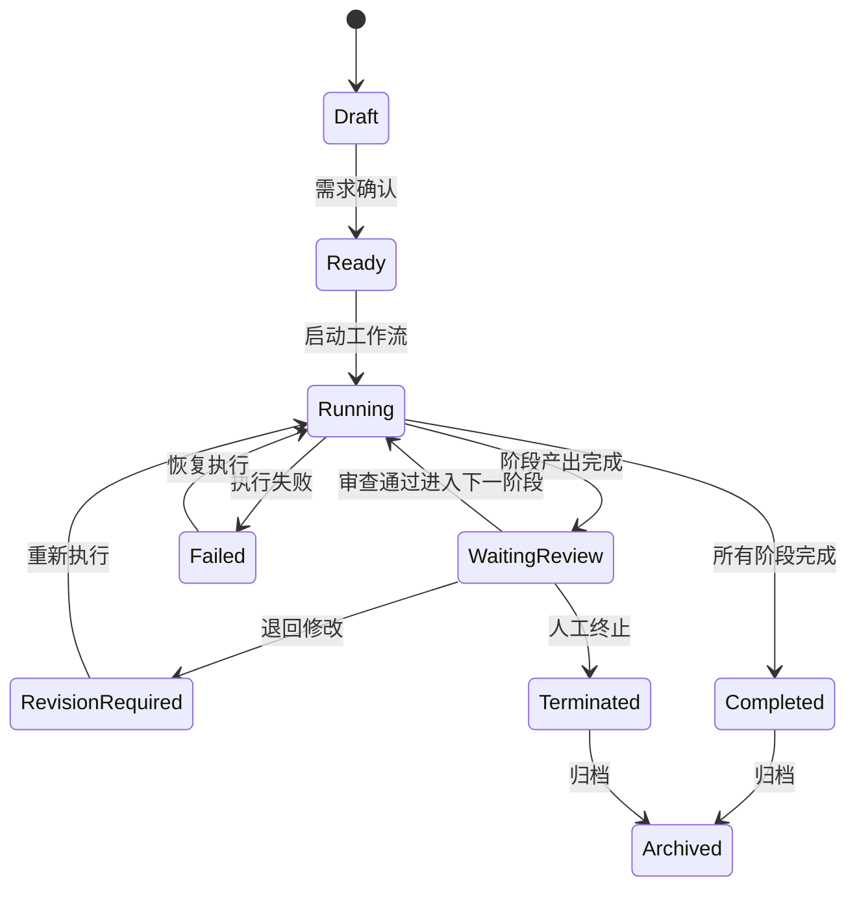

### 8.2 标准内容生产流程

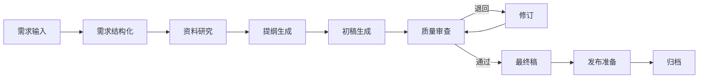

## 9. 模块关系图

```mermaid
flowchart TB
    subgraph Core[核心领域]
        ContentTask[ContentTask]
        WorkflowDefinition[WorkflowDefinition]
        WorkflowRun[WorkflowRun]
        StageRun[StageRun]
        ContentAsset[ContentAsset]
        ReviewRecord[ReviewRecord]
        ContextPack[ContextPack]
    end

    subgraph Application[应用用例]
        TaskService[TaskService]
        WorkflowService[WorkflowService]
        ReviewService[ReviewService]
        AssetService[AssetService]
        ConfigService[ConfigService]
    end

    subgraph Runtime[运行时]
        WorkflowOrchestrator[WorkflowOrchestrator]
        AgentGateway[AgentGateway]
        MCPGateway[MCPGateway]
        SkillRuntime[SkillRuntime]
        PluginRuntime[PluginRuntime]
    end

    subgraph Infra[基础设施]
        Repository[Repository]
        EventBus[EventBus]
        AuditLog[AuditLog]
        Queue[Queue]
        ObjectStore[ObjectStore]
    end

    TaskService --> ContentTask
    WorkflowService --> WorkflowDefinition
    WorkflowService --> WorkflowRun
    WorkflowService --> StageRun
    ReviewService --> ReviewRecord
    AssetService --> ContentAsset
    WorkflowOrchestrator --> WorkflowRun
    WorkflowOrchestrator --> StageRun
    WorkflowOrchestrator --> ContextPack
    WorkflowOrchestrator --> AgentGateway
    WorkflowOrchestrator --> MCPGateway
    WorkflowOrchestrator --> SkillRuntime
    WorkflowOrchestrator --> PluginRuntime
    Application --> Repository
    Runtime --> EventBus
    Runtime --> Queue
    Application --> AuditLog
    AssetService --> ObjectStore
```

## 10. 数据流图

### 10.1 任务创建到执行数据流

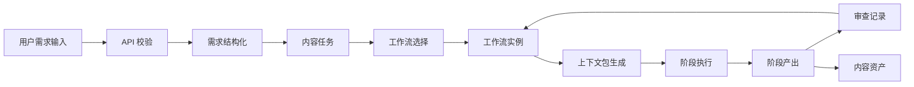

### 10.2 Agent 与 MCP 数据边界

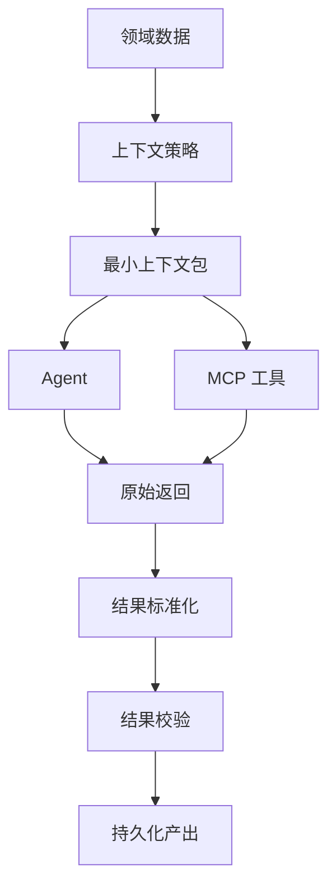

## 11. 时序图

### 11.1 创建内容任务并启动工作流

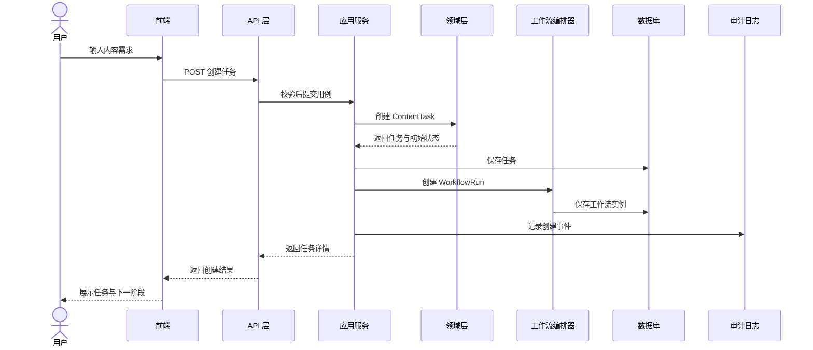

### 11.2 执行阶段并审查 Agent 输出

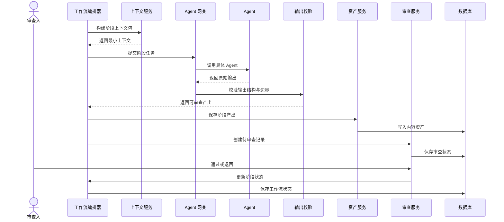

### 11.3 MCP 工具调用

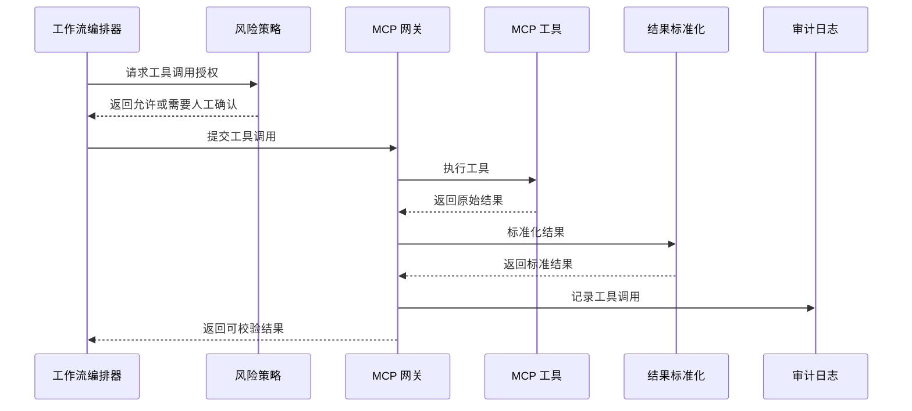

## 12. 核心架构决策

| 决策 | 说明 |
| --- | --- |
| 领域层拥有业务规则 | 防止业务规则散落到 UI、Agent、MCP、Skill 或插件中。 |
| Agent 通过网关接入 | 保证 Claude Code、Codex、Gemini、OpenCode 可替换。 |
| MCP 通过网关治理 | 统一权限、超时、审计、风险确认和结果标准化。 |
| 工作流状态持久化 | 避免依赖聊天上下文，支持恢复、审查和追溯。 |
| 插件通过契约扩展 | 插件可组合、可隔离，不破坏核心业务流程。 |
| 内容资产版本化 | 支持审查、回滚、复盘和复用。 |

## 13. 后续细化文档

- 数据模型：`docs/03-database/data-model.md`
- Agent 角色：`docs/04-agent/agent-roles.md`
- MCP 工具契约：`docs/05-mcp/tool-contracts.md`
- Skill 注册：`docs/06-skill/skill-registry.md`
- 工作流细节：`docs/07-workflow/content-pipeline.md`
- API 契约：`docs/09-api/api-overview.md`
