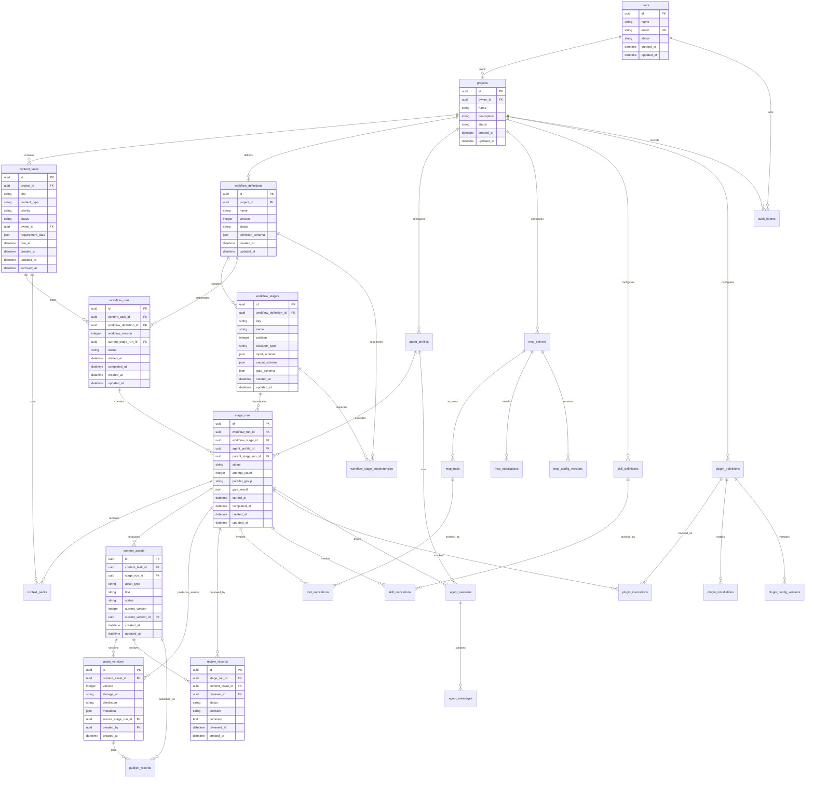
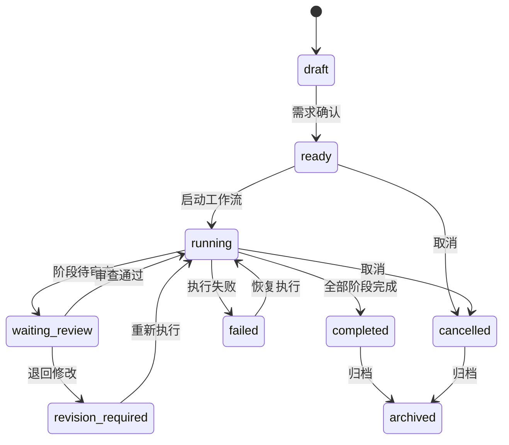
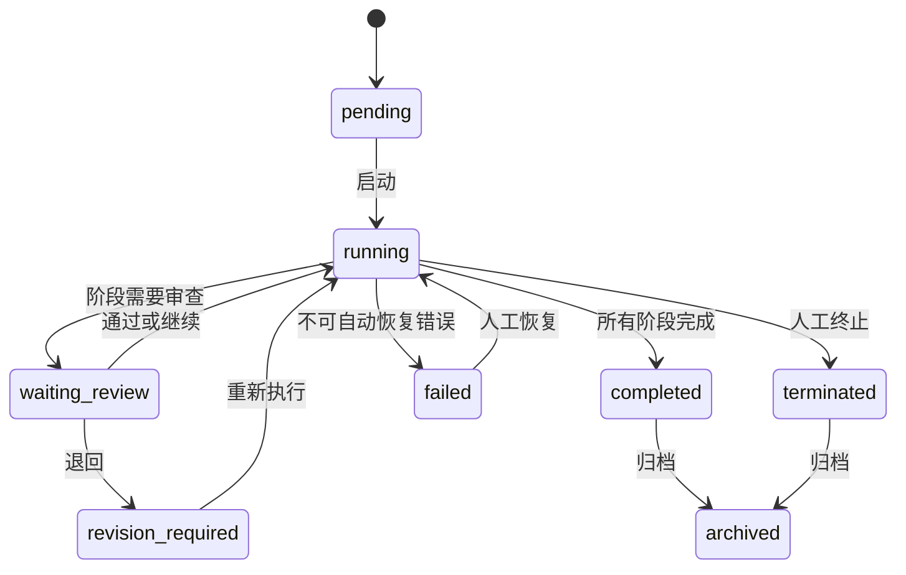
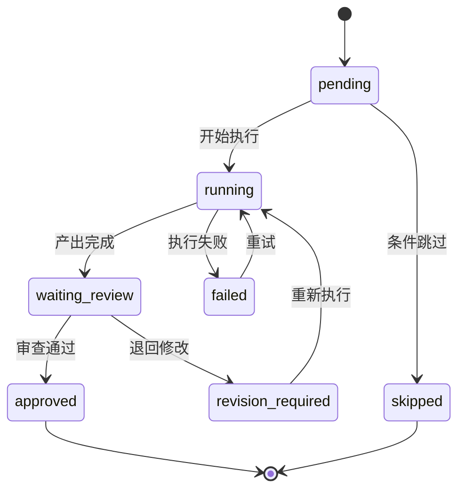
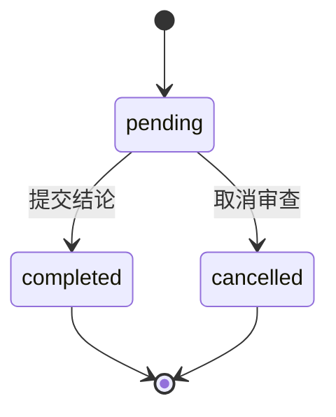

# 数据库设计

## 1. 设计目标

数据库用于支撑 Content Factory 的内容任务、工作流、Agent、MCP、Skill、插件、内容资产、审查记录、状态追踪和审计追溯。

设计必须满足：

- 工作流状态可持久化、可恢复、可审计。
- Agent、MCP、Skill、插件与核心业务解耦。
- 内容资产支持版本化与审查追溯。
- 核心业务规则不写死在 Agent、Prompt、MCP、Skill、插件或 UI 中。
- 表结构优先满足 MVP，保留清晰扩展点，避免过度设计。

## 2. 存储边界

**目标引擎**：MVP 采用 **PostgreSQL（≥14）**，下文 `jsonb`、`timestamptz`、部分唯一索引（`WHERE` 谓词）、行级安全（RLS）等均为 PostgreSQL 方言；迁移工具与具体版本见 `docs/10-development/`。

| 存储对象 | 存储方式 | 说明 |
| --- | --- | --- |
| 任务、工作流、阶段、审查、配置 | 关系型数据库 | 需要事务、关联查询、状态一致性 |
| 内容正文、大型研究材料、附件 | 对象存储或文件存储 | 数据库存储引用、摘要和版本元数据 |
| 执行日志、审计事件 | 关系型数据库或日志存储 | MVP 可先使用关系型表，后续可拆分到日志系统 |
| 短期运行队列 | 队列系统 | 数据库只保存最终状态和必要事件 |
| 向量检索数据 | 向量库 | 后续 RAG 能力独立设计，不进入 MVP 主库 |

## 3. ER 图

> **ER 图范围**：上图完整表达全部实体间关系；字段块聚焦核心业务主干表（users / projects / content_tasks / workflow_definitions / workflow_stages / workflow_runs / stage_runs / content_assets / asset_versions / review_records）。其余实体（context_packs、agent_profiles、mcp_servers、mcp_tools、skill_definitions、plugin_definitions、tool/skill/plugin_invocations、audit_events、workflow_stage_dependencies、agent_sessions、agent_messages、publish_records、mcp/plugin_installations、mcp/plugin_config_versions）的完整字段以 §5 表结构为权威，不在 ER 重复展开，避免与 §5 形成双源漂移。

## 4. 实体关系

### 4.1 项目与用户

- 一个用户可以拥有多个项目。
- 一个项目承载任务、工作流、Agent、MCP、Skill、插件配置。
- MVP 先支持单项目运行，表结构保留项目边界，避免后续迁移成本。

### 4.2 内容任务与工作流

- 一个内容任务可以启动多个工作流实例，通常只有一个活跃实例。
- 一个工作流定义可以生成多个工作流实例。
- 工作流定义按版本发布，工作流实例保存启动时使用的版本号。

### 4.3 工作流与阶段

- 一个工作流定义包含多个阶段定义。
- 一个工作流实例包含多个阶段运行记录。
- 阶段运行记录保存执行状态、执行者、重试次数和时间戳。

### 4.4 阶段与产出

- 一个阶段运行可以生成多个内容资产。
- 内容资产保存当前版本号，正文内容进入资产版本。
- 资产版本保存存储引用、校验值和元数据。

### 4.5 阶段与审查

- 阶段运行完成后可以创建审查记录。
- 审查记录可以关联具体内容资产。
- 审查结论驱动阶段状态和工作流状态流转。

### 4.6 Agent、MCP、Skill、插件

- Agent、MCP、Skill、插件均通过注册表配置接入。
- 阶段运行只引用配置 ID，不依赖具体外部实现。
- 调用记录独立保存，支持审计、追踪、成本分析和失败恢复。

## 5. 表结构

### 5.1 users

用户基础表。

| 字段 | 类型 | 约束 | 说明 |
| --- | --- | --- | --- |
| id | uuid | PK | 用户 ID |
| name | varchar(120) | not null | 显示名称 |
| email | varchar(255) | unique, not null | 邮箱 |
| status | varchar(32) | not null | active, disabled |
| created_at | timestamptz | not null | 创建时间 |
| updated_at | timestamptz | not null | 更新时间 |

### 5.2 projects

项目边界表。

| 字段 | 类型 | 约束 | 说明 |
| --- | --- | --- | --- |
| id | uuid | PK | 项目 ID |
| owner_id | uuid | FK users.id, not null | 项目拥有者 |
| name | varchar(160) | not null | 项目名称 |
| description | text | nullable | 项目说明 |
| status | varchar(32) | not null | active, archived |
| created_at | timestamptz | not null | 创建时间 |
| updated_at | timestamptz | not null | 更新时间 |

**扩展接缝**：MVP 以 `owner_id` 为单一管理者；后续多人协作经 `project_members(user_id, project_id, role, created_at)`（user↔project 多对多 + 角色）接入，访问控制由 owner 单点平滑升级为成员 + RBAC，不改动既有外键（呼应 `system-architecture.md` §13）。

### 5.3 content_tasks

内容生产任务表。

| 字段 | 类型 | 约束 | 说明 |
| --- | --- | --- | --- |
| id | uuid | PK | 任务 ID |
| project_id | uuid | FK projects.id, not null | 所属项目 |
| title | varchar(240) | not null | 任务标题 |
| content_type | varchar(64) | not null | 内容类型，如 article, post, script |
| priority | varchar(32) | not null | low, normal, high, urgent |
| status | varchar(32) | not null | 任务状态 |
| owner_id | uuid | FK users.id, nullable | 负责人 |
| requirement_data | jsonb | not null | 结构化需求、目标、受众、渠道、约束 |
| due_at | timestamptz | nullable | 截止时间 |
| created_at | timestamptz | not null | 创建时间 |
| updated_at | timestamptz | not null | 更新时间 |
| archived_at | timestamptz | nullable | 归档时间 |

### 5.4 workflow_definitions

工作流定义表。

| 字段 | 类型 | 约束 | 说明 |
| --- | --- | --- | --- |
| id | uuid | PK | 工作流定义 ID |
| project_id | uuid | FK projects.id, not null | 所属项目 |
| name | varchar(160) | not null | 工作流名称 |
| version | integer | not null | 版本号，从 1 递增 |
| status | varchar(32) | not null | draft, active, deprecated, archived |
| definition_schema | jsonb | not null | 工作流元数据、默认配置；阶段依赖以 workflow_stage_dependencies 为权威 |
| created_at | timestamptz | not null | 创建时间 |
| updated_at | timestamptz | not null | 更新时间 |

约束：

- `(project_id, name, version)` 唯一。
- 同一项目同一名称只能有一个 active 版本。

### 5.5 workflow_stages

工作流阶段定义表。

| 字段 | 类型 | 约束 | 说明 |
| --- | --- | --- | --- |
| id | uuid | PK | 阶段定义 ID |
| workflow_definition_id | uuid | FK workflow_definitions.id, not null | 所属工作流定义 |
| key | varchar(80) | not null | 阶段稳定标识 |
| name | varchar(160) | not null | 阶段名称 |
| position | integer | not null | 展示与默认执行顺序 |
| executor_type | varchar(32) | not null | human, agent, skill, plugin |
| input_schema | jsonb | not null | 输入契约 |
| output_schema | jsonb | not null | 输出契约 |
| gate_schema | jsonb | not null | 质量门禁配置 |
| created_at | timestamptz | not null | 创建时间 |
| updated_at | timestamptz | not null | 更新时间 |

约束：

- `(workflow_definition_id, key)` 唯一。
- `(workflow_definition_id, position)` 唯一。

> `position` 仅表示展示与默认线性顺序，不表达并行、分支或多前置依赖。真实阶段依赖关系以 `workflow_stage_dependencies`（§5.5.1）为权威。

### 5.5.1 workflow_stage_dependencies

工作流阶段依赖表，承载并行、分支与 DAG 依赖，避免依赖关系只存于 JSON。

| 字段 | 类型 | 约束 | 说明 |
| --- | --- | --- | --- |
| id | uuid | PK | 依赖 ID |
| workflow_definition_id | uuid | FK workflow_definitions.id, not null | 所属工作流定义 |
| stage_id | uuid | FK workflow_stages.id, not null | 下游阶段 |
| depends_on_stage_id | uuid | FK workflow_stages.id, not null | 上游依赖阶段 |
| dependency_type | varchar(32) | not null | finish_to_start, join_all, join_any |
| condition_schema | jsonb | nullable | 条件依赖；满足条件才激活下游 |
| created_at | timestamptz | not null | 创建时间 |

约束：

- `(stage_id, depends_on_stage_id)` 唯一。
- 禁止自依赖（`stage_id <> depends_on_stage_id`）。
- 依赖图必须无环，由领域层在发布工作流定义时校验。

### 5.6 workflow_runs

工作流运行实例表。

| 字段 | 类型 | 约束 | 说明 |
| --- | --- | --- | --- |
| id | uuid | PK | 工作流实例 ID |
| content_task_id | uuid | FK content_tasks.id, not null | 对应内容任务 |
| workflow_definition_id | uuid | FK workflow_definitions.id, not null | 使用的工作流定义 |
| workflow_version | integer | not null | 启动时使用的定义版本 |
| current_stage_run_id | uuid | FK stage_runs.id, nullable | 当前阶段冗余指针，加速状态展示（权威仍为 stage_runs，延迟约束）|
| status | varchar(32) | not null | 工作流运行状态 |
| started_at | timestamptz | nullable | 开始时间 |
| completed_at | timestamptz | nullable | 完成时间 |
| created_at | timestamptz | not null | 创建时间 |
| updated_at | timestamptz | not null | 更新时间 |

### 5.7 stage_runs

阶段运行实例表。

| 字段 | 类型 | 约束 | 说明 |
| --- | --- | --- | --- |
| id | uuid | PK | 阶段运行 ID |
| workflow_run_id | uuid | FK workflow_runs.id, not null | 所属工作流实例 |
| workflow_stage_id | uuid | FK workflow_stages.id, not null | 阶段定义 |
| agent_profile_id | uuid | FK agent_profiles.id, nullable | 执行 Agent，仅 Agent 阶段使用 |
| parent_stage_run_id | uuid | FK stage_runs.id, nullable | 回滚/退回重做新建运行的来源阶段运行，构成血缘；同 run 原地重试不写本字段 |
| status | varchar(32) | not null | 阶段状态 |
| attempt_count | integer | not null | 执行次数 |
| parallel_group | varchar(64) | nullable | 并行分组标识，同组阶段可并行执行 |
| gate_result | jsonb | nullable | 质量门禁结果（结论、得分、命中规则、审查引用）|
| started_at | timestamptz | nullable | 开始时间 |
| completed_at | timestamptz | nullable | 完成时间 |
| created_at | timestamptz | not null | 创建时间 |
| updated_at | timestamptz | not null | 更新时间 |

约束与说明：

- `parent_stage_run_id` 记录回滚与退回重做（新建运行）的血缘，根阶段运行为空；同 run 原地重试仅递增 `attempt_count`、不产生新血缘节点（见 content-workflow §5.4）。
- `parallel_group` 为空表示串行；同一 `workflow_run_id` 下同组阶段并行调度。
- `gate_result` 为门禁判定快照；审查结论仍以 `review_records` 为权威，二者不冲突（见 §10.1）。

### 5.8 context_packs

阶段上下文包表。

| 字段 | 类型 | 约束 | 说明 |
| --- | --- | --- | --- |
| id | uuid | PK | 上下文包 ID |
| content_task_id | uuid | FK content_tasks.id, not null | 所属任务 |
| stage_run_id | uuid | FK stage_runs.id, nullable | 对应阶段运行 |
| version | integer | not null | 上下文版本 |
| scope | varchar(64) | not null | task, stage, review |
| data | jsonb | not null | 最小必要上下文 |
| source_refs | jsonb | not null | 来源引用与版本 |
| sensitivity_level | varchar(32) | not null | public, internal, sensitive |
| created_at | timestamptz | not null | 创建时间 |

约束：

- task 级上下文（`stage_run_id` 为空）：`(content_task_id, scope, version)` 唯一。
- stage 级上下文（`stage_run_id` 非空）：`(stage_run_id, scope, version)` 唯一。
- 以两条部分唯一索引实现，消除同一任务下不同阶段共享版本号导致的键歧义。
- `scope = stage` 时 `stage_run_id` 必须非空；`scope = task` 时 `stage_run_id` 必须为空。

### 5.9 content_assets

内容资产表。

| 字段 | 类型 | 约束 | 说明 |
| --- | --- | --- | --- |
| id | uuid | PK | 资产 ID |
| content_task_id | uuid | FK content_tasks.id, not null | 所属任务 |
| stage_run_id | uuid | FK stage_runs.id, nullable | 来源阶段 |
| asset_type | varchar(64) | not null | 受控词表 topic_brief/research_report/outline/draft/polished_draft/image_plan/image_asset/layout_draft（与 workflow §3 对齐；审核/发布产出走 review_records/publish_records）|
| title | varchar(240) | not null | 资产标题 |
| status | varchar(32) | not null | draft, review_pending, approved, rejected, stale, archived |
| current_version | integer | not null | 当前版本号（与 current_version_id 对应，便于展示）|
| current_version_id | uuid | FK asset_versions.id, nullable | 当前版本指针，保证当前版本引用完整性 |
| created_at | timestamptz | not null | 创建时间 |
| updated_at | timestamptz | not null | 更新时间 |

> `current_version_id` 与 `asset_versions` 构成当前版本的引用完整性约束；因 `content_assets` 与 `asset_versions` 互相引用，该外键可空并采用延迟约束，新建资产时先插入资产再回填当前版本指针。`current_version` 整数仅作展示冗余，权威指针为 `current_version_id`。
>
> `status` 的 `stale` 表示上游回滚/重做导致需重算的陈旧资产（见 `content-workflow.md` §5.5）；`stale` 资产经新建 `stage_run` 重做产出新版本后转回有效态，重做完成前不得进入审核或发布。

### 5.10 asset_versions

内容资产版本表。

| 字段 | 类型 | 约束 | 说明 |
| --- | --- | --- | --- |
| id | uuid | PK | 资产版本 ID |
| content_asset_id | uuid | FK content_assets.id, not null | 所属资产 |
| version | integer | not null | 版本号，从 1 递增 |
| storage_uri | text | not null | 正文或附件存储地址 |
| checksum | varchar(128) | not null | 内容校验值 |
| metadata | jsonb | not null | 字数、格式、模型、来源等元数据 |
| source_stage_run_id | uuid | FK stage_runs.id, nullable | 产出该版本的阶段运行，锚定分叉血缘（见 `content-workflow.md` §5.5） |
| created_by | uuid | FK users.id, nullable | 创建人；系统生成可为空 |
| created_at | timestamptz | not null | 创建时间 |

约束：

- `(content_asset_id, version)` 唯一。

### 5.11 review_records

审查记录表。

| 字段 | 类型 | 约束 | 说明 |
| --- | --- | --- | --- |
| id | uuid | PK | 审查记录 ID |
| stage_run_id | uuid | FK stage_runs.id, not null | 被审查阶段 |
| content_asset_id | uuid | FK content_assets.id, nullable | 被审查资产 |
| reviewer_id | uuid | FK users.id, nullable | 审查人；自动审查可为空 |
| status | varchar(32) | not null | pending, completed, cancelled |
| decision | varchar(32) | nullable | approved, rejected, revision_required, terminated |
| comment | text | nullable | 审查意见 |
| reviewed_at | timestamptz | nullable | 审查时间 |
| created_at | timestamptz | not null | 创建时间 |

### 5.12 agent_profiles

Agent 配置表。

| 字段 | 类型 | 约束 | 说明 |
| --- | --- | --- | --- |
| id | uuid | PK | Agent 配置 ID |
| project_id | uuid | FK projects.id, not null | 所属项目 |
| name | varchar(160) | not null | Agent 名称 |
| provider | varchar(64) | not null | claude_code, codex, gemini, opencode |
| role | varchar(80) | not null | researcher, planner, writer, reviewer |
| capability_schema | jsonb | not null | 能力声明 |
| constraint_schema | jsonb | not null | 限制与输出要求 |
| status | varchar(32) | not null | active, disabled, archived |
| created_at | timestamptz | not null | 创建时间 |
| updated_at | timestamptz | not null | 更新时间 |

### 5.13 mcp_servers

MCP Server 配置表。

| 字段 | 类型 | 约束 | 说明 |
| --- | --- | --- | --- |
| id | uuid | PK | MCP Server ID |
| project_id | uuid | FK projects.id, not null | 所属项目 |
| name | varchar(160) | not null | Server 名称 |
| transport | varchar(32) | not null | stdio, http, sse |
| risk_level | varchar(32) | not null | low, medium, high |
| status | varchar(32) | not null | active, disabled, archived |
| config_schema | jsonb | not null | 非敏感配置结构 |
| created_at | timestamptz | not null | 创建时间 |
| updated_at | timestamptz | not null | 更新时间 |

### 5.14 mcp_tools

MCP 工具表。

| 字段 | 类型 | 约束 | 说明 |
| --- | --- | --- | --- |
| id | uuid | PK | MCP 工具 ID |
| mcp_server_id | uuid | FK mcp_servers.id, not null | 所属 Server |
| name | varchar(160) | not null | 工具名称 |
| purpose | text | not null | 用途说明 |
| input_schema | jsonb | not null | 输入契约 |
| output_schema | jsonb | not null | 输出契约 |
| permission_schema | jsonb | not null | 权限声明 |
| timeout_seconds | integer | not null | 超时时间 |
| status | varchar(32) | not null | active, disabled, archived |
| created_at | timestamptz | not null | 创建时间 |
| updated_at | timestamptz | not null | 更新时间 |

### 5.15 skill_definitions

Skill 定义表。

| 字段 | 类型 | 约束 | 说明 |
| --- | --- | --- | --- |
| id | uuid | PK | Skill ID |
| project_id | uuid | FK projects.id, not null | 所属项目 |
| name | varchar(160) | not null | Skill 名称 |
| trigger_schema | jsonb | not null | 触发条件 |
| input_schema | jsonb | not null | 输入契约 |
| output_schema | jsonb | not null | 输出契约 |
| status | varchar(32) | not null | active, disabled, archived |
| created_at | timestamptz | not null | 创建时间 |
| updated_at | timestamptz | not null | 更新时间 |

### 5.16 plugin_definitions

插件定义表。

| 字段 | 类型 | 约束 | 说明 |
| --- | --- | --- | --- |
| id | uuid | PK | 插件 ID |
| project_id | uuid | FK projects.id, not null | 所属项目 |
| name | varchar(160) | not null | 插件名称 |
| version | varchar(40) | not null | 插件版本 |
| runtime | varchar(32) | not null | 运行时类型，如 process, wasm, service |
| entrypoint | text | not null | 插件入口（命令、模块或服务地址）|
| dependency_schema | jsonb | not null | 依赖声明（运行时、外部服务、其他插件）|
| config_schema | jsonb | not null | 非敏感配置结构 |
| capability_schema | jsonb | not null | 能力声明 |
| permission_schema | jsonb | not null | 权限声明 |
| failure_policy | jsonb | not null | 失败策略 |
| status | varchar(32) | not null | active, disabled, archived |
| created_at | timestamptz | not null | 创建时间 |
| updated_at | timestamptz | not null | 更新时间 |

约束：

- `(project_id, name, version)` 唯一。

### 5.17 invocation tables

调用记录表用于追踪 Agent 外的工具型执行。

#### tool_invocations

| 字段 | 类型 | 约束 | 说明 |
| --- | --- | --- | --- |
| id | uuid | PK | 调用 ID |
| project_id | uuid | FK projects.id, not null | 所属项目，支撑行级隔离 |
| stage_run_id | uuid | FK stage_runs.id, not null | 所属阶段 |
| mcp_tool_id | uuid | FK mcp_tools.id, not null | 被调用工具 |
| caller_type | varchar(32) | not null | workflow, agent, skill, plugin, user |
| caller_id | uuid | nullable | 调用方 ID |
| status | varchar(32) | not null | pending, running, succeeded, failed, denied, timeout, cancelled |
| risk_level | varchar(32) | not null | 调用风险等级 low/medium/high |
| input_data | jsonb | not null | 输入快照，敏感值脱敏 |
| output_data | jsonb | nullable | 输出快照 |
| error_data | jsonb | nullable | 错误信息 |
| started_at | timestamptz | nullable | 开始时间 |
| completed_at | timestamptz | nullable | 完成时间 |
| duration_ms | integer | nullable | 调用耗时，与 MCP 调用日志对齐 |
| created_at | timestamptz | not null | 创建时间 |

#### skill_invocations

字段同 `tool_invocations`，将 `mcp_tool_id` 替换为 `skill_definition_id`。

#### plugin_invocations

字段同 `tool_invocations`，将 `mcp_tool_id` 替换为 `plugin_definition_id`。

约束与说明：

- 三张调用表均含 `project_id`；因含输入/输出快照属敏感数据，启用行级安全（RLS）或强制 `project_id` 谓词访问，禁止跨项目读取（见 `system-architecture.md` §13.3）。
- 三表均含 `caller_type` / `caller_id`，与 MCP 调用日志契约（`mcp-architecture.md` §9.2/§9.3）字段一致，支撑按调用方（workflow/agent/skill/plugin/user）归因。
- **统一执行时间线**：提供只读联合视图 `v_invocations`（UNION 三表的 `stage_run_id` / `caller_type` / `caller_id` / `status` / `risk_level` / `started_at` / `duration_ms` + `kind` 区分 tool/skill/plugin），支撑单阶段跨类型执行时间线查询；明细仍以三张物理表为权威。

### 5.18 audit_events

审计事件表。

| 字段 | 类型 | 约束 | 说明 |
| --- | --- | --- | --- |
| id | uuid | PK | 事件 ID |
| project_id | uuid | FK projects.id, not null | 所属项目 |
| actor_id | uuid | FK users.id, nullable | 操作者；系统事件可为空 |
| subject_type | varchar(80) | not null | content_task, workflow_run, stage_run 等 |
| subject_id | uuid | not null | 目标实体 ID |
| action | varchar(120) | not null | 操作名称 |
| before_data | jsonb | nullable | 变更前关键数据 |
| after_data | jsonb | nullable | 变更后关键数据 |
| metadata | jsonb | not null | IP、来源、请求 ID、风险等级等 |
| sequence_no | bigint | not null | 项目内单调递增序列，断号即视为篡改 |
| prev_hash | varchar(128) | nullable | 前序事件 entry_hash，构成哈希链；项目首条为空 |
| entry_hash | varchar(128) | not null | 本事件规范化内容哈希，链式覆盖 prev_hash |
| created_at | timestamptz | not null | 创建时间 |

约束与说明：

- `audit_events` 通过 `(subject_type, subject_id)` 多态引用任务、工作流、阶段等实体，不建立指向各实体的外键；引用完整性由应用层在写入时校验。
- 仅 `project_id`、`actor_id` 为真实外键（见 ER 图）；多态关系不在 ER 图中以外键连线表达。
- **仅追加（append-only）**：禁止 UPDATE/DELETE，由数据库权限（撤销 update/delete）与触发器强制；物理删除禁止见 §11。
- **哈希链防篡改**：`entry_hash = H(规范化事件字段 + prev_hash)`，按 `(project_id, sequence_no)` 链接；校验任务定期重算并比对，发现断链或断号即告警。
- **存储与权限分离**：审计写入经统一脱敏中间件（强制管道，不依赖调用方自觉）；审计数据与业务库以独立权限/实例隔离，写入身份与读取身份分离。

### 5.19 agent_sessions

Agent 会话运行实例表，对应 `docs/04-agent/agent-architecture.md` §7.1，承载 Agent 运行时状态（非工作流权威状态）。

| 字段 | 类型 | 约束 | 说明 |
| --- | --- | --- | --- |
| id | uuid | PK | Session ID |
| project_id | uuid | FK projects.id, not null | 所属项目 |
| content_task_id | uuid | FK content_tasks.id, not null | 内容任务 |
| workflow_run_id | uuid | FK workflow_runs.id, nullable | 工作流实例 |
| stage_run_id | uuid | FK stage_runs.id, nullable | 阶段运行 |
| agent_profile_id | uuid | FK agent_profiles.id, not null | Agent 配置 |
| provider | varchar(64) | not null | claude_code, codex, gemini, opencode |
| session_type | varchar(32) | not null | ephemeral, persistent, interactive, background |
| provider_session_ref | varchar(255) | nullable | Provider 原生会话句柄，用于恢复与续连 |
| runtime | varchar(32) | not null | cli, sdk, remote, wsl |
| working_directory | text | nullable | 工作目录 |
| context_pack_id | uuid | FK context_packs.id, nullable | 使用的上下文包 |
| status | varchar(32) | not null | 见 `docs/04-agent` §16.2 Session 状态机 |
| started_at | timestamptz | nullable | 开始时间 |
| completed_at | timestamptz | nullable | 完成时间 |
| metadata | jsonb | not null | 模型、成本、环境等运行信息 |
| profile_snapshot | jsonb | nullable | 启动时 Agent 配置快照，保证历史运行可还原当时配置 |
| created_at | timestamptz | not null | 创建时间 |
| updated_at | timestamptz | not null | 更新时间 |

约束与说明：

- 状态值对齐 Agent Session 状态机，工作流权威状态仍由 `workflow_runs` / `stage_runs` 持有。
- `provider_session_ref` 保存 Provider 原生会话标识，支持持久会话恢复，避免聊天上下文成为唯一来源。

### 5.20 agent_messages

Agent 会话消息表，对应 `docs/04-agent/agent-architecture.md` §8.1。

| 字段 | 类型 | 约束 | 说明 |
| --- | --- | --- | --- |
| id | uuid | PK | 消息 ID |
| project_id | uuid | FK projects.id, not null | 所属项目，支撑行级隔离 |
| agent_session_id | uuid | FK agent_sessions.id, not null | 所属 Session |
| role | varchar(32) | not null | system, user, assistant, tool, event |
| content_type | varchar(32) | not null | text, markdown, json, file_ref, tool_call, error |
| content | jsonb | not null | 消息正文或结构化数据 |
| attachments | jsonb | nullable | 文件、资产、上下文引用 |
| sequence | integer | not null | 会话内顺序号 |
| visibility | varchar(32) | not null | internal, user_visible, audit_only |
| created_at | timestamptz | not null | 创建时间 |

约束：

- `(agent_session_id, sequence)` 唯一。
- 原始与标准化输出均须可追溯，敏感上下文不得写入 `user_visible` 消息。

### 5.21 publish_records

发布记录表，锚定已发布的具体资产版本与渠道结果。

| 字段 | 类型 | 约束 | 说明 |
| --- | --- | --- | --- |
| id | uuid | PK | 发布记录 ID |
| content_task_id | uuid | FK content_tasks.id, not null | 所属任务 |
| content_asset_id | uuid | FK content_assets.id, not null | 发布资产 |
| asset_version_id | uuid | FK asset_versions.id, not null | 发布的具体版本（权威指针）|
| channel | varchar(64) | not null | 渠道标识，如 wechat_mp |
| status | varchar(32) | not null | pending, publishing, published, failed, withdrawn |
| external_ref | varchar(255) | nullable | 渠道侧文章或草稿 ID |
| published_at | timestamptz | nullable | 发布完成时间 |
| error_data | jsonb | nullable | 发布失败信息 |
| created_at | timestamptz | not null | 创建时间 |
| updated_at | timestamptz | not null | 更新时间 |

约束与说明：

- `asset_version_id` 提供「已发布版本」的权威指针，发布内容不随后续修订漂移。
- 同一 `(content_asset_id, channel)` 的多次发布以多条记录追加，不覆盖历史。

### 5.22 mcp_installations

MCP Server 安装与生命周期状态表。

| 字段 | 类型 | 约束 | 说明 |
| --- | --- | --- | --- |
| id | uuid | PK | 安装记录 ID |
| mcp_server_id | uuid | FK mcp_servers.id, not null | 所属 Server |
| source | varchar(64) | not null | builtin, marketplace, custom |
| install_status | varchar(32) | not null | pending, installing, installed, failed, disabled, uninstalled |
| installed_version | varchar(40) | nullable | 已安装版本 |
| health_status | varchar(32) | not null | unknown, healthy, degraded, unreachable |
| last_health_at | timestamptz | nullable | 最近健康检查时间 |
| error_data | jsonb | nullable | 安装或健康检查错误 |
| created_at | timestamptz | not null | 创建时间 |
| updated_at | timestamptz | not null | 更新时间 |

### 5.23 mcp_config_versions

MCP 配置版本表，保存被运行引用的非敏感配置快照。

| 字段 | 类型 | 约束 | 说明 |
| --- | --- | --- | --- |
| id | uuid | PK | 配置版本 ID |
| mcp_server_id | uuid | FK mcp_servers.id, not null | 所属 Server |
| version | integer | not null | 配置版本号，从 1 递增 |
| config_schema | jsonb | not null | 非敏感配置快照 |
| created_by | uuid | FK users.id, nullable | 创建人；系统生成可为空 |
| created_at | timestamptz | not null | 创建时间 |

约束：

- `(mcp_server_id, version)` 唯一。
- 敏感凭证不入本表，只保存安全引用（见 §11 禁止事项）。

### 5.24 plugin_installations

插件安装与生命周期状态表（结构与 §5.22 对称）。

| 字段 | 类型 | 约束 | 说明 |
| --- | --- | --- | --- |
| id | uuid | PK | 安装记录 ID |
| plugin_definition_id | uuid | FK plugin_definitions.id, not null | 所属插件 |
| source | varchar(64) | not null | builtin, marketplace, custom |
| install_status | varchar(32) | not null | pending, installing, installed, failed, disabled, uninstalled |
| installed_version | varchar(40) | nullable | 已安装版本 |
| health_status | varchar(32) | not null | unknown, healthy, degraded, unreachable |
| last_health_at | timestamptz | nullable | 最近健康检查时间 |
| error_data | jsonb | nullable | 安装或健康检查错误 |
| created_at | timestamptz | not null | 创建时间 |
| updated_at | timestamptz | not null | 更新时间 |

### 5.25 plugin_config_versions

插件配置版本表，保存被运行引用的非敏感配置快照（结构与 §5.23 对称）。

| 字段 | 类型 | 约束 | 说明 |
| --- | --- | --- | --- |
| id | uuid | PK | 配置版本 ID |
| plugin_definition_id | uuid | FK plugin_definitions.id, not null | 所属插件 |
| version | integer | not null | 配置版本号，从 1 递增 |
| config_schema | jsonb | not null | 非敏感配置快照 |
| created_by | uuid | FK users.id, nullable | 创建人；系统生成可为空 |
| created_at | timestamptz | not null | 创建时间 |

约束：

- `(plugin_definition_id, version)` 唯一。

## 6. 字段设计规范

### 6.1 主键

- 所有核心表使用 `uuid id` 作为主键。
- 外部系统标识不得作为主键，只能作为普通字段或唯一键。

### 6.2 时间字段

- 所有可变实体包含 `created_at` 和 `updated_at`。
- 运行类实体包含 `started_at`、`completed_at`。
- 归档类实体包含 `archived_at`。

### 6.3 状态字段

- 状态字段统一命名为 `status`。
- 审查结论使用 `decision`，避免与审查记录生命周期混淆。
- 状态流转必须由领域层控制，不允许 UI 或外部工具直接写入任意状态。

### 6.4 JSON 字段

JSON 字段只用于可扩展契约和低频查询数据：

- `requirement_data`
- `definition_schema`
- `input_schema`
- `output_schema`
- `gate_schema`
- `capability_schema`
- `permission_schema`
- `metadata`

禁止将核心状态、关联关系、审查结论等高频查询字段只保存在 JSON 中。

关键 JSON 契约字段（`definition_schema`、`input_schema`、`output_schema`、`gate_schema`、`capability_schema`、`permission_schema`、`requirement_data` 等）须内含 `schema_version`，演进时据此判定兼容与迁移路径，避免无版本的隐式 schema 漂移。

### 6.5 软删除与归档

- 业务数据不做物理删除，使用 `status = archived` 或 `archived_at`。
- 审计事件不允许删除。
- 资产版本不允许覆盖，只能新增版本。

## 7. 索引设计

### 7.1 基础索引

| 表 | 索引 | 用途 |
| --- | --- | --- |
| users | `idx_users_email_unique(email)` unique | 登录与用户查找 |
| projects | `idx_projects_owner_status(owner_id, status)` | 用户项目列表 |
| content_tasks | `idx_content_tasks_project_status_updated(project_id, status, updated_at)` | 任务列表与状态筛选 |
| content_tasks | `idx_content_tasks_owner_status(owner_id, status)` | 负责人任务列表 |
| content_tasks | `idx_content_tasks_due_at(due_at)` | 截止时间排序 |
| workflow_definitions | `idx_workflow_definitions_project_status(project_id, status)` | 工作流模板列表 |
| workflow_stages | `idx_workflow_stages_definition_position(workflow_definition_id, position)` | 阶段顺序加载 |
| workflow_runs | `idx_workflow_runs_task_status(content_task_id, status)` | 查询任务工作流实例 |
| stage_runs | `idx_stage_runs_workflow_status(workflow_run_id, status)` | 查询工作流阶段状态 |
| context_packs | `idx_context_packs_task_stage(content_task_id, stage_run_id)` | 查询任务或阶段上下文 |
| content_assets | `idx_content_assets_task_type(content_task_id, asset_type)` | 查询任务资产 |
| asset_versions | `idx_asset_versions_asset_version(content_asset_id, version)` unique | 查询资产版本 |
| review_records | `idx_review_records_stage_status(stage_run_id, status)` | 查询阶段审查状态 |
| audit_events | `idx_audit_events_subject(subject_type, subject_id, created_at)` | 实体审计追踪 |
| audit_events | `idx_audit_events_project_time(project_id, created_at)` | 项目审计列表 |

### 7.2 扩展索引

| 表 | 索引 | 用途 |
| --- | --- | --- |
| agent_profiles | `idx_agent_profiles_project_provider_status(project_id, provider, status)` | Agent 选择 |
| mcp_servers | `idx_mcp_servers_project_status(project_id, status)` | MCP Server 列表 |
| mcp_tools | `idx_mcp_tools_server_status(mcp_server_id, status)` | MCP 工具列表 |
| skill_definitions | `idx_skill_definitions_project_status(project_id, status)` | Skill 列表 |
| plugin_definitions | `idx_plugin_definitions_project_status(project_id, status)` | 插件列表 |
| tool_invocations | `idx_tool_invocations_stage_status(stage_run_id, status)` | 阶段工具调用追踪 |
| skill_invocations | `idx_skill_invocations_stage_status(stage_run_id, status)` | 阶段 Skill 调用追踪 |
| plugin_invocations | `idx_plugin_invocations_stage_status(stage_run_id, status)` | 阶段插件调用追踪 |
| workflow_stage_dependencies | `idx_stage_deps_stage(stage_id)` / `idx_stage_deps_upstream(depends_on_stage_id)` | DAG 依赖加载与拓扑校验 |
| agent_sessions | `idx_agent_sessions_stage_status(stage_run_id, status)` | 阶段会话状态追踪 |
| agent_sessions | `idx_agent_sessions_task(content_task_id)` | 任务维度会话查询 |
| agent_messages | `idx_agent_messages_session_seq(agent_session_id, sequence)` unique | 会话消息顺序加载 |
| publish_records | `idx_publish_records_task_channel(content_task_id, channel)` | 任务发布记录查询 |
| mcp_installations | `idx_mcp_installations_server(mcp_server_id, install_status)` | MCP 安装状态查询 |
| mcp_config_versions | `idx_mcp_config_versions_server_version(mcp_server_id, version)` unique | MCP 配置版本查询 |
| plugin_installations | `idx_plugin_installations_plugin(plugin_definition_id, install_status)` | 插件安装状态查询 |
| plugin_config_versions | `idx_plugin_config_versions_plugin_version(plugin_definition_id, version)` unique | 插件配置版本查询 |
| workflow_definitions | `idx_workflow_definitions_active_unique(project_id, name) WHERE status='active'` unique | 强制同项目同名仅一个 active 版本（§9.1）|

### 7.3 JSON 索引原则

- MVP 不默认为所有 JSON 字段建立索引。
- 只有当某个 JSON 路径成为稳定查询条件时，才建立表达式索引。
- 对 `requirement_data` 可预留全文检索或 JSON 路径索引，但必须基于实际查询需求添加。

## 8. 状态机设计

### 8.1 内容任务状态机

任务状态值：

| 状态 | 说明 |
| --- | --- |
| draft | 需求未确认 |
| ready | 需求已确认，等待执行 |
| running | 工作流执行中 |
| waiting_review | 等待人工或自动审查 |
| revision_required | 需要修订 |
| failed | 执行失败，等待恢复 |
| completed | 已完成 |
| cancelled | 已取消 |
| archived | 已归档 |

### 8.2 工作流运行状态机

### 8.3 阶段运行状态机

阶段状态值：

| 状态 | 说明 |
| --- | --- |
| pending | 等待执行 |
| running | 执行中 |
| waiting_review | 等待审查 |
| approved | 已通过 |
| revision_required | 需要修订 |
| failed | 执行失败 |
| skipped | 条件跳过 |

### 8.4 审查记录状态

审查结论：

| decision | 说明 |
| --- | --- |
| approved | 通过 |
| rejected | 拒绝并终止当前产出 |
| revision_required | 退回修改 |
| terminated | 终止工作流 |

**单一真相源**：审查"是否通过"以 `review_records.decision` 为权威；`stage_runs.status`（approved/revision_required）由审查结论在同一事务内驱动同步（见 §10.1），不反向写回。结论产生前 stage_run 停留 `waiting_review`。

## 9. 版本设计

### 9.1 工作流版本

- `workflow_definitions.version` 使用递增整数。
- 修改 active 工作流时不覆盖原版本，必须创建新版本。
- `workflow_runs.workflow_version` 保存启动时使用的版本号。
- 运行中的工作流不随定义变更自动升级。

### 9.2 资产版本

- `content_assets.current_version_id` 外键指向 `asset_versions` 当前版本，保证引用完整性；`current_version` 整数仅作展示冗余。
- 每次 Agent 生成、人工修改、审查修订都创建新的 `asset_versions`。
- `asset_versions` 不允许更新正文引用，只允许追加新版本。
- `checksum` 用于检测内容是否变化和防止重复写入。

### 9.3 上下文版本

- `context_packs.version` 记录上下文包版本；stage 级上下文版本唯一性以 `stage_run_id` 为键，task 级以 `content_task_id` 为键（见 §5.8）。
- 每次进入阶段执行前生成新的上下文包快照。
- 上下文包必须记录 `source_refs`，用于追溯输入来源。
- 敏感数据必须在写入 `data` 前按策略脱敏或裁剪。
- `sensitivity_level` 驱动到 Provider 的传播控制（由 ContextBuilder 强制，非写入方自觉）：`public` 可入任意 Provider；`internal` 仅受信任本地 Provider；`sensitive` 默认不出本地、禁止注入外部 Provider（如外部 Codex/Gemini），必经脱敏或裁剪后方可传播，违反则拒绝构建上下文。

### 9.4 配置版本

- Agent、MCP、Skill、插件配置默认按记录更新。
- 运行记录必须绑定配置快照或可追溯版本，历史运行不受后续配置变更影响：Agent 配置经 `agent_sessions.profile_snapshot` 固化，MCP 配置经 `mcp_config_versions` 版本化，Skill/插件调用经 invocation 表 `input_data` 快照留痕。
- 配置频繁变更的对象提供独立配置版本表（见 `mcp_config_versions`、`plugin_config_versions`）。

### 9.5 发布版本指针

- "哪个版本被发布"以 `publish_records.asset_version_id`（不可变外键）为权威指针，发布后不可改写。
- 工作流回滚（`content-workflow.md` §5）以该指针为已发布锚点：回滚生成新版本，原发布记录保留，重新发布另立记录，杜绝已发布版本漂移。

## 10. 一致性与事务边界

### 10.1 强一致事务

以下操作必须在单事务中完成：

- 创建内容任务与初始审计事件。
- 创建工作流实例与初始阶段运行。
- 阶段状态变更与审查记录创建。
- 资产版本新增与当前版本更新。

### 10.2 最终一致事件

以下操作允许异步处理：

- Agent 调用日志汇总。
- MCP 调用成本统计。
- 搜索索引更新。
- 内容质量分析。
- 仪表盘聚合指标。

## 11. 禁止事项

- 禁止物理删除审计事件和资产版本。
- 禁止只在 JSON 字段中保存核心状态和核心关系。
- 禁止绕过状态机直接改写任务、工作流、阶段状态。
- 禁止将外部 Agent、MCP、Skill、插件的实现细节写入领域表。
- 禁止在数据库中保存明文密钥、令牌或敏感凭证。
- 禁止让一次性聊天记录成为唯一数据来源。

## 12. 后续细化

- 工作流执行细节：`docs/07-workflow/content-workflow.md`
- MCP 工具契约：`docs/05-mcp/mcp-architecture.md`
- Agent 配置细节：`docs/04-agent/agent-architecture.md` §15
- 具体数据库选型与迁移工具：`docs/10-development/setup.md`（待创建）
- API 契约：`docs/09-api/api-overview.md`（待创建）
