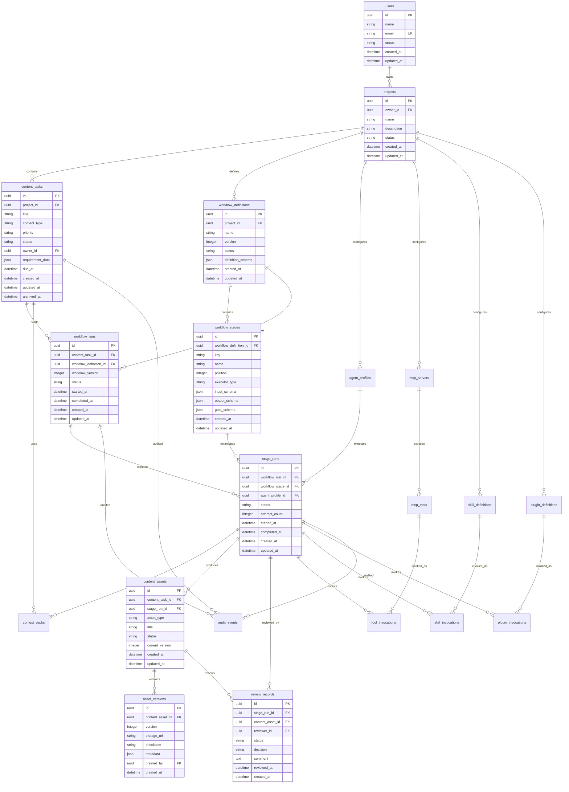
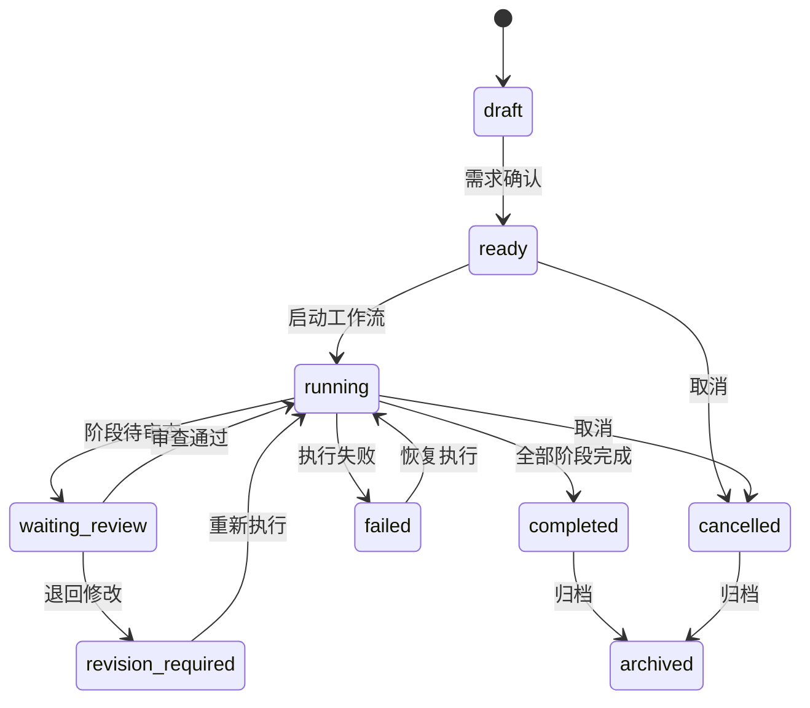
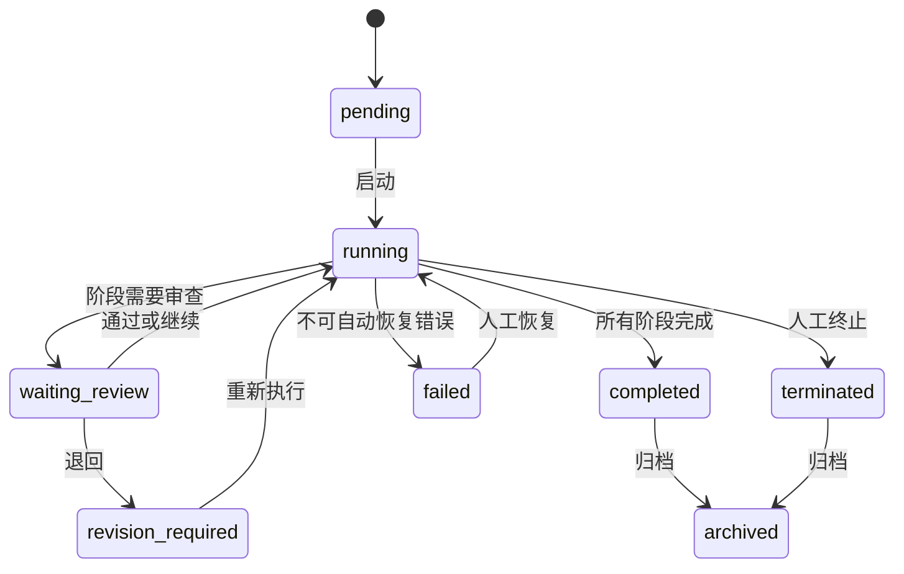
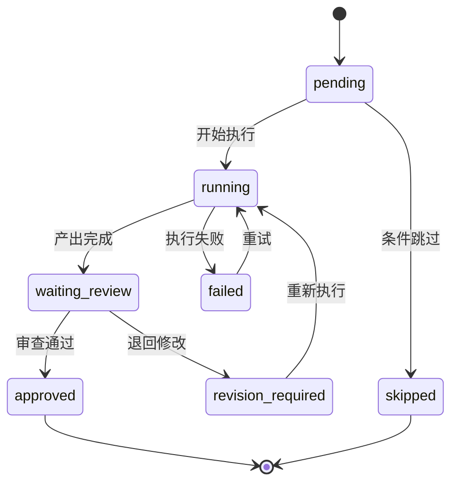
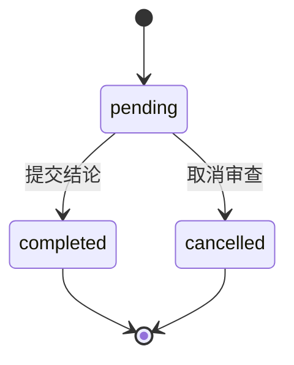

# 数据库设计

## 1. 设计目标

数据库用于支撑 Content Factory 的内容任务、工作流、Agent、MCP、Skill、插件、内容资产、审查记录、状态追踪和审计追溯。

设计必须满足：

- 工作流状态可持久化、可恢复、可审计。
- Agent、MCP、Skill、插件与核心业务解耦。
- 内容资产支持版本化与审查追溯。
- 核心业务规则不写死在 Agent、Prompt、MCP、Skill、插件或 UI 中。
- 表结构优先满足 MVP，保留清晰扩展点，避免过度设计。

## 2. 存储边界

| 存储对象 | 存储方式 | 说明 |
| --- | --- | --- |
| 任务、工作流、阶段、审查、配置 | 关系型数据库 | 需要事务、关联查询、状态一致性 |
| 内容正文、大型研究材料、附件 | 对象存储或文件存储 | 数据库存储引用、摘要和版本元数据 |
| 执行日志、审计事件 | 关系型数据库或日志存储 | MVP 可先使用关系型表，后续可拆分到日志系统 |
| 短期运行队列 | 队列系统 | 数据库只保存最终状态和必要事件 |
| 向量检索数据 | 向量库 | 后续 RAG 能力独立设计，不进入 MVP 主库 |

## 3. ER 图

## 4. 实体关系

### 4.1 项目与用户

- 一个用户可以拥有多个项目。
- 一个项目承载任务、工作流、Agent、MCP、Skill、插件配置。
- MVP 先支持单项目运行，表结构保留项目边界，避免后续迁移成本。

### 4.2 内容任务与工作流

- 一个内容任务可以启动多个工作流实例，通常只有一个活跃实例。
- 一个工作流定义可以生成多个工作流实例。
- 工作流定义按版本发布，工作流实例保存启动时使用的版本号。

### 4.3 工作流与阶段

- 一个工作流定义包含多个阶段定义。
- 一个工作流实例包含多个阶段运行记录。
- 阶段运行记录保存执行状态、执行者、重试次数和时间戳。

### 4.4 阶段与产出

- 一个阶段运行可以生成多个内容资产。
- 内容资产保存当前版本号，正文内容进入资产版本。
- 资产版本保存存储引用、校验值和元数据。

### 4.5 阶段与审查

- 阶段运行完成后可以创建审查记录。
- 审查记录可以关联具体内容资产。
- 审查结论驱动阶段状态和工作流状态流转。

### 4.6 Agent、MCP、Skill、插件

- Agent、MCP、Skill、插件均通过注册表配置接入。
- 阶段运行只引用配置 ID，不依赖具体外部实现。
- 调用记录独立保存，支持审计、追踪、成本分析和失败恢复。

## 5. 表结构

### 5.1 users

用户基础表。

| 字段 | 类型 | 约束 | 说明 |
| --- | --- | --- | --- |
| id | uuid | PK | 用户 ID |
| name | varchar(120) | not null | 显示名称 |
| email | varchar(255) | unique, not null | 邮箱 |
| status | varchar(32) | not null | active, disabled |
| created_at | timestamptz | not null | 创建时间 |
| updated_at | timestamptz | not null | 更新时间 |

### 5.2 projects

项目边界表。

| 字段 | 类型 | 约束 | 说明 |
| --- | --- | --- | --- |
| id | uuid | PK | 项目 ID |
| owner_id | uuid | FK users.id, not null | 项目拥有者 |
| name | varchar(160) | not null | 项目名称 |
| description | text | nullable | 项目说明 |
| status | varchar(32) | not null | active, archived |
| created_at | timestamptz | not null | 创建时间 |
| updated_at | timestamptz | not null | 更新时间 |

### 5.3 content_tasks

内容生产任务表。

| 字段 | 类型 | 约束 | 说明 |
| --- | --- | --- | --- |
| id | uuid | PK | 任务 ID |
| project_id | uuid | FK projects.id, not null | 所属项目 |
| title | varchar(240) | not null | 任务标题 |
| content_type | varchar(64) | not null | 内容类型，如 article, post, script |
| priority | varchar(32) | not null | low, normal, high, urgent |
| status | varchar(32) | not null | 任务状态 |
| owner_id | uuid | FK users.id, nullable | 负责人 |
| requirement_data | jsonb | not null | 结构化需求、目标、受众、渠道、约束 |
| due_at | timestamptz | nullable | 截止时间 |
| created_at | timestamptz | not null | 创建时间 |
| updated_at | timestamptz | not null | 更新时间 |
| archived_at | timestamptz | nullable | 归档时间 |

### 5.4 workflow_definitions

工作流定义表。

| 字段 | 类型 | 约束 | 说明 |
| --- | --- | --- | --- |
| id | uuid | PK | 工作流定义 ID |
| project_id | uuid | FK projects.id, not null | 所属项目 |
| name | varchar(160) | not null | 工作流名称 |
| version | integer | not null | 版本号，从 1 递增 |
| status | varchar(32) | not null | draft, active, deprecated, archived |
| definition_schema | jsonb | not null | 工作流元数据、阶段依赖、默认配置 |
| created_at | timestamptz | not null | 创建时间 |
| updated_at | timestamptz | not null | 更新时间 |

约束：

- `(project_id, name, version)` 唯一。
- 同一项目同一名称只能有一个 active 版本。

### 5.5 workflow_stages

工作流阶段定义表。

| 字段 | 类型 | 约束 | 说明 |
| --- | --- | --- | --- |
| id | uuid | PK | 阶段定义 ID |
| workflow_definition_id | uuid | FK workflow_definitions.id, not null | 所属工作流定义 |
| key | varchar(80) | not null | 阶段稳定标识 |
| name | varchar(160) | not null | 阶段名称 |
| position | integer | not null | 展示与默认执行顺序 |
| executor_type | varchar(32) | not null | human, agent, skill, plugin |
| input_schema | jsonb | not null | 输入契约 |
| output_schema | jsonb | not null | 输出契约 |
| gate_schema | jsonb | not null | 质量门禁配置 |
| created_at | timestamptz | not null | 创建时间 |
| updated_at | timestamptz | not null | 更新时间 |

约束：

- `(workflow_definition_id, key)` 唯一。
- `(workflow_definition_id, position)` 唯一。

### 5.6 workflow_runs

工作流运行实例表。

| 字段 | 类型 | 约束 | 说明 |
| --- | --- | --- | --- |
| id | uuid | PK | 工作流实例 ID |
| content_task_id | uuid | FK content_tasks.id, not null | 对应内容任务 |
| workflow_definition_id | uuid | FK workflow_definitions.id, not null | 使用的工作流定义 |
| workflow_version | integer | not null | 启动时使用的定义版本 |
| status | varchar(32) | not null | 工作流运行状态 |
| started_at | timestamptz | nullable | 开始时间 |
| completed_at | timestamptz | nullable | 完成时间 |
| created_at | timestamptz | not null | 创建时间 |
| updated_at | timestamptz | not null | 更新时间 |

### 5.7 stage_runs

阶段运行实例表。

| 字段 | 类型 | 约束 | 说明 |
| --- | --- | --- | --- |
| id | uuid | PK | 阶段运行 ID |
| workflow_run_id | uuid | FK workflow_runs.id, not null | 所属工作流实例 |
| workflow_stage_id | uuid | FK workflow_stages.id, not null | 阶段定义 |
| agent_profile_id | uuid | FK agent_profiles.id, nullable | 执行 Agent，仅 Agent 阶段使用 |
| status | varchar(32) | not null | 阶段状态 |
| attempt_count | integer | not null | 执行次数 |
| started_at | timestamptz | nullable | 开始时间 |
| completed_at | timestamptz | nullable | 完成时间 |
| created_at | timestamptz | not null | 创建时间 |
| updated_at | timestamptz | not null | 更新时间 |

### 5.8 context_packs

阶段上下文包表。

| 字段 | 类型 | 约束 | 说明 |
| --- | --- | --- | --- |
| id | uuid | PK | 上下文包 ID |
| content_task_id | uuid | FK content_tasks.id, not null | 所属任务 |
| stage_run_id | uuid | FK stage_runs.id, nullable | 对应阶段运行 |
| version | integer | not null | 上下文版本 |
| scope | varchar(64) | not null | task, stage, review |
| data | jsonb | not null | 最小必要上下文 |
| source_refs | jsonb | not null | 来源引用与版本 |
| sensitivity_level | varchar(32) | not null | public, internal, sensitive |
| created_at | timestamptz | not null | 创建时间 |

约束：

- `(content_task_id, scope, version)` 唯一。

### 5.9 content_assets

内容资产表。

| 字段 | 类型 | 约束 | 说明 |
| --- | --- | --- | --- |
| id | uuid | PK | 资产 ID |
| content_task_id | uuid | FK content_tasks.id, not null | 所属任务 |
| stage_run_id | uuid | FK stage_runs.id, nullable | 来源阶段 |
| asset_type | varchar(64) | not null | research, outline, draft, revision, final |
| title | varchar(240) | not null | 资产标题 |
| status | varchar(32) | not null | draft, review_pending, approved, rejected, archived |
| current_version | integer | not null | 当前版本号 |
| created_at | timestamptz | not null | 创建时间 |
| updated_at | timestamptz | not null | 更新时间 |

### 5.10 asset_versions

内容资产版本表。

| 字段 | 类型 | 约束 | 说明 |
| --- | --- | --- | --- |
| id | uuid | PK | 资产版本 ID |
| content_asset_id | uuid | FK content_assets.id, not null | 所属资产 |
| version | integer | not null | 版本号，从 1 递增 |
| storage_uri | text | not null | 正文或附件存储地址 |
| checksum | varchar(128) | not null | 内容校验值 |
| metadata | jsonb | not null | 字数、格式、模型、来源等元数据 |
| created_by | uuid | FK users.id, nullable | 创建人；系统生成可为空 |
| created_at | timestamptz | not null | 创建时间 |

约束：

- `(content_asset_id, version)` 唯一。

### 5.11 review_records

审查记录表。

| 字段 | 类型 | 约束 | 说明 |
| --- | --- | --- | --- |
| id | uuid | PK | 审查记录 ID |
| stage_run_id | uuid | FK stage_runs.id, not null | 被审查阶段 |
| content_asset_id | uuid | FK content_assets.id, nullable | 被审查资产 |
| reviewer_id | uuid | FK users.id, nullable | 审查人；自动审查可为空 |
| status | varchar(32) | not null | pending, completed, cancelled |
| decision | varchar(32) | nullable | approved, rejected, revision_required, terminated |
| comment | text | nullable | 审查意见 |
| reviewed_at | timestamptz | nullable | 审查时间 |
| created_at | timestamptz | not null | 创建时间 |

### 5.12 agent_profiles

Agent 配置表。

| 字段 | 类型 | 约束 | 说明 |
| --- | --- | --- | --- |
| id | uuid | PK | Agent 配置 ID |
| project_id | uuid | FK projects.id, not null | 所属项目 |
| name | varchar(160) | not null | Agent 名称 |
| provider | varchar(64) | not null | claude_code, codex, gemini, opencode |
| role | varchar(80) | not null | researcher, planner, writer, reviewer |
| capability_schema | jsonb | not null | 能力声明 |
| constraint_schema | jsonb | not null | 限制与输出要求 |
| status | varchar(32) | not null | active, disabled, archived |
| created_at | timestamptz | not null | 创建时间 |
| updated_at | timestamptz | not null | 更新时间 |

### 5.13 mcp_servers

MCP Server 配置表。

| 字段 | 类型 | 约束 | 说明 |
| --- | --- | --- | --- |
| id | uuid | PK | MCP Server ID |
| project_id | uuid | FK projects.id, not null | 所属项目 |
| name | varchar(160) | not null | Server 名称 |
| transport | varchar(32) | not null | stdio, http, sse |
| risk_level | varchar(32) | not null | low, medium, high |
| status | varchar(32) | not null | active, disabled, archived |
| config_schema | jsonb | not null | 非敏感配置结构 |
| created_at | timestamptz | not null | 创建时间 |
| updated_at | timestamptz | not null | 更新时间 |

### 5.14 mcp_tools

MCP 工具表。

| 字段 | 类型 | 约束 | 说明 |
| --- | --- | --- | --- |
| id | uuid | PK | MCP 工具 ID |
| mcp_server_id | uuid | FK mcp_servers.id, not null | 所属 Server |
| name | varchar(160) | not null | 工具名称 |
| purpose | text | not null | 用途说明 |
| input_schema | jsonb | not null | 输入契约 |
| output_schema | jsonb | not null | 输出契约 |
| permission_schema | jsonb | not null | 权限声明 |
| timeout_seconds | integer | not null | 超时时间 |
| status | varchar(32) | not null | active, disabled, archived |
| created_at | timestamptz | not null | 创建时间 |
| updated_at | timestamptz | not null | 更新时间 |

### 5.15 skill_definitions

Skill 定义表。

| 字段 | 类型 | 约束 | 说明 |
| --- | --- | --- | --- |
| id | uuid | PK | Skill ID |
| project_id | uuid | FK projects.id, not null | 所属项目 |
| name | varchar(160) | not null | Skill 名称 |
| trigger_schema | jsonb | not null | 触发条件 |
| input_schema | jsonb | not null | 输入契约 |
| output_schema | jsonb | not null | 输出契约 |
| status | varchar(32) | not null | active, disabled, archived |
| created_at | timestamptz | not null | 创建时间 |
| updated_at | timestamptz | not null | 更新时间 |

### 5.16 plugin_definitions

插件定义表。

| 字段 | 类型 | 约束 | 说明 |
| --- | --- | --- | --- |
| id | uuid | PK | 插件 ID |
| project_id | uuid | FK projects.id, not null | 所属项目 |
| name | varchar(160) | not null | 插件名称 |
| version | varchar(40) | not null | 插件版本 |
| capability_schema | jsonb | not null | 能力声明 |
| permission_schema | jsonb | not null | 权限声明 |
| failure_policy | jsonb | not null | 失败策略 |
| status | varchar(32) | not null | active, disabled, archived |
| created_at | timestamptz | not null | 创建时间 |
| updated_at | timestamptz | not null | 更新时间 |

约束：

- `(project_id, name, version)` 唯一。

### 5.17 invocation tables

调用记录表用于追踪 Agent 外的工具型执行。

#### tool_invocations

| 字段 | 类型 | 约束 | 说明 |
| --- | --- | --- | --- |
| id | uuid | PK | 调用 ID |
| stage_run_id | uuid | FK stage_runs.id, not null | 所属阶段 |
| mcp_tool_id | uuid | FK mcp_tools.id, not null | 被调用工具 |
| status | varchar(32) | not null | pending, running, succeeded, failed, cancelled |
| input_data | jsonb | not null | 输入快照，敏感值脱敏 |
| output_data | jsonb | nullable | 输出快照 |
| error_data | jsonb | nullable | 错误信息 |
| started_at | timestamptz | nullable | 开始时间 |
| completed_at | timestamptz | nullable | 完成时间 |
| created_at | timestamptz | not null | 创建时间 |

#### skill_invocations

字段同 `tool_invocations`，将 `mcp_tool_id` 替换为 `skill_definition_id`。

#### plugin_invocations

字段同 `tool_invocations`，将 `mcp_tool_id` 替换为 `plugin_definition_id`。

### 5.18 audit_events

审计事件表。

| 字段 | 类型 | 约束 | 说明 |
| --- | --- | --- | --- |
| id | uuid | PK | 事件 ID |
| project_id | uuid | FK projects.id, not null | 所属项目 |
| actor_id | uuid | FK users.id, nullable | 操作者；系统事件可为空 |
| subject_type | varchar(80) | not null | content_task, workflow_run, stage_run 等 |
| subject_id | uuid | not null | 目标实体 ID |
| action | varchar(120) | not null | 操作名称 |
| before_data | jsonb | nullable | 变更前关键数据 |
| after_data | jsonb | nullable | 变更后关键数据 |
| metadata | jsonb | not null | IP、来源、请求 ID、风险等级等 |
| created_at | timestamptz | not null | 创建时间 |

## 6. 字段设计规范

### 6.1 主键

- 所有核心表使用 `uuid id` 作为主键。
- 外部系统标识不得作为主键，只能作为普通字段或唯一键。

### 6.2 时间字段

- 所有可变实体包含 `created_at` 和 `updated_at`。
- 运行类实体包含 `started_at`、`completed_at`。
- 归档类实体包含 `archived_at`。

### 6.3 状态字段

- 状态字段统一命名为 `status`。
- 审查结论使用 `decision`，避免与审查记录生命周期混淆。
- 状态流转必须由领域层控制，不允许 UI 或外部工具直接写入任意状态。

### 6.4 JSON 字段

JSON 字段只用于可扩展契约和低频查询数据：

- `requirement_data`
- `definition_schema`
- `input_schema`
- `output_schema`
- `gate_schema`
- `capability_schema`
- `permission_schema`
- `metadata`

禁止将核心状态、关联关系、审查结论等高频查询字段只保存在 JSON 中。

### 6.5 软删除与归档

- 业务数据不做物理删除，使用 `status = archived` 或 `archived_at`。
- 审计事件不允许删除。
- 资产版本不允许覆盖，只能新增版本。

## 7. 索引设计

### 7.1 基础索引

| 表 | 索引 | 用途 |
| --- | --- | --- |
| users | `idx_users_email_unique(email)` unique | 登录与用户查找 |
| projects | `idx_projects_owner_status(owner_id, status)` | 用户项目列表 |
| content_tasks | `idx_content_tasks_project_status_updated(project_id, status, updated_at)` | 任务列表与状态筛选 |
| content_tasks | `idx_content_tasks_owner_status(owner_id, status)` | 负责人任务列表 |
| content_tasks | `idx_content_tasks_due_at(due_at)` | 截止时间排序 |
| workflow_definitions | `idx_workflow_definitions_project_status(project_id, status)` | 工作流模板列表 |
| workflow_stages | `idx_workflow_stages_definition_position(workflow_definition_id, position)` | 阶段顺序加载 |
| workflow_runs | `idx_workflow_runs_task_status(content_task_id, status)` | 查询任务工作流实例 |
| stage_runs | `idx_stage_runs_workflow_status(workflow_run_id, status)` | 查询工作流阶段状态 |
| context_packs | `idx_context_packs_task_stage(content_task_id, stage_run_id)` | 查询任务或阶段上下文 |
| content_assets | `idx_content_assets_task_type(content_task_id, asset_type)` | 查询任务资产 |
| asset_versions | `idx_asset_versions_asset_version(content_asset_id, version)` unique | 查询资产版本 |
| review_records | `idx_review_records_stage_status(stage_run_id, status)` | 查询阶段审查状态 |
| audit_events | `idx_audit_events_subject(subject_type, subject_id, created_at)` | 实体审计追踪 |
| audit_events | `idx_audit_events_project_time(project_id, created_at)` | 项目审计列表 |

### 7.2 扩展索引

| 表 | 索引 | 用途 |
| --- | --- | --- |
| agent_profiles | `idx_agent_profiles_project_provider_status(project_id, provider, status)` | Agent 选择 |
| mcp_servers | `idx_mcp_servers_project_status(project_id, status)` | MCP Server 列表 |
| mcp_tools | `idx_mcp_tools_server_status(mcp_server_id, status)` | MCP 工具列表 |
| skill_definitions | `idx_skill_definitions_project_status(project_id, status)` | Skill 列表 |
| plugin_definitions | `idx_plugin_definitions_project_status(project_id, status)` | 插件列表 |
| tool_invocations | `idx_tool_invocations_stage_status(stage_run_id, status)` | 阶段工具调用追踪 |
| skill_invocations | `idx_skill_invocations_stage_status(stage_run_id, status)` | 阶段 Skill 调用追踪 |
| plugin_invocations | `idx_plugin_invocations_stage_status(stage_run_id, status)` | 阶段插件调用追踪 |

### 7.3 JSON 索引原则

- MVP 不默认为所有 JSON 字段建立索引。
- 只有当某个 JSON 路径成为稳定查询条件时，才建立表达式索引。
- 对 `requirement_data` 可预留全文检索或 JSON 路径索引，但必须基于实际查询需求添加。

## 8. 状态机设计

### 8.1 内容任务状态机

任务状态值：

| 状态 | 说明 |
| --- | --- |
| draft | 需求未确认 |
| ready | 需求已确认，等待执行 |
| running | 工作流执行中 |
| waiting_review | 等待人工或自动审查 |
| revision_required | 需要修订 |
| failed | 执行失败，等待恢复 |
| completed | 已完成 |
| cancelled | 已取消 |
| archived | 已归档 |

### 8.2 工作流运行状态机

### 8.3 阶段运行状态机

阶段状态值：

| 状态 | 说明 |
| --- | --- |
| pending | 等待执行 |
| running | 执行中 |
| waiting_review | 等待审查 |
| approved | 已通过 |
| revision_required | 需要修订 |
| failed | 执行失败 |
| skipped | 条件跳过 |

### 8.4 审查记录状态

审查结论：

| decision | 说明 |
| --- | --- |
| approved | 通过 |
| rejected | 拒绝并终止当前产出 |
| revision_required | 退回修改 |
| terminated | 终止工作流 |

## 9. 版本设计

### 9.1 工作流版本

- `workflow_definitions.version` 使用递增整数。
- 修改 active 工作流时不覆盖原版本，必须创建新版本。
- `workflow_runs.workflow_version` 保存启动时使用的版本号。
- 运行中的工作流不随定义变更自动升级。

### 9.2 资产版本

- `content_assets.current_version` 指向当前版本号。
- 每次 Agent 生成、人工修改、审查修订都创建新的 `asset_versions`。
- `asset_versions` 不允许更新正文引用，只允许追加新版本。
- `checksum` 用于检测内容是否变化和防止重复写入。

### 9.3 上下文版本

- `context_packs.version` 记录上下文包版本。
- 每次进入阶段执行前生成新的上下文包快照。
- 上下文包必须记录 `source_refs`，用于追溯输入来源。
- 敏感数据必须在写入 `data` 前按策略脱敏或裁剪。

### 9.4 配置版本

- Agent、MCP、Skill、插件配置默认按记录更新。
- 当配置被工作流实例引用时，运行记录必须保存必要快照或引用可追溯版本。
- 后续若配置频繁变更，再引入独立 `*_versions` 表。

## 10. 一致性与事务边界

### 10.1 强一致事务

以下操作必须在单事务中完成：

- 创建内容任务与初始审计事件。
- 创建工作流实例与初始阶段运行。
- 阶段状态变更与审查记录创建。
- 资产版本新增与当前版本更新。

### 10.2 最终一致事件

以下操作允许异步处理：

- Agent 调用日志汇总。
- MCP 调用成本统计。
- 搜索索引更新。
- 内容质量分析。
- 仪表盘聚合指标。

## 11. 禁止事项

- 禁止物理删除审计事件和资产版本。
- 禁止只在 JSON 字段中保存核心状态和核心关系。
- 禁止绕过状态机直接改写任务、工作流、阶段状态。
- 禁止将外部 Agent、MCP、Skill、插件的实现细节写入领域表。
- 禁止在数据库中保存明文密钥、令牌或敏感凭证。
- 禁止让一次性聊天记录成为唯一数据来源。

## 12. 后续细化

- 具体数据库选型与迁移工具：`docs/10-development/setup.md`
- API 契约：`docs/09-api/api-overview.md`
- 工作流执行细节：`docs/07-workflow/content-pipeline.md`
- Agent 配置细节：`docs/04-agent/agent-roles.md`
- MCP 工具契约：`docs/05-mcp/tool-contracts.md`
