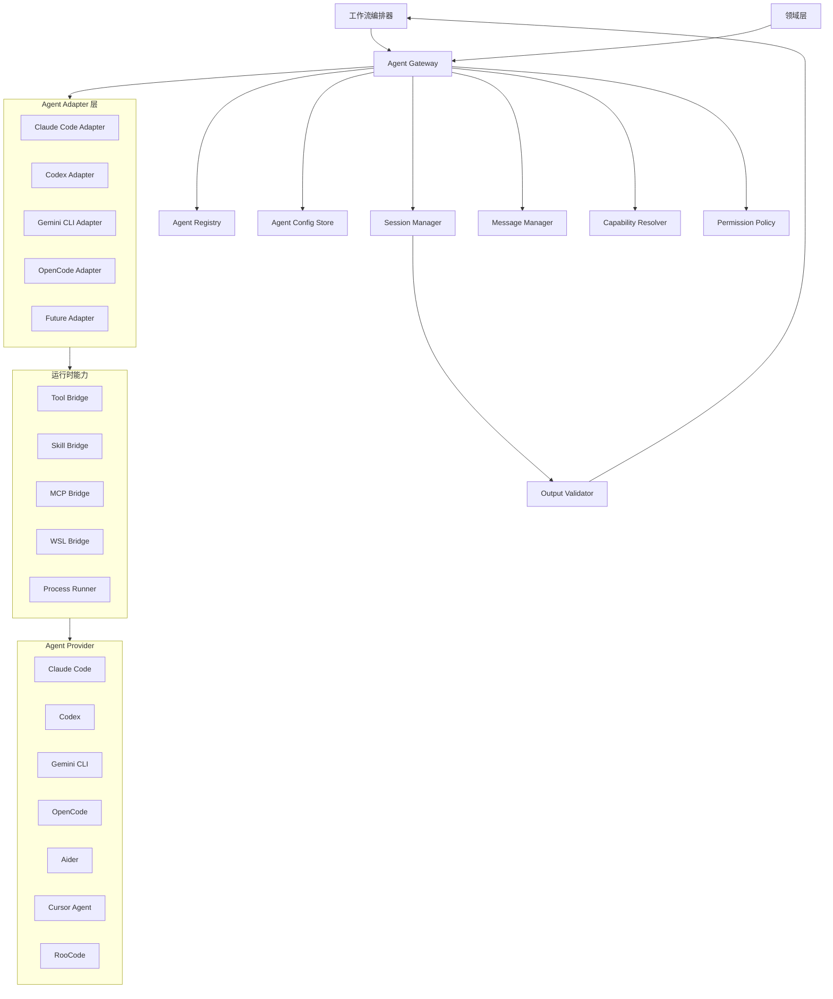
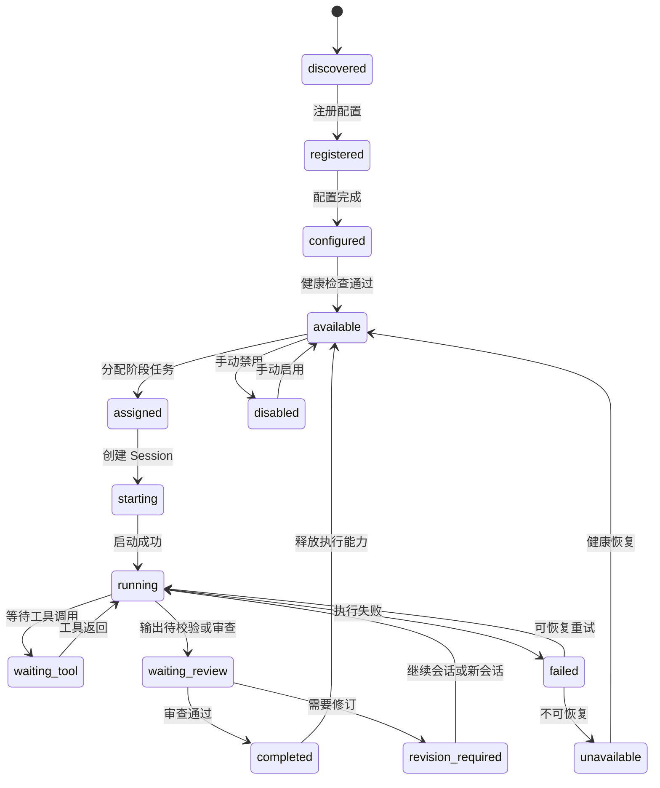
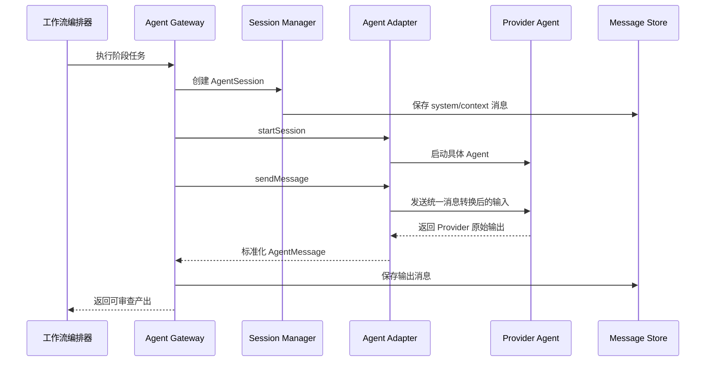
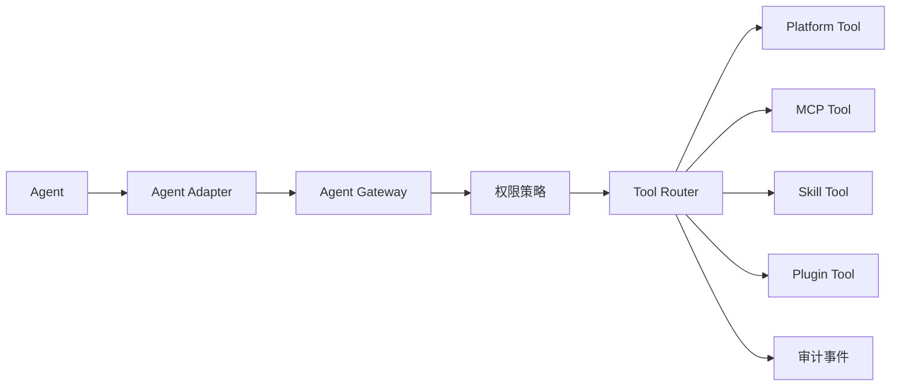
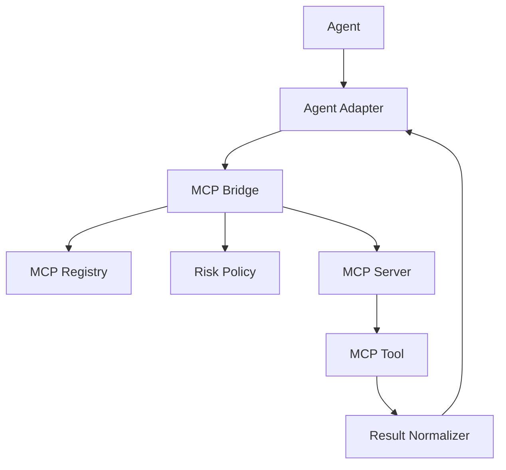
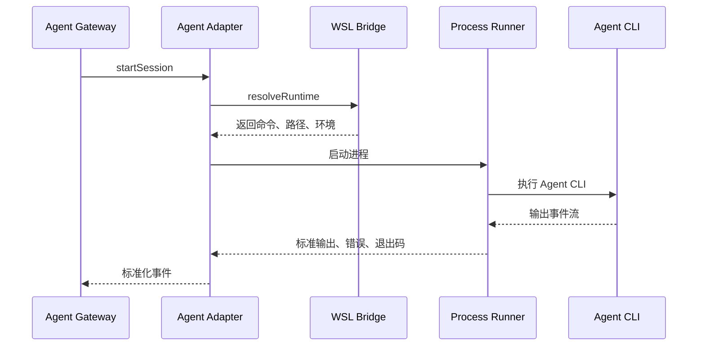
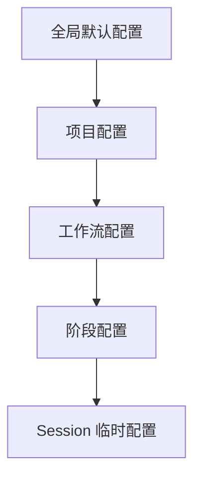
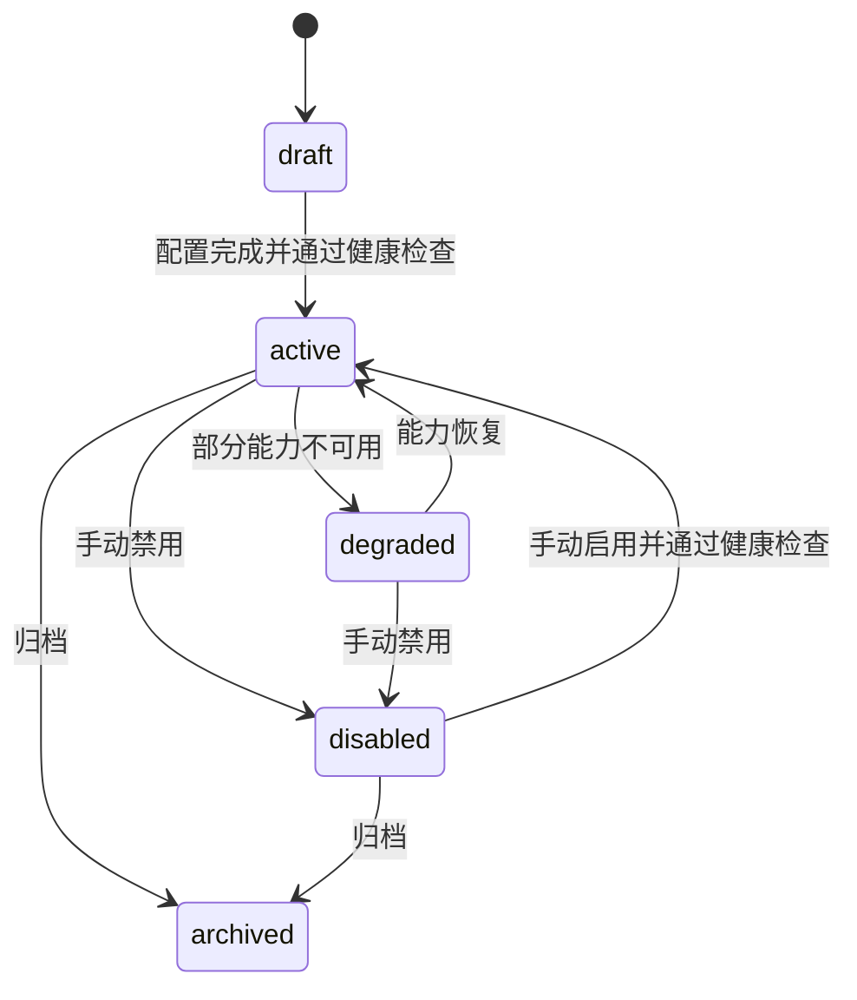
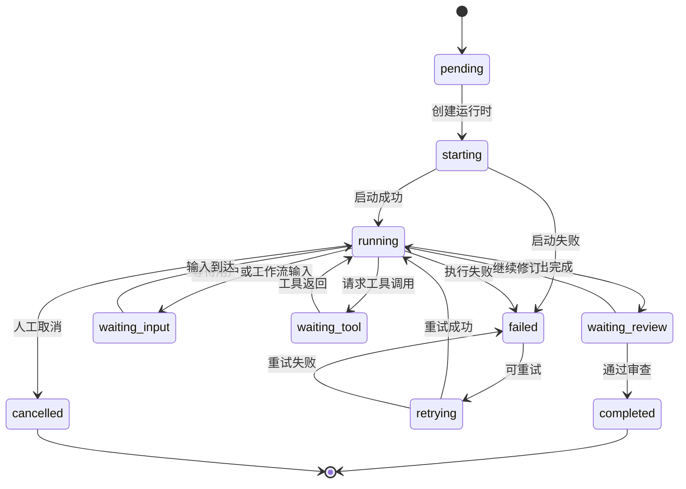

# Agent 架构

## 1. 设计目标

Content Factory 需要统一管理 Claude Code、Codex、Gemini CLI、OpenCode 等 Agent，并为未来接入 Aider、Cursor Agent、RooCode 预留扩展能力。

核心目标：

- 提供统一 Agent 抽象层，业务代码只依赖抽象契约。
- 新增 Agent 只新增适配器与配置，不修改内容任务、工作流、审查等业务代码。
- 支持 Agent 生命周期、Session、Message、Tool、Skill、MCP、WSL、发现、注册、配置和状态管理。
- 保证 Agent 是能力执行者，不是业务规则所有者。
- 所有 Agent 输入、输出、状态、错误和审查结果可追踪、可审计、可恢复。

## 2. 架构原则

- **抽象优先**：业务层只依赖 `AgentGateway`、`AgentProfile`、`AgentSession`、`AgentMessage` 等统一模型。
- **适配隔离**：不同 Agent 的 CLI、SDK、协议差异由 Adapter 层吸收。
- **配置驱动**：Agent 能力、命令、环境、权限、工作目录、WSL 策略通过配置声明。
- **最小上下文**：Agent 只能接收当前阶段必要上下文包。
- **输出校验**：Agent 输出必须经过结构校验、质量门禁或人工审查。
- **可替换**：同一角色可以切换不同 Agent Provider，不影响业务流程。
- **可观测**：Session、Message、Tool 调用、错误、耗时、退出码必须记录。

## 3. 总体架构



## 4. 统一 Agent 抽象层

### 4.1 核心接口

| 抽象 | 职责 |
| --- | --- |
| `AgentProvider` | Agent 类型标识，如 `claude_code`, `codex`, `gemini_cli`, `opencode` |
| `AgentProfile` | 项目内 Agent 配置，声明角色、能力、权限、运行环境 |
| `AgentAdapter` | 适配具体 Agent 的启动、消息发送、工具桥接、停止、状态读取 |
| `AgentGateway` | 面向业务和工作流的统一入口 |
| `AgentSession` | 一次 Agent 会话实例，绑定任务、阶段、上下文和运行状态 |
| `AgentMessage` | 统一消息模型，屏蔽不同 Provider 的消息格式差异 |
| `AgentToolCall` | Agent 触发工具、Skill 或 MCP 调用的标准记录 |
| `AgentCapability` | Agent 能力描述，用于工作流阶段匹配 |

### 4.2 Adapter 契约

```text
AgentAdapter
├── provider(): AgentProvider
├── discover(environment): AgentDiscoveryResult
├── validateConfig(config): ValidationResult
├── startSession(request): AgentSessionHandle
├── sendMessage(session, message): AgentMessageResult
├── stream(session): AgentEventStream
├── stopSession(session, reason): StopResult
├── getStatus(session): AgentRuntimeStatus
└── normalizeOutput(raw): AgentOutput
```

业务代码只调用 `AgentGateway`，不直接调用任何 Adapter。

## 5. 支持的 Agent

### 5.1 当前支持范围

| Provider | 接入方式 | 主要用途 | 适配重点 |
| --- | --- | --- | --- |
| Claude Code | CLI / SDK / harness | 规划、编码、审查、文档、复杂任务执行 | Session、Tool、Skill、MCP、文件上下文 |
| Codex | CLI / API wrapper | 后端实现、代码生成、测试建议 | 只读上下文、patch 输出、沙箱限制 |
| Gemini CLI | CLI | 前端、视觉、多模态、替代分析 | 命令行会话、文件输入、结构化输出 |
| OpenCode | CLI | 代码执行、编辑辅助、轻量 Agent 任务 | 会话进程、输出标准化、权限控制 |

### 5.2 未来支持范围

| Provider | 接入策略 |
| --- | --- |
| Aider | 新增 `AiderAdapter`，实现统一 `AgentAdapter` 契约 |
| Cursor Agent | 新增 `CursorAgentAdapter`，通过 CLI、API 或本地协议接入 |
| RooCode | 新增 `RooCodeAdapter`，通过扩展协议或外部进程接入 |

新增 Provider 的唯一要求：实现 Adapter 契约、声明能力、注册配置。不得修改业务领域模型和工作流用例。

## 6. Agent 生命周期



生命周期说明：

| 状态 | 说明 |
| --- | --- |
| discovered | 系统发现本机或远端可用 Agent |
| registered | Agent 已进入注册表 |
| configured | 已完成项目级配置 |
| available | 可被工作流调度 |
| assigned | 已分配到具体阶段 |
| starting | 正在创建 Session 或进程 |
| running | 正在执行任务 |
| waiting_tool | 等待 Tool、Skill、MCP 调用结果 |
| waiting_review | 输出已生成，等待校验或审查 |
| revision_required | 输出需要修订 |
| completed | 当前任务完成 |
| failed | 执行失败，可按策略重试 |
| unavailable | 健康检查失败或依赖不可用 |
| disabled | 被管理员禁用 |

## 7. Session 机制

### 7.1 Session 定义

`AgentSession` 是一次 Agent 执行上下文，绑定一个工作流阶段或子任务。

核心字段：

| 字段 | 说明 |
| --- | --- |
| `id` | Session ID |
| `project_id` | 所属项目 |
| `content_task_id` | 内容任务 ID |
| `workflow_run_id` | 工作流实例 ID |
| `stage_run_id` | 阶段运行 ID |
| `agent_profile_id` | Agent 配置 ID |
| `provider` | Agent Provider |
| `runtime` | CLI、SDK、remote、wsl 等运行方式 |
| `working_directory` | 工作目录 |
| `context_pack_id` | 使用的上下文包版本 |
| `status` | Session 状态 |
| `started_at` / `completed_at` | 时间戳 |
| `metadata` | 运行参数、模型、成本、环境信息 |

### 7.2 Session 类型

| 类型 | 用途 |
| --- | --- |
| `ephemeral` | 单轮任务，完成后关闭 |
| `persistent` | 多轮任务，保留上下文直到阶段结束 |
| `interactive` | 需要人工介入或确认 |
| `background` | 长任务后台运行，通过事件回传状态 |

### 7.3 Session 原则

- Session 是运行时状态，不是业务状态来源。
- 工作流权威状态保存在 `workflow_runs` 和 `stage_runs`。
- Session 可以恢复、重试或替换 Agent，但必须保留原始消息与审计记录。
- 不允许用未持久化的聊天上下文作为唯一任务上下文。

## 8. Message 机制

### 8.1 消息模型

统一消息模型用于屏蔽不同 Agent 的输入输出差异。

| 字段 | 说明 |
| --- | --- |
| `id` | 消息 ID |
| `session_id` | 所属 Session |
| `role` | system, user, assistant, tool, event |
| `content_type` | text, markdown, json, file_ref, tool_call, error |
| `content` | 消息正文或结构化数据 |
| `attachments` | 文件、资产、上下文引用 |
| `sequence` | 会话内顺序号 |
| `visibility` | internal, user_visible, audit_only |
| `created_at` | 创建时间 |

### 8.2 消息流



### 8.3 消息原则

- System、Context、Task、Output 必须分层组织。
- 工具结果使用 `tool` 消息，不混入普通文本。
- Agent 原始输出和标准化输出都必须可追溯。
- 敏感上下文不得写入用户可见消息。

## 9. Tool 机制

### 9.1 Tool 分类

| 类型 | 说明 |
| --- | --- |
| Built-in Tool | Agent 自带能力，例如读写文件、执行命令 |
| Platform Tool | Content Factory 提供的内部工具，例如读取资产、写审查记录 |
| MCP Tool | 通过 MCP Server 暴露的外部工具 |
| Skill Tool | 通过 Skill 体系执行的领域命令 |
| Plugin Tool | 插件提供的扩展动作 |

### 9.2 Tool 调用链路



### 9.3 Tool 原则

- Tool 调用必须声明权限、输入、输出、超时和错误语义。
- 高风险 Tool 必须经策略判断或人工确认。
- Agent 不直接访问业务内部实现，只通过 Tool Router 调用受控能力。
- Tool 结果必须以结构化消息返回 Session。

## 10. Skill 机制

Skill 是可复用领域能力或质量门禁，Agent 可以请求使用，但不能绕过工作流策略。

### 10.1 Skill 接入方式

- Skill 注册到 `Skill Registry`。
- Agent Profile 声明可用 Skill 范围。
- 工作流阶段声明允许使用的 Skill。
- Skill 调用由 `Skill Bridge` 执行并记录。

### 10.2 Skill 调用规则

- Agent 请求 Skill 时必须包含目的、输入和期望输出。
- `Skill Bridge` 根据阶段策略判断是否允许。
- Skill 输出作为结构化 Tool 结果返回 Agent。
- 质量门禁 Skill 的结果必须进入审查记录或阶段状态判断。

## 11. MCP 机制

MCP 为 Agent 提供外部工具能力，但 MCP Server 不承载核心业务规则。

### 11.1 MCP 集成结构



### 11.2 MCP 调用原则

- 最小权限、最小上下文、最小数据暴露。
- 外部网络、敏感数据、生产环境、破坏性操作必须显式授权。
- MCP 返回结果必须标准化并校验。
- Agent 只能通过 MCP Bridge 使用 MCP，不直接持有 MCP Server 内部连接。

## 12. WSL 机制

Content Factory 需要兼容 Windows + WSL 场景，尤其是 CLI Agent 的运行环境差异。

### 12.1 WSL 适配目标

- 支持在 Windows 主机发现 WSL 内 Agent CLI。
- 支持在 WSL 内执行 Linux CLI Agent。
- 支持 Windows 路径与 WSL 路径转换。
- 支持工作目录、环境变量、凭证引用和文件权限隔离。

### 12.2 WSL Bridge 职责

| 职责 | 说明 |
| --- | --- |
| 环境检测 | 检测是否运行在 WSL、Windows、Linux |
| 发行版选择 | 选择默认或指定 WSL distro |
| 路径转换 | Windows path 与 WSL path 双向转换 |
| 命令包装 | 将 Agent CLI 命令包装为 `wsl.exe` 或原生命令 |
| 环境注入 | 注入最小必要环境变量 |
| 权限隔离 | 限制工作目录和敏感路径访问 |

### 12.3 WSL 执行流



## 13. Agent 发现机制

### 13.1 发现来源

| 来源 | 说明 |
| --- | --- |
| PATH | 检测 CLI 是否存在 |
| 配置文件 | 读取项目或用户配置中的 Agent 定义 |
| MCP / Plugin | 通过扩展能力发现远端 Agent |
| 手动注册 | 用户在配置中心录入 Agent |
| 健康检查 | 验证命令、版本、鉴权和工作目录 |

### 13.2 发现结果

`AgentDiscoveryResult` 包含：

- provider
- display_name
- executable_path
- version
- runtime_type
- supported_features
- health_status
- missing_dependencies
- recommended_config

发现只产生候选项，不自动进入可用状态。必须经过注册和配置。

## 14. Agent 注册机制

### 14.1 注册流程


### 14.2 注册表字段

| 字段 | 说明 |
| --- | --- |
| `provider` | Agent Provider |
| `name` | 项目内名称 |
| `role` | researcher, planner, writer, reviewer, engineer |
| `capabilities` | 能力声明 |
| `runtime` | cli, sdk, remote, wsl |
| `command` | CLI 命令模板 |
| `working_directory_policy` | 工作目录策略 |
| `tool_policy` | 可用 Tool 范围 |
| `skill_policy` | 可用 Skill 范围 |
| `mcp_policy` | 可用 MCP 范围 |
| `permission_policy` | 文件、命令、网络、敏感数据权限 |
| `status` | active, disabled, archived |

## 15. Agent 配置机制

### 15.1 配置层级



优先级：`Session` > `Stage` > `Workflow` > `Project` > `Global`。

### 15.2 配置类型

| 类型 | 说明 |
| --- | --- |
| 能力配置 | 角色、任务类型、支持输入输出 |
| 运行配置 | 命令、参数、工作目录、超时、重试 |
| 模型配置 | 模型名称、温度、上下文长度、成本限制 |
| 工具配置 | Tool、Skill、MCP、插件可用范围 |
| 权限配置 | 文件、命令、网络、外部 API、敏感数据 |
| 输出配置 | 输出格式、Schema、校验规则 |
| WSL 配置 | distro、路径映射、环境变量 |

### 15.3 配置原则

- 密钥和令牌不进入普通配置表，只保存安全引用。
- 运行中的 Session 使用配置快照，避免配置变更影响执行中任务。
- 工作流定义只引用 Agent 能力和角色，不绑定具体 Provider。

## 16. Agent 状态机

### 16.1 Agent Profile 状态机



### 16.2 Agent Session 状态机



## 17. 新增 Agent 扩展流程

新增 Aider、Cursor Agent、RooCode 或其他 Agent 时必须按以下流程执行：

1. 新增 `AgentAdapter` 实现。
2. 声明 `AgentProvider` 枚举或配置项。
3. 实现发现、配置校验、启动、消息发送、事件流、停止、状态读取、输出标准化。
4. 提供默认能力声明和权限模板。
5. 注册到 `Agent Registry`。
6. 编写适配器测试和最小执行验证。
7. 更新 Agent 文档和配置示例。

禁止事项：

- 禁止修改内容任务、工作流、审查等业务代码来适配新 Agent。
- 禁止让新 Agent 直接访问领域实体内部实现。
- 禁止绕过 `AgentGateway`、`ToolRouter`、`MCPBridge` 或 `SkillBridge`。

## 18. 数据模型映射

Agent 架构与数据库设计的映射：

| 架构对象 | 数据表 |
| --- | --- |
| AgentProfile | `agent_profiles` |
| AgentSession | 后续新增 `agent_sessions` 或复用运行日志表 |
| AgentMessage | 后续新增 `agent_messages` |
| AgentToolCall | `tool_invocations`, `skill_invocations`, `plugin_invocations` |
| ContextPack | `context_packs` |
| StageRun | `stage_runs` |
| AuditEvent | `audit_events` |

当前 `docs/03-database/database-design.md` 已覆盖 Agent Profile 和调用记录。Session 与 Message 表在实现 Agent 运行时前补充数据库迁移设计。

## 19. 安全与审计

- Agent 不得默认访问敏感数据。
- Agent 所有命令执行必须受权限策略限制。
- Agent 对外部网络、生产环境、文件写入、发布动作的请求必须进入风险策略。
- Agent 输出不得直接进入最终内容，必须经过校验或审查。
- 所有 Session、Message、Tool 调用、错误和人工确认必须记录审计事件。

## 20. 后续细化文档

- Agent 角色矩阵：`docs/04-agent/agent-roles.md`
- MCP 工具契约：`docs/05-mcp/tool-contracts.md`
- Skill 注册规范：`docs/06-skill/skill-registry.md`
- 工作流编排：`docs/07-workflow/content-pipeline.md`
- 数据库补充：`docs/03-database/database-design.md`
