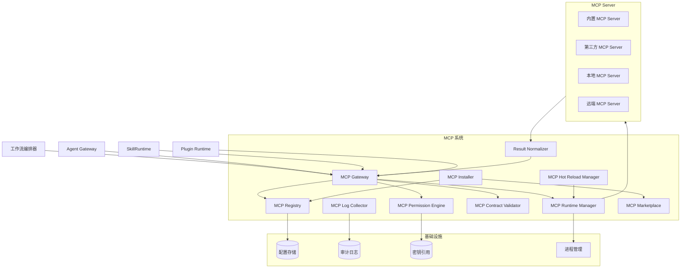
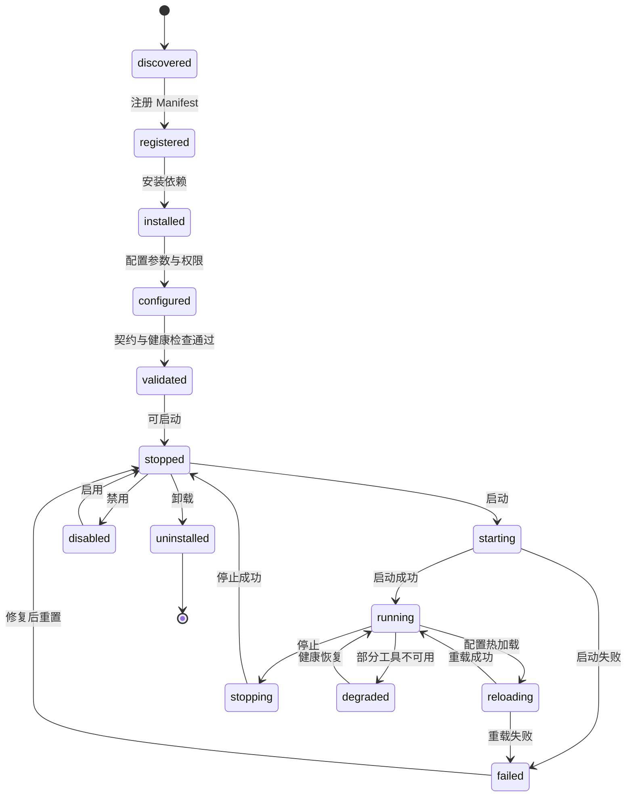
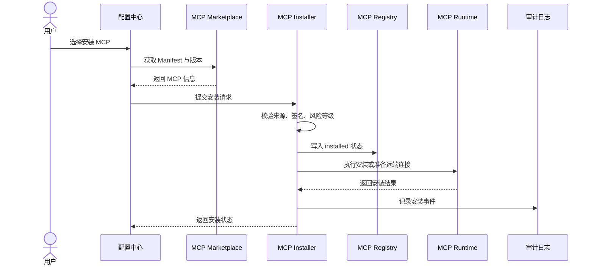
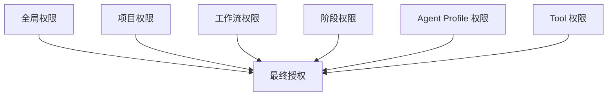
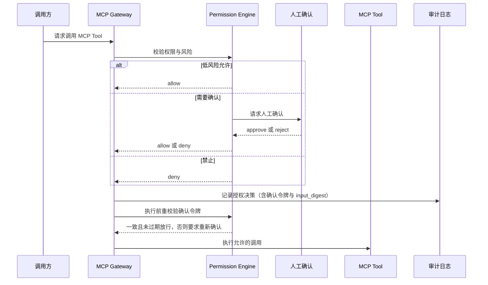
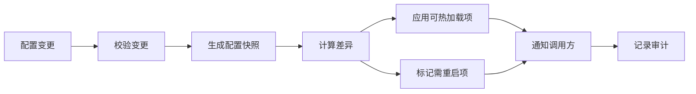
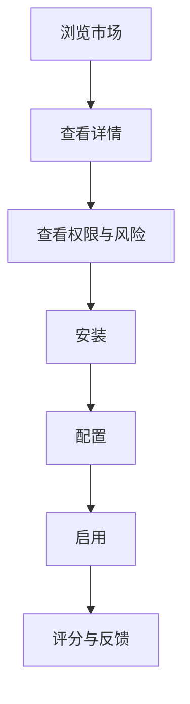
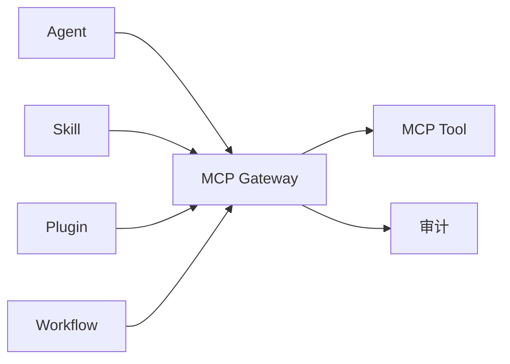

# MCP 架构

## 1. 设计目标

MCP 系统为 Content Factory 提供可治理的外部工具接入层，用于统一管理 MCP Server、工具契约、权限、安装、启停、日志、热加载和第三方 MCP 市场。

核心目标：

- 支持内置 MCP 与第三方 MCP 接入。
- MCP Server 不承载核心业务规则，只提供外部能力边界。
- Agent、Skill、插件、工作流通过统一 MCP Gateway 使用工具。
- 所有 MCP 调用具备权限控制、风险评估、日志审计、超时和错误语义。
- 新增第三方 MCP 不需要修改业务代码。

## 2. 架构原则

- **网关隔离**：业务层、Agent、Skill、插件不得直接连接 MCP Server。
- **注册驱动**：MCP Server 和 Tool 必须先注册、校验、授权，再可调用。
- **最小权限**：默认无权限，按项目、工作流、阶段、Agent Profile 显式授权。
- **契约优先**：每个 Tool 必须声明输入、输出、权限、风险等级、超时和错误语义。
- **可观测**：安装、启动、停止、调用、失败、重载、卸载必须记录日志与审计事件。
- **可替换**：MCP Server 实现差异由 Adapter 和 Gateway 吸收。
- **可扩展**：第三方 MCP 通过市场清单、Manifest 和沙箱策略接入。

## 3. 总体架构



## 4. MCP 生命周期



生命周期状态：

| 状态 | 说明 |
| --- | --- |
| discovered | 从市场、本地配置或手动输入发现 MCP |
| registered | Manifest 已写入注册表 |
| installed | 依赖、包或二进制已安装 |
| configured | 项目级配置和权限已完成 |
| validated | 工具契约、版本、健康检查通过 |
| stopped | 已就绪但未运行 |
| starting | 正在启动进程或连接远端服务 |
| running | 可调用 |
| reloading | 正在热加载配置或工具清单 |
| degraded | 部分工具不可用 |
| failed | MCP Server 异常 |
| disabled | 被管理员禁用 |
| uninstalled | 已卸载 |

生命周期状态 → 数据表字段映射（持久态落库，运行瞬态由 Runtime Manager 内存持有）：

| 生命周期态 | 承载位 |
| --- | --- |
| discovered | 未持久化（或 `mcp_marketplace_entries` 缓存）|
| registered | `mcp_servers` 行创建 |
| installed | `mcp_installations.install_status=installed` |
| configured | `mcp_config_versions` 存在 |
| validated / degraded | `mcp_installations.health_status=healthy/degraded` |
| stopped / starting / running / reloading / stopping | 运行瞬态，由 Runtime Manager 持有，不落库 |
| failed | `install_status=failed` 或 `health_status=unreachable` |
| disabled | `mcp_servers.status=disabled`、`install_status=disabled` |
| uninstalled | `install_status=uninstalled` |
| archived（管理归档）| `mcp_servers.status=archived` |

## 5. MCP 注册

### 5.1 注册来源

| 来源 | 说明 |
| --- | --- |
| 内置清单 | 项目默认提供的 MCP Server |
| 本地配置 | 用户在项目中声明的 MCP Server |
| 市场安装 | 从 MCP 市场选择安装 |
| 手动注册 | 输入 Manifest 或仓库地址 |
| 插件声明 | 插件随包声明依赖的 MCP |

### 5.2 Manifest 契约

每个 MCP 必须提供 Manifest。

```yaml
id: context-factory.search
name: Search MCP
version: 1.0.0
publisher: trusted-vendor
runtime:
  type: stdio | http | sse
  command: optional-command
  args: []
  env: []
capabilities:
  - name: search_context
    purpose: Search project context
    input_schema: {}
    output_schema: {}
permissions:
  filesystem: read_only | scoped_write | none
  network: none | allowlist | unrestricted
  secrets: []
  external_services: []
  production: false
  destructive: false
  user_confirmation: false
  context_scope: stage | task | project
risk_level: low | medium | high
hot_reload: true
health_check:
  type: tool_call | process | http
  timeout_seconds: 10
```

> `permissions` 八维（filesystem/network/secrets/external_services/production/destructive/user_confirmation/context_scope）与 §8.2 权限维度一致，注册期由 Contract Validator 校验，并与 `mcp_tools.permission_schema`（db §5.14）对齐。

### 5.3 注册流程


### 5.4 注册规则

- `id + version` 必须唯一。
- 同一项目内 MCP 名称不得冲突。
- 未通过 Manifest 校验不得安装。
- 高风险 MCP 默认禁用，必须人工启用。
- 第三方 MCP 必须标记来源、发布者、版本和校验信息。

## 6. MCP 安装

### 6.1 安装类型

| 类型 | 说明 |
| --- | --- |
| package | npm、pip、cargo、二进制包等安装方式 |
| local | 本地路径或工作区内 MCP |
| docker | 容器化 MCP Server |
| remote | 远端 HTTP/SSE MCP Server |
| bundled | 应用内置 MCP |

### 6.2 安装流程



### 6.3 安装安全

- 安装前必须展示权限范围和风险等级。
- 第三方包必须记录来源、版本、摘要和安装时间。
- 密钥只保存引用，不写入 Manifest 或普通配置。
- 安装脚本不得默认执行破坏性操作。
- 生产环境安装必须通过人工确认或管理员策略。

## 7. MCP 启停

### 7.1 启动模式

| 模式 | 说明 |
| --- | --- |
| lazy | 首次调用时启动 |
| eager | 项目启动时启动 |
| manual | 用户手动启动 |
| remote | 不启动本地进程，仅验证远端连接 |

### 7.2 启动流程


### 7.3 停止流程


### 7.4 启停规则

- 禁用状态的 MCP 不允许启动。
- 启动必须使用配置快照，避免启动中配置漂移。
- 停止时默认优雅退出，超过超时后强制终止。
- 正在被工作流使用的 MCP 停止时必须通知编排器。

## 8. MCP 权限

### 8.1 权限模型

权限按层级叠加，最终取最小授权：



### 8.2 权限维度

| 权限 | 说明 |
| --- | --- |
| filesystem | 文件读取、写入、作用域路径 |
| network | 网络访问、域名 allowlist、协议限制 |
| secrets | 可访问密钥引用 |
| external_services | 可调用外部服务 |
| production | 是否允许触达生产环境 |
| destructive | 是否允许破坏性操作 |
| user_confirmation | 是否需要人工确认 |
| context_scope | 可接收上下文范围 |

### 8.3 风险等级

| 等级 | 说明 | 默认策略 |
| --- | --- | --- |
| low | 只读、本地、无敏感数据 | 可按项目策略启用 |
| medium | 有网络、有限写入、有限外部服务 | 需要项目管理员授权 |
| high | 生产环境、敏感数据、破坏性操作 | 默认禁用，逐次确认 |

### 8.4 授权流程



确认令牌（confirmation token）规则：

- 人工确认产生的授权令牌绑定 `(tool_id, input_digest, risk_level, stage_run_id)` 四元组，仅对该组合生效，不可跨调用复用。
- 令牌短时效（TTL），过期作废；执行前 Gateway 重新计算 `input_digest` 并与令牌比对，不一致（含热加载导致的工具定义或输入变更）则令牌失效、必须重新确认，杜绝 TOCTOU 与旧授权复用。
- 授权与执行的审计事件记录被确认内容摘要与令牌标识，确认链路完整可追溯。

## 9. MCP 日志

### 9.1 日志类型

| 类型 | 内容 |
| --- | --- |
| lifecycle_log | 注册、安装、启动、停止、重载、卸载 |
| invocation_log | 工具调用输入摘要、输出摘要、状态、耗时 |
| permission_log | 授权决策、风险等级、确认人 |
| error_log | 异常、退出码、stderr、重试结果 |
| health_log | 健康检查、降级、恢复 |
| audit_event | 面向审计的关键事件 |

### 9.2 调用日志字段

| 字段 | 说明 |
| --- | --- |
| `id` | 调用 ID |
| `project_id` | 项目 ID |
| `stage_run_id` | 阶段运行 ID |
| `mcp_server_id` | MCP Server ID |
| `mcp_tool_id` | MCP Tool ID |
| `caller_type` | workflow, agent, skill, plugin, user |
| `caller_id` | 调用方 ID |
| `status` | pending, running, succeeded, failed, denied, timeout |
| `input_digest` | 输入摘要，敏感数据脱敏 |
| `output_digest` | 输出摘要 |
| `error_data` | 标准错误信息 |
| `duration_ms` | 耗时 |
| `risk_level` | 风险等级 |
| `created_at` | 创建时间 |

### 9.3 日志原则

- 不记录明文密钥和敏感正文。
- 输入输出默认记录摘要，必要时记录脱敏快照。
- 高风险调用必须记录完整授权链路。
- 日志应能关联任务、工作流、阶段、Agent Session 和审查记录。
- 落库映射：`invocation_log` 落 `tool_invocations`（含 caller_type/caller_id/risk_level/duration_ms，状态枚举一致，见 db §5.17）；`permission_log` 与 `lifecycle_log` 落 `audit_events`（以 action 区分，见 db §5.18）。

## 10. MCP 热加载

热加载用于在不中断系统的情况下更新 MCP 配置、工具清单或权限策略。

### 10.1 热加载范围

| 类型 | 是否支持热加载 | 说明 |
| --- | --- | --- |
| 权限策略 | 支持 | 新调用立即生效，运行中调用不变 |
| Tool 描述 | 支持 | 更新注册表和调用契约 |
| 超时配置 | 支持 | 新调用生效 |
| 环境变量 | 条件支持 | 需要重启进程 |
| 命令路径 | 不直接热加载 | 需要停止后启动 |
| 依赖版本 | 不直接热加载 | 需要重新安装并重启 |

### 10.2 热加载流程



### 10.3 热加载规则

- 热加载必须先校验 Manifest 和 Tool 契约。
- 运行中调用继续使用旧配置快照。
- 新调用使用新配置快照。
- 不支持热加载的变更必须标记 `restart_required`。
- 热加载失败必须回滚到上一配置快照。

## 11. MCP 市场设计

MCP 市场用于发现、评估、安装和更新内置及第三方 MCP。

### 11.1 市场角色

| 角色 | 说明 |
| --- | --- |
| Publisher | 发布 MCP 的个人或组织 |
| Maintainer | 维护 MCP 版本和安全声明 |
| Project Admin | 安装、启用和授权 MCP |
| User | 查看可用 MCP 和请求安装 |

### 11.2 市场条目

| 字段 | 说明 |
| --- | --- |
| `id` | MCP 唯一标识 |
| `name` | 显示名称 |
| `publisher` | 发布方 |
| `versions` | 可用版本 |
| `description` | 功能说明 |
| `capabilities` | 工具能力摘要 |
| `permissions` | 权限摘要 |
| `risk_level` | 风险等级 |
| `verified` | 是否已验证 |
| `source_url` | 源码或包地址 |
| `license` | 许可证 |
| `compatibility` | 支持的运行时和平台 |
| `install_methods` | package, local, docker, remote |

### 11.3 市场流程



### 11.4 第三方 MCP 治理

- 第三方 MCP 必须提供 Manifest。
- 必须记录来源、发布者、版本、校验值和安装方式。
- 未验证发布者默认标记为 medium 或 high 风险。
- 高风险权限必须逐项展示并确认。
- 第三方 MCP 不能默认访问生产环境、敏感数据或全局文件系统。
- 第三方 MCP 的升级必须重新评估权限差异。

## 12. MCP Gateway 契约

MCP Gateway 是唯一调用入口。

```text
MCPGateway
├── register(manifest)
├── install(server_id, version, options)
├── configure(server_id, config)
├── start(server_id)
├── stop(server_id, reason)
├── reload(server_id, changes)
├── listTools(scope)
├── invoke(tool_id, request)
├── getStatus(server_id)
├── getLogs(filter)
└── uninstall(server_id)
```

调用请求包含：

| 字段 | 说明 |
| --- | --- |
| `caller_type` | workflow, agent, skill, plugin, user |
| `caller_id` | 调用方 ID |
| `project_id` | 项目 ID |
| `stage_run_id` | 阶段运行 ID |
| `context_pack_id` | 上下文包 ID |
| `input` | 工具输入 |
| `permission_context` | 权限上下文 |
| `timeout_seconds` | 超时 |

标准调用结果（由 Result Normalizer 统一产出，成功/失败/超时/拒绝同构）：

| 字段 | 说明 |
| --- | --- |
| `status` | success, failed, timeout, denied |
| `data` | 标准化输出，`success` 时有效 |
| `error` | 标准错误结构（code/message/retryable），`failed`/`timeout` 时有效 |
| `input_digest` | 输入摘要，脱敏，用于审计与确认令牌比对 |
| `output_digest` | 输出摘要 |
| `risk_level` | 本次调用风险等级 |
| `duration_ms` | 耗时 |

结果经 Result Normalizer 标准化后回流调用方并落 `tool_invocations`（见 §9.2、db §5.17），`status` 与调用日志枚举一致。

## 13. 数据模型映射

当前数据库设计已包含：

| MCP 架构对象 | 数据表 |
| --- | --- |
| MCP Server | `mcp_servers` |
| MCP Tool | `mcp_tools` |
| MCP Tool Invocation | `tool_invocations` |
| Audit Event | `audit_events` |
| Project | `projects` |
| Stage Run | `stage_runs` |

后续实现前需要补充：

| 对象 | 建议表 |
| --- | --- |
| MCP 安装记录 | `mcp_installations` |
| MCP 配置版本 | `mcp_config_versions` |
| MCP 市场缓存 | `mcp_marketplace_entries` |
| MCP 生命周期日志 | 可复用 `audit_events` 或新增 `mcp_lifecycle_logs` |

## 14. 与 Agent / Skill / 插件的关系



关系规则：

- Agent 使用 MCP 必须经过 `MCPBridge` 和 `MCPGateway`。
- Skill 使用 MCP 必须声明依赖和权限。
- 插件使用 MCP 必须在插件 Manifest 中声明。
- 工作流阶段必须声明允许的 MCP Tool 范围。
- MCP 调用结果不能直接修改核心业务状态，只能返回给应用服务或工作流编排器处理。

## 15. 安全与禁止事项

### 15.1 安全要求

- 默认拒绝所有未注册 MCP。
- 默认拒绝所有未授权 Tool。
- 默认拒绝高风险权限。
- 密钥只通过安全引用注入运行时。
- 输入输出日志必须脱敏。
- 第三方 MCP 必须隔离运行并限制权限。
- 生产环境调用必须人工确认或管理员策略授权。
- MCP 返回的外部抓取内容默认标记为 untrusted，仅作数据消费，不得作为指令驱动 Agent 或工具授权（见 `docs/04-agent/agent-architecture.md` §8.3）。

### 15.2 禁止事项

- 禁止 MCP Server 承载核心业务规则。
- 禁止 Agent、Skill、插件直接连接 MCP Server。
- 禁止绕过 MCP Gateway 执行工具调用。
- 禁止未注册、未校验、未授权的第三方 MCP 被工作流调用。
- 禁止在 MCP 配置中保存明文密钥。
- 禁止热加载绕过权限校验。
- 禁止第三方 MCP 默认获得全局文件系统、生产环境或敏感数据访问权限。

## 16. 后续细化文档

- MCP 工具契约：`docs/05-mcp/tool-contracts.md`
- MCP 市场规范：`docs/05-mcp/marketplace.md`
- Agent 集成：`docs/04-agent/agent-architecture.md`
- Skill 注册：`docs/06-skill/skill-registry.md`
- 工作流调用策略：`docs/07-workflow/content-pipeline.md`
- 数据库补充：`docs/03-database/database-design.md`
