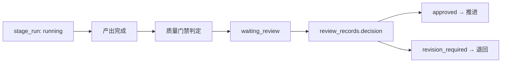

# 质量门禁（Quality Gates）

> 文档类型：质量门禁规范
> 最高约束：`docs/00-project/project-constitution.md`
> 关联：`docs/07-workflow/content-workflow.md` §8（质量门禁）/§4.2（阶段状态机）、`docs/03-database/database-design.md` §5.5（`workflow_stages.gate_schema`）/§5.7（`stage_runs.gate_result`）/§8.3-§8.4、`docs/06-skill/skill-registry.md`、`docs/00-project/decision-log.md`（ADR-006/ADR-016）
> 用途：定义质量门禁的概念、门禁契约、判定结果结构、与审查记录及阶段状态机的关系，补全 workflow §12 引用。

## 1. 定位与原则

- **门禁决定阶段能否推进**：每个阶段在产出完成后经质量门禁判定，未通过不进入下一阶段（workflow §8）。
- **门禁配置化，不写死**：门禁规则经 `workflow_stages.gate_schema` 声明，不写死在 Agent/Prompt/UI（constitution / db §5.5）。
- **门禁结果可追溯**：判定结果落 `stage_runs.gate_result` 快照；审查"是否通过"以 `review_records.decision` 为权威（ADR-006 / db §8.4）。
- **自动 + 人工**：门禁可由质量门禁 Skill 自动判定，或由人工审查，或两者结合（PRD §6.7）。

> **MVP 边界（ADR-016）**：质量门禁 Skill 的**自动化**为 P1；MVP 期门禁以**人工审查 + 基础规则校验**为主，`gate_schema`/`gate_result` 表字段建立并落地基础结构，复杂自动门禁 Skill 延后。

## 2. 门禁与状态机的关系

门禁判定驱动阶段状态流转（db §8.3，权威）：

- `gate_result` 是门禁判定**快照**（结论、得分、命中规则、审查引用），不替代审查权威（db §5.7）。
- 阶段在结论产生前停留 `waiting_review`（db §8.4）；审查结论在同一事务内驱动 `stage_runs.status`（ADR-006）。
- 审查结论四值 `approved/rejected/revision_required/terminated` 的业务落点见 workflow §4.1。

## 3. 门禁结果契约

`gate_result`（`stage_runs.gate_result`，jsonb）与质量门禁 Skill 输出统一结构（含 `schema_version`，ADR-015）：

| 字段 | 说明 |
| --- | --- |
| `result` | `passed` / `failed` / `needs_review`（需人工裁决）|
| `score` | 门禁得分（可选，依阶段定义）|
| `matched_rules` | 命中/未命中的规则清单 |
| `review_ref` | 关联审查记录引用（如进入人工审查）|
| `details` | 各检查项明细（脱敏，ADR-012）|

- 质量门禁 Skill 的输出须符合本契约（`skill-registry.md` §3），其结果进入 `gate_result` 或审查记录。
- `needs_review` 表示自动门禁无法独立裁决，转人工审查（Reviewer 角色，`agent-roles.md`）。

## 4. 阶段门禁定义（对齐 workflow §8）

各阶段门禁项（MVP 以人工审查 + 基础校验落地，自动化 Skill 为 P1）：

| 阶段 | 门禁项 | MVP 落地形式 |
| --- | --- | --- |
| 选题 | 目标、受众、渠道、验收标准完整 | 基础字段校验 + 人工确认 |
| 调研 | 来源可追溯，事实有依据 | 来源引用校验 + 人工审查 |
| 大纲 | 结构完整，逻辑清晰 | 人工审查 |
| 写作 | 覆盖大纲，无明显事实错误 | 人工审查（+ 引用标记校验）|
| 润色 | 风格一致，不改变事实 | 人工审查（阶段可跳过，ADR-017）|
| 配图 | 版权可控，图文匹配 | 版权状态校验 + 人工确认（可跳过）|
| 排版 | 格式正确，渠道适配 | 格式检查 + 人工确认（可跳过）|
| 审核 | 质量、事实、安全、合规通过 | 人工审查（必经）|
| 发布准备 | 授权通过，渠道配置有效 | 授权校验 + 人工确认（必经）|

## 5. 门禁与审查记录

- 门禁判定为 `failed` 或 `needs_review` 时创建/关联审查记录（`review_records`，db §5.11）。
- 审查结论 `revision_required`：沿当前资产链退回重做（同 run 或新建 run，见 workflow §5.4）。
- 审查结论 `rejected`：作废当前产出，强制新建 `stage_run` 重做（workflow §4.1）。
- 门禁通过（`approved`）方可推进下一阶段；下游若因回滚失效标 `stale`（workflow §5.5）。

## 6. 配置映射

| 门禁概念 | 数据落点 |
| --- | --- |
| 门禁规则定义 | `workflow_stages.gate_schema`（db §5.5）|
| 门禁判定结果 | `stage_runs.gate_result`（db §5.7）|
| 审查权威结论 | `review_records.decision`（db §5.11 / §8.4）|
| 门禁 Skill | `skill_definitions`（标记 `is_quality_gate`，`skill-registry.md` §3）|
| 门禁 Skill 调用记录 | `skill_invocations`（db §5.17）|

## 7. 禁止事项

- 禁止 Agent 自由文本绕过质量门禁；门禁结论进入阶段状态判断（workflow §11）。
- 禁止门禁规则写死在 Agent/Prompt/UI（constitution）。
- 禁止未通过审核的内容进入发布准备（workflow §11 / roadmap §7.5）。
- 禁止门禁结果覆盖审查权威结论（`review_records.decision` 为单一真相源，ADR-006）。

## 8. 关联文档

- 工作流门禁与状态机：`docs/07-workflow/content-workflow.md` §8 / §4
- Skill 注册：`docs/06-skill/skill-registry.md`
- 审查记录与状态：`docs/03-database/database-design.md` §5.11 / §8.4
- Agent 角色（Reviewer）：`docs/04-agent/agent-roles.md`
