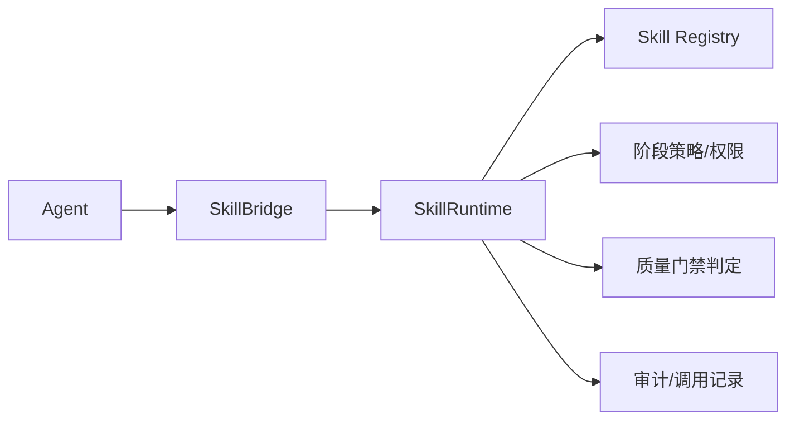
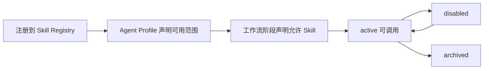

# Skill 注册规范（Skill Registry）

> 文档类型：Skill 体系注册与契约规范
> 最高约束：`docs/00-project/project-constitution.md`
> 关联：`docs/04-agent/agent-architecture.md` §10（Skill 机制）、`docs/02-architecture/system-architecture.md` §2（SkillRuntime/SkillBridge 命名）、`docs/03-database/database-design.md` §5.15（`skill_definitions`）/§5.17（`skill_invocations`）、`docs/06-skill/quality-gates.md`、`docs/00-project/decision-log.md`（ADR-005/ADR-016）
> 用途：定义 Skill 的注册模型、契约、生命周期、调用路径与治理，落实 agent §10 与 arch §16 的前置占位接口。补全 agent/mcp/workflow 多处对本文档的引用。

## 1. 定位与原则

- **Skill 是可复用领域能力或质量门禁**：Agent 可请求使用，但不能绕过工作流策略（agent §10）。
- **单路径桥接**：Skill 调用由 `SkillBridge` 执行并记录，单路径桥接到顶层 `SkillRuntime`，无第二条调用路径（ADR-005 / agent §10.1）。
- **不承载核心业务规则**：业务规则在领域层（constitution）；Skill 提供领域能力或门禁判定，不沉淀工作流规则。
- **可治理**：注册、契约、权限、调用记录可审计（db §5.17）。

> **MVP 边界（ADR-016）**：MVP 期 `skill_definitions`/`skill_invocations` **仅建表 + 配置/只读展示**，**不实现** `SkillRuntime` 真实执行；质量门禁 Skill 自动化为 P1（PRD §7.3）。本规范定义目标设计，MVP 落地范围以此边界收敛。

## 2. 调用架构

- Agent 经 `SkillBridge` 转交顶层 `SkillRuntime`（类比 `MCPBridge`→`MCPGateway`）。
- `SkillRuntime` 校验注册、阶段策略与权限后执行，结果作为结构化 Tool 结果返回 Agent（agent §10.2）。
- 质量门禁类 Skill 的结果进入审查记录或阶段状态判断（见 `quality-gates.md`）。

## 3. 注册模型

映射 `skill_definitions`（db §5.15）。

| 字段 | 类型 | 说明 |
| --- | --- | --- |
| `id` | uuid | Skill ID |
| `project_id` | uuid | 所属项目（隔离维度）|
| `name` | varchar(160) | Skill 名称（项目内唯一）|
| `trigger_schema` | jsonb | 触发条件（含 `schema_version`，ADR-015）|
| `input_schema` | jsonb | 输入契约 |
| `output_schema` | jsonb | 输出契约 |
| `status` | varchar(32) | active / disabled / archived |

补充约定：

- **名称唯一**：同项目内 `name` 不冲突。
- **质量门禁标记**：门禁类 Skill 在 `trigger_schema`/元数据标记 `is_quality_gate`，其输出须符合门禁结果契约（见 `quality-gates.md` §3）。
- **schema 版本化**：契约 JSON 内含 `schema_version`，演进据此判定兼容（ADR-015 / db §6.4）。

## 4. 接入与生命周期

- Skill 注册到 Registry（agent §10.1）。
- Agent Profile 经 `skill_policy` 声明可用 Skill 范围（agent §14.2）。
- 工作流阶段声明允许使用的 Skill（agent §10.1）。
- 状态与 `skill_definitions.status` 对齐（active/disabled/archived）。

## 5. 调用规则

- Agent 请求 Skill 必须包含**目的、输入、期望输出**（agent §10.2）。
- `SkillBridge` 依阶段策略判断是否允许；越权或未声明范围拒绝。
- 输入按 `input_schema` 校验，非法直接拒绝并返回结构化错误（对齐 agent §9.5）。
- Skill 输出作为结构化 Tool 结果返回 Agent；质量门禁结果进入审查记录或阶段状态判断。
- Skill 使用 MCP 必须声明依赖与权限，统一经 MCP Gateway（mcp §14）。

## 6. 调用记录与审计

映射 `skill_invocations`（db §5.17，字段同 `tool_invocations`，将 `mcp_tool_id` 替换为 `skill_definition_id`）。

- 含 `project_id`（RLS/谓词隔离，ADR-009）、`caller_type`/`caller_id`、`status`、`risk_level`、`input_data`（脱敏快照）、`duration_ms`。
- 纳入统一执行时间线视图 `v_invocations`（`kind=skill`），支撑调用追溯（db §5.17 / ui §3.2）。
- 有副作用的 Skill 携带幂等键去重（ADR-022）。

## 7. 治理与禁止事项

- Skill 不得绕过项目宪法与工作流策略（PRD §6.9）。
- Skill 不得承载核心业务规则。
- 质量门禁 Skill 不得被 Agent 自由文本绕过；门禁结论进入阶段状态判断（见 `quality-gates.md`）。
- 敏感上下文遵循 `sensitivity_level` 传播控制（db §9.3）。

## 8. 关联文档

- Skill 机制（架构层）：`docs/04-agent/agent-architecture.md` §10
- 质量门禁：`docs/06-skill/quality-gates.md`
- 数据表：`docs/03-database/database-design.md` §5.15 / §5.17
- 决策记录：`docs/00-project/decision-log.md`
