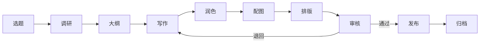
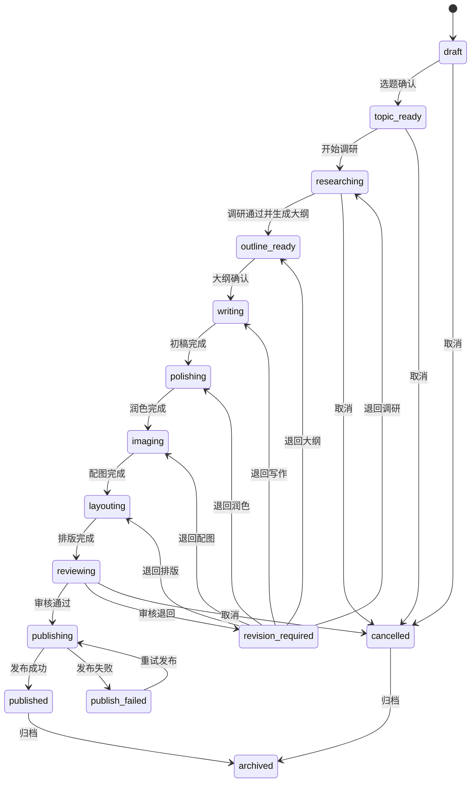
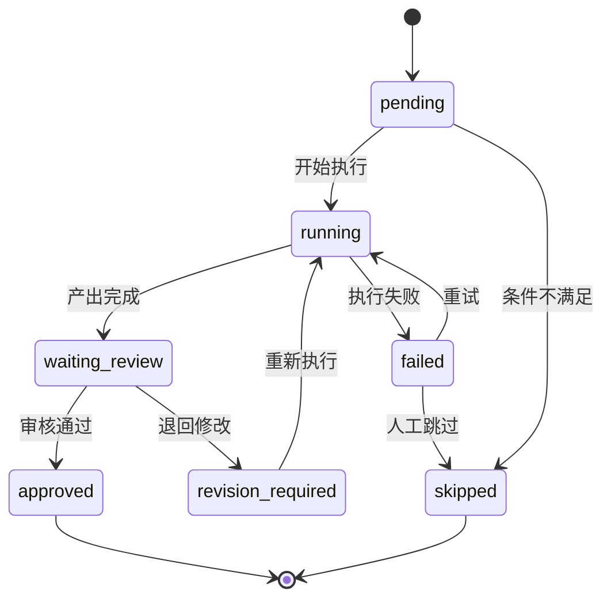
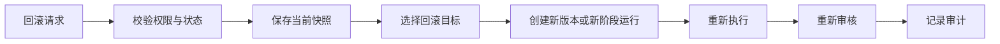
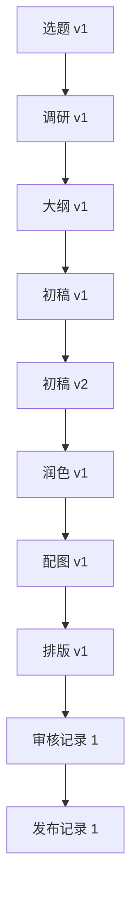
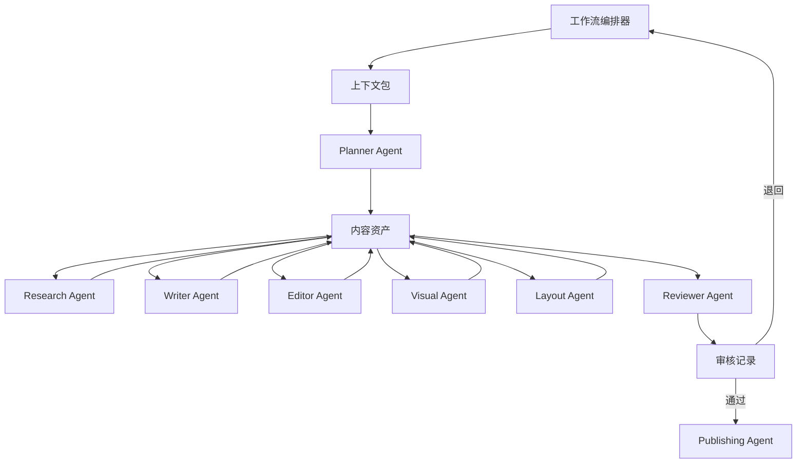
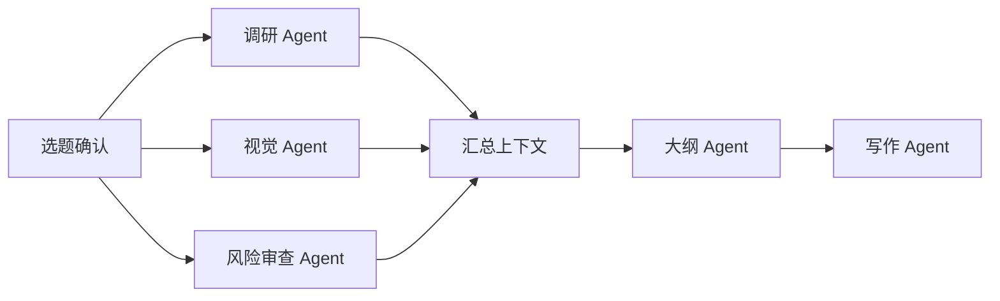

# 内容生产工作流

## 1. 设计目标

内容生产工作流用于将选题从初始想法推进到可发布内容，并保证每个阶段具备明确输入、输出、执行者、质量门禁、版本记录和回滚策略。

工作流必须遵守：

- 业务规则属于领域层和工作流定义，不写死在 Agent、Prompt、MCP、Skill、插件或 UI 中。
- 每个阶段产出必须持久化为内容资产或审查记录，不能只存在于聊天上下文。
- Agent 是阶段执行者，不是业务规则所有者。
- 发布动作必须经过审核与明确授权。

## 2. 标准阶段

标准内容生产流程包含：选题、调研、大纲、写作、润色、配图、排版、审核、发布。

## 3. 阶段设计

### 3.1 选题

目标：将内容想法转化为可执行选题。

| 项目 | 内容 |
| --- | --- |
| 输入 | 用户想法、目标受众、渠道、内容类型、业务目标 |
| 输出 | 选题卡、标题候选、目标读者、内容角度、验收标准 |
| 主要执行者 | Planner Agent、人工负责人 |
| 质量门禁 | 目标清晰、受众明确、渠道匹配、可执行 |
| 资产类型 | `topic_brief` |

规则：

- 选题必须明确内容目标和目标用户。
- 不允许直接从模糊想法进入写作阶段。
- 选题变更必须生成新版本。

### 3.2 调研

目标：收集事实、背景、竞品、引用来源和内容素材。

| 项目 | 内容 |
| --- | --- |
| 输入 | 选题卡、目标受众、关键词、渠道约束 |
| 输出 | 调研摘要、来源列表、事实清单、风险点、可引用材料 |
| 主要执行者 | Research Agent、MCP 搜索工具 |
| 质量门禁 | 来源可追溯、关键事实有依据、风险点已标注 |
| 资产类型 | `research_report` |

规则：

- 调研必须记录来源引用。
- MCP 结果必须经过 Agent 或人工整理后进入资产。
- 未验证事实不得进入最终稿。

### 3.3 大纲

目标：基于选题和调研生成内容结构。

| 项目 | 内容 |
| --- | --- |
| 输入 | 选题卡、调研报告、渠道格式要求 |
| 输出 | 一级结构、二级要点、论证顺序、CTA、缺口清单 |
| 主要执行者 | Planner Agent、Writer Agent |
| 质量门禁 | 结构完整、逻辑清晰、覆盖核心诉求 |
| 资产类型 | `outline` |

规则：

- 大纲必须显式引用调研结论。
- 大纲通过后才能进入写作。
- 大纲变更会影响后续写作和排版版本。

### 3.4 写作

目标：生成符合大纲、语气和渠道要求的初稿。

| 项目 | 内容 |
| --- | --- |
| 输入 | 大纲、调研报告、风格要求、渠道约束 |
| 输出 | 初稿、未决问题、事实引用标记 |
| 主要执行者 | Writer Agent |
| 质量门禁 | 覆盖大纲、语言通顺、引用可追溯、无明显事实错误 |
| 资产类型 | `draft` |

规则：

- 写作不得绕过已通过的大纲。
- 初稿必须保留来源引用或事实依据标记。
- 重大改写生成新资产版本。

### 3.5 润色

目标：优化语言、节奏、风格、一致性和可读性。

| 项目 | 内容 |
| --- | --- |
| 输入 | 初稿、品牌语气、渠道规范、审查意见 |
| 输出 | 润色稿、修改摘要、风格一致性说明 |
| 主要执行者 | Editor Agent、Reviewer Agent |
| 质量门禁 | 风格一致、表达清晰、结构未被破坏 |
| 资产类型 | `polished_draft` |

规则：

- 润色不得改变事实含义。
- 风格改动必须保留修改摘要。
- 若发现事实问题，回滚到调研或写作阶段处理。

### 3.6 配图

目标：生成或选择符合内容语义、渠道规格和版权要求的图片方案。

| 项目 | 内容 |
| --- | --- |
| 输入 | 润色稿、视觉风格、渠道尺寸、版权约束 |
| 输出 | 配图需求、图片候选、Alt 文本、版权记录 |
| 主要执行者 | Visual Agent、MCP 图片工具、人工负责人 |
| 质量门禁 | 图文匹配、尺寸合规、版权可控、无敏感风险 |
| 资产类型 | `image_plan`, `image_asset` |

规则：

- 配图不得使用来源不明素材。
- AI 生成图片必须记录生成参数或工具引用。
- 高风险图片必须人工确认。

### 3.7 排版

目标：将内容和图片组织为目标渠道可发布格式。

| 项目 | 内容 |
| --- | --- |
| 输入 | 润色稿、配图、渠道模板、排版规范 |
| 输出 | 排版稿、渠道预览、格式检查结果 |
| 主要执行者 | Layout Agent、Plugin、人工负责人 |
| 质量门禁 | 格式正确、图片位置合理、链接和 CTA 正常 |
| 资产类型 | `layout_draft` |

规则：

- 排版只处理呈现结构，不修改核心事实。
- 渠道模板由配置或插件提供，不写死在业务代码中。
- 排版产物必须可预览和回滚。

### 3.8 审核

目标：确认内容质量、事实、品牌、安全、合规和发布条件。

| 项目 | 内容 |
| --- | --- |
| 输入 | 排版稿、全部阶段资产、审查清单 |
| 输出 | 审核结论、修改意见、发布许可或退回原因 |
| 主要执行者 | Reviewer Agent、人工审核人 |
| 质量门禁 | 人工或策略通过 |
| 资产类型 | `review_record` |

规则：

- 审核结论必须持久化。
- 未通过审核不得发布。
- 审核可退回到写作、润色、配图、排版或调研阶段。

### 3.9 发布

目标：将审核通过的内容准备或提交到发布渠道。

| 项目 | 内容 |
| --- | --- |
| 输入 | 审核通过的排版稿、发布渠道、发布时间、授权信息 |
| 输出 | 发布记录、渠道链接、发布状态、失败原因 |
| 主要执行者 | Publishing Agent、发布插件、人工负责人 |
| 质量门禁 | 审核通过、授权通过、渠道配置有效 |
| 资产类型 | `publish_record` |

规则：

- 发布必须显式授权。
- 自动发布到外部平台属于高风险动作，必须遵守 MCP 和插件权限策略。
- 发布失败不得修改最终稿版本，只记录失败状态和原因。

## 4. 状态流转图

### 4.1 工作流状态

### 4.2 阶段状态

## 5. 回滚机制

回滚用于从当前阶段退回到某个历史稳定点，并生成新的执行分支或版本。

### 5.1 回滚类型

| 类型 | 说明 | 示例 |
| --- | --- | --- |
| 阶段回滚 | 退回到指定阶段重新执行 | 审核退回写作 |
| 资产回滚 | 恢复某个内容资产版本 | 恢复初稿 v2 |
| 配置回滚 | 使用旧工作流或模板配置重新执行 | 回滚排版模板 |
| 发布回滚 | 撤销或修正发布记录 | 下架或重新发布 |

### 5.2 回滚流程

### 5.3 回滚规则

- 回滚不删除历史版本。
- 回滚必须记录原因、操作者、目标版本和影响范围。
- 已发布内容回滚必须生成发布修正记录，不直接覆盖历史发布记录。
- 回滚后重新执行的阶段必须生成新的 `stage_run` 和资产版本。

## 6. 版本机制

### 6.1 版本对象

| 对象 | 版本规则 |
| --- | --- |
| 选题卡 | 选题目标或角度变更生成新版本 |
| 调研报告 | 新增关键来源或事实修正生成新版本 |
| 大纲 | 结构变化生成新版本 |
| 初稿 | 每次完整写作或大改生成新版本 |
| 润色稿 | 每次风格或语言修订生成新版本 |
| 配图 | 图片候选、版权、参数变化生成新版本 |
| 排版稿 | 渠道模板或布局变化生成新版本 |
| 审核记录 | 每次审核生成独立记录，不覆盖旧记录 |
| 发布记录 | 每次发布或重试生成独立记录 |

### 6.2 版本链路

### 6.3 版本规则

- 资产版本只追加，不覆盖。
- 当前版本由内容资产记录指向。
- 每个版本必须记录来源阶段、创建者、时间、摘要和校验值。
- Agent 输出版本必须保留原始输出和标准化输出引用。

## 7. 多 Agent 协作机制

### 7.1 Agent 角色

| 角色 | 职责 | 典型阶段 |
| --- | --- | --- |
| Planner Agent | 选题拆解、大纲规划、流程决策建议 | 选题、大纲 |
| Research Agent | 搜索、整理、引用、事实核查 | 调研 |
| Writer Agent | 初稿生成、结构化写作 | 写作 |
| Editor Agent | 语言润色、风格统一 | 润色 |
| Visual Agent | 配图方案、图片提示词、Alt 文本 | 配图 |
| Layout Agent | 渠道排版、格式检查 | 排版 |
| Reviewer Agent | 质量、事实、风险、合规审查 | 审核 |
| Publishing Agent | 发布准备、渠道提交、发布记录 | 发布 |

### 7.2 协作模式

### 7.3 多 Agent 并行

调研、配图建议、风险审查可以并行执行，但写作和审核必须依赖明确版本。

### 7.4 协作规则

- 每个 Agent 只处理当前阶段授权范围。
- Agent 间不直接共享隐式聊天上下文，必须通过 `ContextPack` 和 `ContentAsset` 传递。
- 并行 Agent 产出必须经过汇总阶段形成统一上下文。
- 冲突结论必须进入审核或人工决策。
- Reviewer Agent 不得直接修改最终内容，只提出结论和建议。

## 8. 质量门禁

| 阶段 | 门禁 |
| --- | --- |
| 选题 | 目标、受众、渠道、验收标准完整 |
| 调研 | 来源可追溯，事实有依据 |
| 大纲 | 结构完整，逻辑清晰 |
| 写作 | 覆盖大纲，无明显事实错误 |
| 润色 | 风格一致，不改变事实 |
| 配图 | 版权可控，图文匹配 |
| 排版 | 格式正确，渠道适配 |
| 审核 | 质量、事实、安全、合规通过 |
| 发布 | 授权通过，渠道配置有效 |

## 9. 数据映射

| 工作流对象 | 数据表 |
| --- | --- |
| 内容任务 | `content_tasks` |
| 工作流定义 | `workflow_definitions` |
| 阶段定义 | `workflow_stages` |
| 工作流运行 | `workflow_runs` |
| 阶段运行 | `stage_runs` |
| 上下文包 | `context_packs` |
| 内容资产 | `content_assets` |
| 资产版本 | `asset_versions` |
| 审核记录 | `review_records` |
| 发布记录 | 可先使用 `content_assets` + `audit_events`，后续扩展 `publish_records` |
| 审计事件 | `audit_events` |

## 10. 发布控制

发布阶段必须满足：

- 审核状态为通过。
- 发布渠道配置有效。
- 发布权限通过策略校验。
- 外部平台或生产环境调用已获得授权。
- 发布内容版本固定，不使用可变草稿。

发布输出必须记录：

- 发布渠道。
- 发布版本。
- 发布时间。
- 发布操作者或 Agent。
- 外部链接或失败原因。
- 回滚或修正入口。

## 11. 禁止事项

- 禁止跳过选题、调研、大纲直接进入写作。
- 禁止未审核内容进入发布阶段。
- 禁止把 Agent 聊天记录作为唯一阶段产出。
- 禁止 Agent 之间通过隐式上下文传递关键事实。
- 禁止覆盖历史资产版本。
- 禁止发布动作绕过权限与人工确认。
- 禁止在工作流中写死具体 Agent、MCP、Skill 或插件实现。

## 12. 后续细化文档

- Agent 角色矩阵：`docs/04-agent/agent-roles.md`
- MCP 工具契约：`docs/05-mcp/tool-contracts.md`
- Skill 质量门禁：`docs/06-skill/quality-gates.md`
- API 契约：`docs/09-api/api-overview.md`
- UI 工作台：`docs/08-ui/information-architecture.md`
