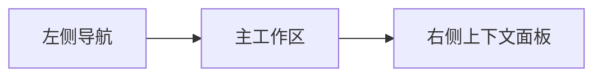
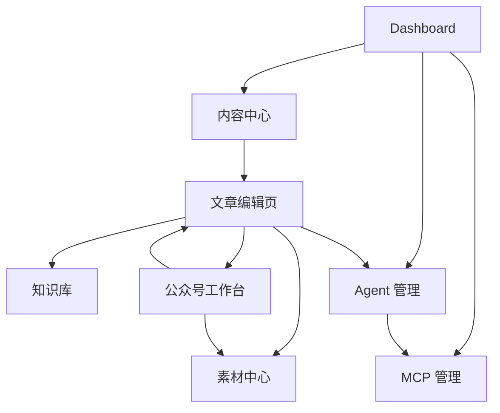
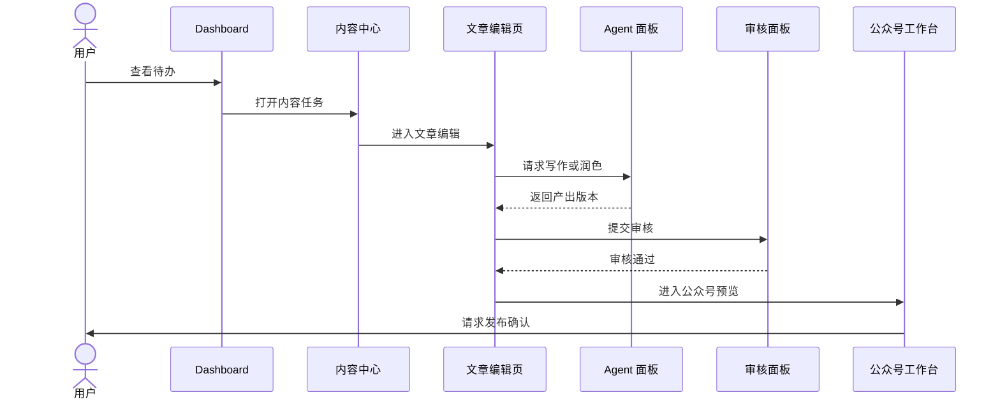
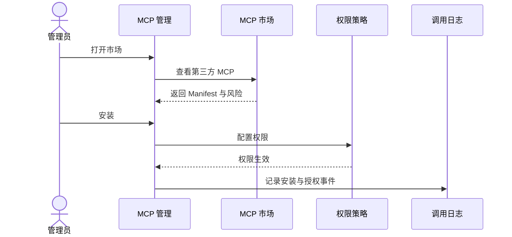

# UI 设计

## 1. 设计目标

Content Factory 的 UI 是面向内容生产、AI Agent 编排和工作流治理的专业工作台。界面需要兼顾 Notion 的内容组织能力、Cursor 的 AI 协作体验、Linear 的任务效率与状态清晰度。

设计目标：

- 让用户快速掌握内容生产状态。
- 让内容、素材、知识、Agent、MCP 和公众号发布流程在同一工作台内协作。
- 保证关键状态、风险、审查、发布动作可见、可控、可追踪。
- 前端只负责呈现和交互，不承载核心业务规则。

## 2. 设计参考

| 参考产品 | 借鉴点 | 应用方式 |
| --- | --- | --- |
| Notion | 文档块、侧边导航、内容资产组织、轻量编辑 | 知识库、文章编辑页、素材关联 |
| Cursor | AI 面板、上下文提示、Agent 协作、命令式交互 | Agent 任务侧栏、AI 操作面板、上下文包预览 |
| Linear | 高密度任务列表、状态流、快捷操作、清晰层级 | Dashboard、内容中心、工作流状态、审核队列 |

## 3. 信息架构

导航深度控制在 3 层以内，主导航聚焦高频工作流。

```mermaid
flowchart TB
    App[Content Factory]
    Dashboard[Dashboard]
    Content[内容中心]
    Editor[文章编辑页]
    Assets[素材中心]
    Knowledge[知识库]
    Agents[Agent 管理]
    MCP[MCP 管理]
    WeChat[公众号工作台]
    Settings[项目设置]

    App --> Dashboard
    App --> Content
    Content --> Editor
    App --> Assets
    App --> Knowledge
    App --> Agents
    App --> MCP
    App --> WeChat
    App --> Settings

    Content --> Tasks[任务列表]
    Content --> Workflow[工作流视图]
    Content --> Review[审核队列]
    Assets --> Images[图片素材]
    Assets --> References[引用资料]
    Knowledge --> Docs[知识文档]
    Knowledge --> Context[上下文包]
    Agents --> AgentProfiles[Agent 配置]
    Agents --> Sessions[Agent Sessions]
    MCP --> Servers[MCP Servers]
    MCP --> Tools[MCP Tools]
    WeChat --> Drafts[公众号草稿]
    WeChat --> Publish[发布记录]
    App --> Workflows[工作流设计器]
    App --> Skills[Skill 管理]
    App --> Plugins[插件管理]
    App --> Channels[发布渠道]
    Workflows --> WfTemplates[模板与版本]
    Skills --> SkillRegistry[Skill 注册与门禁]
    Plugins --> PluginsInstalled[已安装与市场]
    Channels --> ChannelConfig[渠道配置]
    Settings --> Members[成员与角色]
```



> §3 为高层导航骨架（聚焦主干，导航 3 层内），完整路由以 §4 页面树为权威；图中二级节点为代表性展示，三级叶子（如 capabilities/logs/marketplace/materials/gates 等）不在骨架穷举，以页面树为准。

### 3.1 UI 模块与架构模块映射

UI 页面承载架构 §3.1 的六个前端模块，避免命名漂移与执行监控/审查工作台被弱化为附属视图：

| 架构模块（arch §3.1）| UI 承载页 |
| --- | --- |
| 任务中心 | Dashboard、内容中心（任务列表）|
| 工作流设计器 | 工作流设计器（§23）|
| 执行监控 | 任务详情/文章编辑页的阶段与 Agent 输出视图、Dashboard 运行态，依实时通道（§22）推进 |
| 审查工作台 | 内容中心-审核队列、文章编辑页审查动作（通过/退回/修订/终止）|
| 资产库 | 素材中心、知识库 |
| 配置中心 | Agent 管理、MCP 管理、Skill 管理、插件管理、发布渠道、项目设置 |

### 3.2 调用追溯视图

执行监控提供统一「调用追溯视图」，按 `stage_run` 聚合该阶段全部 Agent / 工具 / Skill / 插件调用（数据源 `database-design.md` §5.17 `v_invocations`）：

| 列 | 内容 |
| --- | --- |
| 调用方 / 类型 | `caller_type` + 类别（agent/tool/skill/plugin）|
| 状态 | succeeded / failed / denied / timeout |
| 风险 | `risk_level`，高风险标记 |
| 耗时 | `duration_ms` |
| 输入 / 输出 | 摘要展开，敏感值已脱敏 |

支撑 PRD §6.5 上下文可追溯与 §7.5 可追溯率硬指标；入口挂在任务详情 / 文章编辑页与 Dashboard 运行态。

## 4. 页面树

```text
/
├── dashboard
├── content
│   ├── tasks
│   ├── tasks/:taskId
│   ├── tasks/:taskId/editor
│   ├── tasks/:taskId/workflow
│   └── review
├── workflows
│   ├── templates
│   ├── :workflowId/designer
│   └── :workflowId/versions
├── assets
│   ├── materials
│   ├── images
│   └── references
├── knowledge
│   ├── documents
│   ├── context-packs
│   └── sources
├── agents
│   ├── profiles
│   ├── sessions
│   └── capabilities
├── mcp
│   ├── servers
│   ├── tools
│   ├── logs
│   └── marketplace
├── skills
│   ├── registry
│   └── gates
├── plugins
│   ├── installed
│   └── marketplace
├── channels
│   ├── list
│   └── :channelId/config
├── wechat
│   ├── workspace
│   ├── drafts
│   ├── preview
│   └── publish-records
└── settings
    ├── project
    ├── members
    ├── roles
    ├── permissions
    └── integrations
```

## 5. 全局布局设计

### 5.1 桌面布局

采用三栏工作台：左侧主导航，中间主工作区，右侧上下文面板。



```text
┌──────────────────────────────────────────────────────────────┐
│ Top Bar: 项目切换 / 全局搜索 / 新建 / 通知 / 用户             │
├──────────────┬────────────────────────────┬──────────────────┤
│ Sidebar      │ Main Workspace             │ Context Panel    │
│ Dashboard    │ 页面标题 / 过滤 / 内容     │ Agent / 审查 /   │
│ Content      │ 表格 / 编辑器 / 看板       │ 版本 / 日志      │
│ Assets       │                            │                  │
│ Knowledge    │                            │                  │
│ Agents       │                            │                  │
│ MCP          │                            │                  │
│ WeChat       │                            │                  │
└──────────────┴────────────────────────────┴──────────────────┘
```

### 5.2 响应式布局

| 宽度 | 布局 |
| --- | --- |
| ≥1280px | 三栏布局，右侧上下文常驻 |
| 1024-1279px | 左侧收窄，右侧可折叠 |
| 768-1023px | 双栏布局，右侧抽屉 |
| <768px | 单栏布局，底部导航或抽屉导航 |

### 5.3 布局原则

- 关键状态始终可见。
- 右侧上下文面板用于 Agent、版本、审查、日志，不打断主工作区。
- 高风险动作使用确认弹窗，不使用仅 Toast 的轻提示。
- 列表页支持键盘快捷操作。

## 6. 视觉系统

### 6.1 视觉方向

- Notion 式低噪音内容画布。
- Cursor 式深色友好的 AI 面板。
- Linear 式高密度列表、状态色和快捷操作。

### 6.2 色彩

| Token | 用途 |
| --- | --- |
| `bg-canvas` | 页面背景 |
| `bg-surface` | 卡片、面板 |
| `bg-subtle` | 次级区域 |
| `text-primary` | 主文本 |
| `text-secondary` | 次级文本 |
| `border-muted` | 分割线 |
| `accent-primary` | 主操作、选中态 |
| `status-running` | 执行中 |
| `status-review` | 待审核 |
| `status-success` | 已完成 |
| `status-warning` | 需处理 |
| `status-danger` | 失败或风险 |

### 6.3 排版与间距

- 基准字号 14-16px。
- 正文行高 1.5-1.7。
- 使用 8px 间距体系。
- 表格和列表保持高信息密度，但行高不低于 36px。
- 标题层级最多 4 级。

## 7. 通用组件设计

| 组件 | 用途 |
| --- | --- |
| `AppShell` | 全局布局容器 |
| `SidebarNav` | 主导航 |
| `TopBar` | 项目切换、搜索、创建、通知 |
| `CommandMenu` | 全局命令面板 |
| `StatusBadge` | 任务、阶段、Agent、MCP 状态 |
| `WorkflowTimeline` | 工作流阶段进度 |
| `AgentActivityPanel` | Agent 会话、输出、工具调用 |
| `ContextPanel` | 右侧上下文面板 |
| `AssetCard` | 内容、素材、知识资产卡片 |
| `ReviewPanel` | 审核意见、门禁结果、决策按钮 |
| `VersionHistory` | 资产版本链路 |
| `RiskConfirmDialog` | 高风险动作确认 |
| `EmptyState` | 空状态引导 |
| `Skeleton` | 加载骨架 |
| `DataTable` | 高密度数据表 |
| `SplitEditor` | 编辑器 + 预览分栏 |

## 8. 交互设计原则

- 系统状态可见：任务状态、阶段状态、Agent 运行、MCP 调用必须可见。
- 识别优于回忆：工作流阶段、上下文来源、版本链路直接展示。
- 用户可控：支持暂停、退回、重试、取消、回滚。
- 防错优先：发布、生产环境调用、敏感数据发送必须确认。
- 快捷高效：常用操作支持命令面板和快捷键。
- 渐进披露：默认展示关键摘要，详情进入右侧面板或详情页。

## 9. Dashboard

### 9.1 页面目标

展示整个内容工厂的运行状态，帮助用户快速判断：哪些任务在执行、哪些待审核、哪些失败、哪些即将发布。

### 9.2 页面结构

```text
Dashboard
├── KPI 概览
│   ├── 进行中任务
│   ├── 待审核
│   ├── 发布准备
│   └── 失败/阻塞
├── 今日工作队列
├── 工作流运行状态
├── Agent 活动
├── MCP 风险与错误
└── 最近发布/归档
```

### 9.3 关键组件

- `MetricCard`
- `WorkQueueList`
- `WorkflowHealthChart`
- `AgentActivityFeed`
- `MCPAlertList`
- `RecentPublishList`

### 9.4 交互

- 点击 KPI 进入过滤后的内容中心。
- 待审核卡片可直接打开审核面板。
- Agent 活动点击后打开 Session 详情。
- MCP 错误点击后进入 MCP 日志页。

## 10. 内容中心

### 10.1 页面目标

管理内容任务、工作流状态、审核队列和任务优先级。

### 10.2 页面结构

```text
内容中心
├── 视图切换：列表 / 看板 / 日历 / 审核
├── 过滤器：状态 / 类型 / 负责人 / 渠道 / 优先级
├── 任务列表
│   ├── 标题
│   ├── 状态
│   ├── 当前阶段
│   ├── 负责人
│   ├── Agent
│   ├── 更新时间
│   └── 风险提示
└── 右侧任务摘要面板
```

### 10.3 列表视图

参考 Linear，高密度展示任务。

```text
┌────────────────────────────────────────────────────────────┐
│ New Task  Filter  View: List / Board / Review              │
├────┬─────────────────────────┬────────┬────────┬───────────┤
│ 状态│ 标题                    │ 阶段   │ 负责人 │ 更新时间  │
├────┼─────────────────────────┼────────┼────────┼───────────┤
│ RUN│ AI Agent 内容工厂 PRD    │ 审核   │ SGY    │ 10m ago   │
│ REV│ 公众号文章：MCP 市场     │ 排版   │ SGY    │ 1h ago    │
└────┴─────────────────────────┴────────┴────────┴───────────┘
```

状态徽章映射领域任务状态机（`database-design.md` §8.1）：

| 徽章 | 领域状态 | 含义 |
| --- | --- | --- |
| DRAFT | draft | 草稿待确认 |
| READY | ready | 已确认待启动 |
| RUN | running | 执行中 |
| REV | waiting_review | 等待审查 |
| REVISE | revision_required | 退回修改 |
| DONE | completed | 已完成 |
| FAIL | failed | 执行失败 |
| CANCEL | cancelled | 已取消 |
| ARCH | archived | 已归档 |

徽章不仅以颜色区分（§21），同时显示文本；工作流级 `terminated`（人工终止，见 wf §4.1）在任务详情单独标注。

### 10.4 交互

- `N` 新建任务。
- `/` 聚焦搜索。
- `F` 打开过滤器。
- `Enter` 打开任务。
- 任务行右键或更多菜单支持：启动、暂停、退回、归档。

## 11. 文章编辑页

### 11.1 页面目标

提供内容编辑、版本管理、Agent 协作、审查和预览能力。

### 11.2 页面结构

```text
文章编辑页
├── 顶部：任务标题 / 状态 / 当前阶段 / 保存状态 / 审核按钮
├── 左侧：文档大纲 / 阶段资产
├── 中间：块编辑器 / Markdown 编辑器
├── 右侧：Agent 面板 / 版本 / 审核 / 上下文
└── 底部：字数 / 渠道适配 / 风险提示
```

### 11.3 编辑模式

| 模式 | 用途 |
| --- | --- |
| Write | 正文编辑 |
| Review | 审核意见与修改建议 |
| Compare | 版本对比 |
| Preview | 渠道预览 |
| Agent | Agent 协作与生成 |

### 11.4 交互

- 选中文本后可调用 Agent：改写、扩写、压缩、换风格、检查事实。
- 右侧 Agent 面板显示当前上下文包和可用工具。
- 保存生成新草稿版本，不覆盖已审核版本。
- 发布前锁定版本，禁止使用未审核草稿。

## 12. 素材中心

### 12.1 页面目标

管理研究材料、图片、引用、附件和可复用素材。

### 12.2 页面结构

```text
素材中心
├── 素材类型：全部 / 图片 / 引用 / 附件 / 调研 / 模板
├── 搜索与标签
├── 素材网格或列表
├── 素材详情
│   ├── 来源
│   ├── 版权
│   ├── 关联任务
│   ├── 使用历史
│   └── 风险提示
└── 上传 / 导入 / 从 MCP 获取
```

### 12.3 交互

- 拖拽上传素材。
- 素材可关联文章、阶段、版本。
- 图片素材必须显示版权状态。
- 引用素材必须显示来源 URL、抓取时间、可信度。

## 13. 知识库

### 13.1 页面目标

沉淀长期可复用知识、品牌规范、选题库、上下文包和外部来源。

### 13.2 页面结构

```text
知识库
├── 文档树
├── 知识文档编辑区
├── 标签与来源
├── 上下文包列表
├── 关联工作流与任务
└── 检索测试面板
```

### 13.3 交互

- 支持 Notion 风格文档树和块编辑。
- 支持将知识条目加入 Agent 上下文包。
- 支持查看知识被哪些任务引用。
- 支持检索测试，验证 Agent 能否找到正确上下文。

## 14. Agent 管理

### 14.1 页面目标

管理 Agent Profile、能力、Session、状态、权限和执行记录。

### 14.2 页面结构

```text
Agent 管理
├── Agent 列表
│   ├── 名称
│   ├── Provider
│   ├── 角色
│   ├── 状态
│   ├── 能力
│   └── 最近执行
├── Agent 配置详情
│   ├── 运行方式
│   ├── 能力声明
│   ├── Tool / Skill / MCP 权限
│   ├── WSL 配置
│   └── 输出 Schema
├── Session 列表
└── Session 详情
```

### 14.3 交互

- 支持 Agent 健康检查。
- 支持启用、禁用、归档。
- 支持查看 Session 消息、工具调用、错误和审查结果。
- 高风险权限修改需要确认。

## 15. MCP 管理

### 15.1 页面目标

管理 MCP Server、Tool、权限、日志、热加载和市场安装。

### 15.2 页面结构

```text
MCP 管理
├── MCP Server 列表
├── Tool 清单
├── 权限策略
├── 调用日志
├── 热加载状态
└── MCP 市场
```

### 15.3 交互

- 安装第三方 MCP 前展示 Manifest、权限和风险等级。
- 支持启动、停止、重载、禁用、卸载。
- Tool 调用日志支持按任务、阶段、Agent、状态过滤。
- 高风险 MCP 默认禁用。

## 16. 公众号工作台

### 16.1 页面目标

面向微信公众号内容生产，提供文章排版、预览、素材关联、审核和发布准备能力。

### 16.2 页面结构

```text
公众号工作台
├── 文章草稿
├── 微信样式预览
├── 封面与摘要
├── 图片素材
├── 排版检查
├── 审核状态
├── 发布设置
└── 发布记录
```

### 16.3 关键能力

- 微信图文预览。
- 标题、摘要、封面图管理。
- 正文排版检查。
- 图片尺寸和版权检查。
- 发布前审核锁定版本。
- 发布记录和回滚入口。

### 16.4 发布控制

- 未审核通过不可发布。
- 未配置公众号集成不可发布。
- 发布属于外部平台动作，必须确认。
- 发布失败展示原因，不覆盖最终稿。

## 17. 页面关系图



## 18. 核心用户流程

### 18.1 从任务到发布



### 18.2 安装并授权 MCP



## 19. 空状态与错误状态

| 场景 | 设计 |
| --- | --- |
| 无任务 | 展示新建任务按钮和示例流程 |
| 无素材 | 提供上传、导入、MCP 获取入口 |
| 无 Agent | 提供发现和注册 Agent 入口 |
| 无 MCP | 提供安装内置 MCP 和打开市场入口 |
| Agent 执行失败 | 展示错误摘要、日志、重试、切换 Agent |
| MCP 权限拒绝 | 展示拒绝原因、所需权限、申请入口 |
| 发布失败 | 展示渠道错误、重试、回滚、人工处理 |

全局错误与加载态（跨页面统一处理）：

| 场景 | 设计 |
| --- | --- |
| 未认证 401 | 跳转登录并保留来源路由；会话过期提示重新登录 |
| 无权限 403 | 展示无权限说明与申请入口，不暴露受限数据 |
| 网络错误 / 超时 | 全局提示 + 重试，区分可重试与不可重试 |
| 实时通道断连 | 标识「连接中断」并自动重连、回退轮询（§22），恢复后补拉最新状态 |
| 加载中 | 骨架屏（§21），关键区域占位 |
| 分页 / 加载失败 | 局部错误条 + 重新加载，不清空已加载数据 |
| 服务端错误 5xx | 友好降级页 + 错误参考号，引导反馈 |

## 20. 权限与风险交互

高风险动作必须使用阻断式确认：

- 发布到公众号。
- 调用生产环境 API。
- 发送敏感数据给外部 MCP。
- 启用高风险第三方 MCP。
- 修改 Agent 全局权限。
- 删除或归档关键配置。

确认弹窗必须展示：操作类型、影响范围、风险评估、执行对象、确认按钮。

> 高风险动作清单与确认要求由后端风险策略（`system-architecture.md` §13、`mcp-architecture.md` §8 权限与风险）驱动并下发，前端仅按返回的风险元数据（如 `requires_confirmation`、`risk_level`）渲染弹窗，不在前端硬编码业务判定规则，避免业务规则泄漏到 UI；确认令牌绑定见 `mcp-architecture.md` §8.4。

## 21. 可访问性与性能

- 关键操作支持键盘访问。
- 所有按钮和图标必须有可识别标签。
- 状态不能只依赖颜色表达。
- 列表和编辑器使用骨架屏。
- 长列表使用分页或虚拟滚动。
- 动画遵守 `prefers-reduced-motion`。
- 色彩对比度满足 WCAG AA。

## 22. 实时更新通道

Agent 长会话、后台 Session 与工作流阶段推进是异步的（见 `docs/02-architecture/system-architecture.md` §14.1、§15.1）。前端必须通过实时通道呈现流式输出与状态变化，且实时数据仅用于展示，权威状态以后端为准。

### 22.1 通道选型

- 默认使用 SSE 承载服务端单向推送（Agent 流式输出、状态变更、工具调用事件）；需要双向交互的场景（如交互式 Session 输入）使用 WebSocket。
- 通道不可用时回退到轮询，回退对用户透明，仅降低实时性。

### 22.2 订阅粒度

| 粒度 | 用途 |
| --- | --- |
| task | 任务级状态与阶段推进 |
| stage_run | 单阶段执行状态与门禁结果 |
| session | Agent 会话流式输出、消息、工具调用 |

### 22.3 消息类型

| 类型 | 说明 |
| --- | --- |
| `status_change` | 任务 / 阶段 / Session 状态流转 |
| `agent_token` | Agent 流式增量输出 |
| `tool_call` | 工具 / MCP 调用开始与结果 |
| `review_event` | 审查创建、结论 |
| `error` | 执行失败、连接异常 |

### 22.4 连接与一致性

- 断线自动重连并按最后事件序号续传；持续失败回退轮询并提示连接降级。
- 实时事件不写入前端权威状态，刷新后以后端查询结果为准（遵守 §27 前端状态非权威原则）。
- 敏感内容遵循后端可见性标记，不在 `user_visible` 之外的通道下发。

## 23. 工作流设计器

### 23.1 页面目标

可视化定义与编排工作流模板：阶段、依赖、执行者、质量门禁与版本，对应 PRD §6.3 与架构 §3.1「工作流设计器」。

### 23.2 页面结构

```text
工作流设计器
├── 模板列表（含版本、状态：draft / active / deprecated）
├── 阶段编排画布
│   ├── 阶段节点（key / name / executor_type）
│   ├── 依赖连线（finish_to_start / join_all / join_any）
│   └── 并行分组
├── 阶段配置面板
│   ├── 输入 / 输出契约
│   ├── 执行者绑定（按能力，不绑定具体 Provider）
│   └── 质量门禁配置
└── 版本与发布（新建版本不覆盖、运行中实例不自动升级）
```

### 23.3 交互

- 阶段依赖以 `workflow_stage_dependencies`（DB §5.5.1）为权威，画布编辑产生依赖记录，保存前校验无环。
- 执行者按能力需求绑定，由后端能力匹配选择 Agent（agent §4.4），前端不写死 Provider。
- 模板发布创建新版本（DB §9.1），不修改运行中实例。
- 门禁配置映射 `workflow_stages.gate_schema`，前端不实现门禁逻辑。

## 24. Skill 与插件管理

补全配置中心对 Skill 与插件的治理界面（架构 §3.1、PRD §6.9 / §6.10），与 Agent / MCP 管理同等粒度。

### 24.1 Skill 管理

```text
Skill 管理
├── Skill 列表（名称 / 触发条件 / 输入输出 / 状态）
├── Skill 详情（用途、触发、输出格式）
├── 质量门禁 Skill 标记
└── 工作流阶段引用关系
```

### 24.2 插件管理

```text
插件管理
├── 已安装插件（名称 / 版本 / runtime / 状态 / 健康）
├── 插件详情（能力、权限、依赖、入口、失败策略）
├── 安装 / 升级 / 禁用 / 卸载（展示来源与校验信息）
└── 插件市场
```

### 24.3 交互

- 安装第三方插件前展示来源、版本、权限、依赖与校验信息，高风险默认禁用（对齐 MCP 安装确认）。
- Skill / 插件权限与失败策略只读展示后端配置，前端不实现治理逻辑。
- 状态映射 DB `skill_definitions`、`plugin_definitions` / `plugin_installations`。

## 25. 身份与访问

对接架构 §13 身份与访问控制，提供认证、会话、项目成员与角色界面。

### 25.1 认证与会话

- 未认证访问重定向登录；会话过期或被吊销时统一拦截并提示重新登录。
- 前端不持有后端长期凭证，仅持服务端校验的会话令牌。

### 25.2 项目成员与角色

```text
settings/members
├── 成员列表（用户 / 角色 / 状态）
├── 角色（MVP：owner；预留成员角色，呼应 DB-005 project_members）
└── 邀请 / 移除 / 变更角色（高风险，需确认）
```

### 25.3 项目隔离

- TopBar 项目切换即切换数据作用域，所有列表按当前 `project_id` 隔离（架构 §13.3）。
- 跨项目数据不展示、不可操作；切换项目清空与上一项目相关的本地视图状态。

### 25.4 权限页

- `settings/permissions` 展示角色到操作的授权矩阵与高风险操作授权项。
- 授权变更为高风险动作，使用阻断式确认并写审计。

## 26. 发布与渠道管理

发布与渠道是可扩展能力，公众号图文为 MVP 首要渠道（PRD §6.12）；公众号工作台（§16）是渠道的具体实现之一。

### 26.1 渠道配置

```text
channels
├── 渠道列表（类型 / 状态 / 授权情况）
├── 渠道配置（格式、字数、封面、排版适配规则）
└── 外部平台授权（OAuth / 凭证引用，凭证不在前端留存）
```

### 26.2 发布记录

- 发布记录展示锚定的具体资产版本（对应 DB `publish_records.asset_version_id`），保证已发布内容不随后续修订漂移。
- 展示发布状态（pending / publishing / published / failed / withdrawn）、渠道侧引用、失败原因与审计事件。
- 支持重试、撤回、重发，均为外部动作，需确认并写审计。

### 26.3 多渠道扩展

- 新增渠道通过插件接入，工作台以统一抽象渲染不同渠道的预览与适配检查，不为单一渠道硬编码。

## 27. 禁止事项

- 禁止在前端实现核心业务规则。
- 禁止前端直接调用 Agent、MCP、Skill 或插件内部实现。
- 禁止将前端本地状态作为工作流权威状态。
- 禁止未审核版本进入公众号发布。
- 禁止高风险动作只用 Toast 提示。
- 禁止隐藏 Agent 或 MCP 的失败原因。

## 28. 后续细化文档

- 设计系统 Token：`docs/08-ui/design-system.md`
- 页面原型：`docs/08-ui/wireframes.md`
- API 契约：`docs/09-api/api-overview.md`
- 工作流文档：`docs/07-workflow/content-workflow.md`
- Agent 架构：`docs/04-agent/agent-architecture.md`
- MCP 架构：`docs/05-mcp/mcp-architecture.md`
