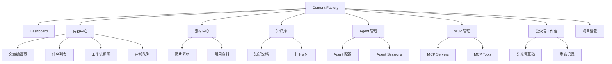
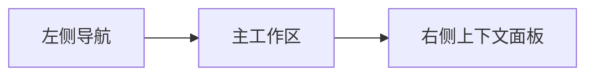
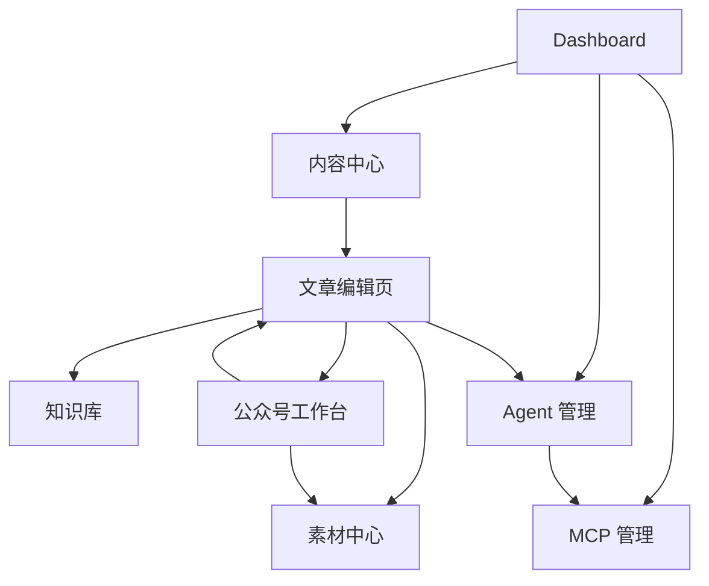
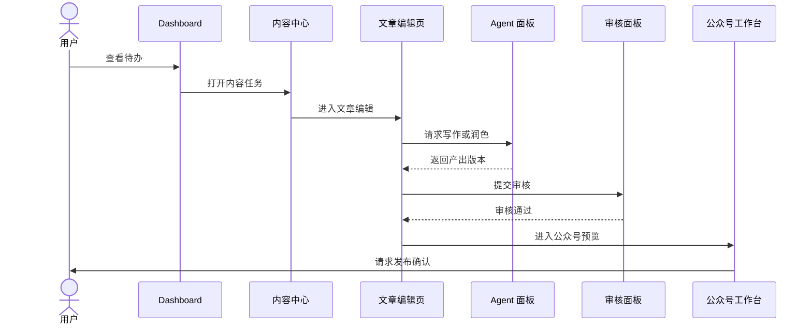
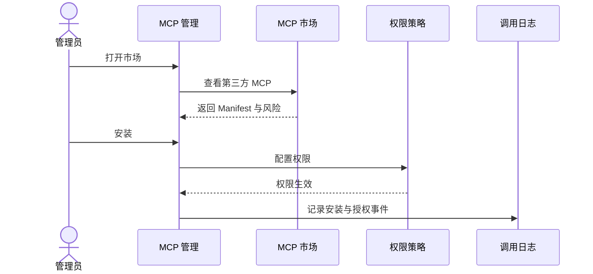

# UI 设计

## 1. 设计目标

Content Factory 的 UI 是面向内容生产、AI Agent 编排和工作流治理的专业工作台。界面需要兼顾 Notion 的内容组织能力、Cursor 的 AI 协作体验、Linear 的任务效率与状态清晰度。

设计目标：

- 让用户快速掌握内容生产状态。
- 让内容、素材、知识、Agent、MCP 和公众号发布流程在同一工作台内协作。
- 保证关键状态、风险、审查、发布动作可见、可控、可追踪。
- 前端只负责呈现和交互，不承载核心业务规则。

## 2. 设计参考

| 参考产品 | 借鉴点 | 应用方式 |
| --- | --- | --- |
| Notion | 文档块、侧边导航、内容资产组织、轻量编辑 | 知识库、文章编辑页、素材关联 |
| Cursor | AI 面板、上下文提示、Agent 协作、命令式交互 | Agent 任务侧栏、AI 操作面板、上下文包预览 |
| Linear | 高密度任务列表、状态流、快捷操作、清晰层级 | Dashboard、内容中心、工作流状态、审核队列 |

## 3. 信息架构

导航深度控制在 3 层以内，主导航聚焦高频工作流。



## 4. 页面树

```text
/
├── dashboard
├── content
│   ├── tasks
│   ├── tasks/:taskId
│   ├── tasks/:taskId/editor
│   ├── tasks/:taskId/workflow
│   └── review
├── assets
│   ├── materials
│   ├── images
│   └── references
├── knowledge
│   ├── documents
│   ├── context-packs
│   └── sources
├── agents
│   ├── profiles
│   ├── sessions
│   └── capabilities
├── mcp
│   ├── servers
│   ├── tools
│   ├── logs
│   └── marketplace
├── wechat
│   ├── workspace
│   ├── drafts
│   ├── preview
│   └── publish-records
└── settings
    ├── project
    ├── workflow
    ├── permissions
    └── integrations
```

## 5. 全局布局设计

### 5.1 桌面布局

采用三栏工作台：左侧主导航，中间主工作区，右侧上下文面板。



```text
┌──────────────────────────────────────────────────────────────┐
│ Top Bar: 项目切换 / 全局搜索 / 新建 / 通知 / 用户             │
├──────────────┬────────────────────────────┬──────────────────┤
│ Sidebar      │ Main Workspace             │ Context Panel    │
│ Dashboard    │ 页面标题 / 过滤 / 内容     │ Agent / 审查 /   │
│ Content      │ 表格 / 编辑器 / 看板       │ 版本 / 日志      │
│ Assets       │                            │                  │
│ Knowledge    │                            │                  │
│ Agents       │                            │                  │
│ MCP          │                            │                  │
│ WeChat       │                            │                  │
└──────────────┴────────────────────────────┴──────────────────┘
```

### 5.2 响应式布局

| 宽度 | 布局 |
| --- | --- |
| ≥1280px | 三栏布局，右侧上下文常驻 |
| 1024-1279px | 左侧收窄，右侧可折叠 |
| 768-1023px | 双栏布局，右侧抽屉 |
| <768px | 单栏布局，底部导航或抽屉导航 |

### 5.3 布局原则

- 关键状态始终可见。
- 右侧上下文面板用于 Agent、版本、审查、日志，不打断主工作区。
- 高风险动作使用确认弹窗，不使用仅 Toast 的轻提示。
- 列表页支持键盘快捷操作。

## 6. 视觉系统

### 6.1 视觉方向

- Notion 式低噪音内容画布。
- Cursor 式深色友好的 AI 面板。
- Linear 式高密度列表、状态色和快捷操作。

### 6.2 色彩

| Token | 用途 |
| --- | --- |
| `bg-canvas` | 页面背景 |
| `bg-surface` | 卡片、面板 |
| `bg-subtle` | 次级区域 |
| `text-primary` | 主文本 |
| `text-secondary` | 次级文本 |
| `border-muted` | 分割线 |
| `accent-primary` | 主操作、选中态 |
| `status-running` | 执行中 |
| `status-review` | 待审核 |
| `status-success` | 已完成 |
| `status-warning` | 需处理 |
| `status-danger` | 失败或风险 |

### 6.3 排版与间距

- 基准字号 14-16px。
- 正文行高 1.5-1.7。
- 使用 8px 间距体系。
- 表格和列表保持高信息密度，但行高不低于 36px。
- 标题层级最多 4 级。

## 7. 通用组件设计

| 组件 | 用途 |
| --- | --- |
| `AppShell` | 全局布局容器 |
| `SidebarNav` | 主导航 |
| `TopBar` | 项目切换、搜索、创建、通知 |
| `CommandMenu` | 全局命令面板 |
| `StatusBadge` | 任务、阶段、Agent、MCP 状态 |
| `WorkflowTimeline` | 工作流阶段进度 |
| `AgentActivityPanel` | Agent 会话、输出、工具调用 |
| `ContextPanel` | 右侧上下文面板 |
| `AssetCard` | 内容、素材、知识资产卡片 |
| `ReviewPanel` | 审核意见、门禁结果、决策按钮 |
| `VersionHistory` | 资产版本链路 |
| `RiskConfirmDialog` | 高风险动作确认 |
| `EmptyState` | 空状态引导 |
| `Skeleton` | 加载骨架 |
| `DataTable` | 高密度数据表 |
| `SplitEditor` | 编辑器 + 预览分栏 |

## 8. 交互设计原则

- 系统状态可见：任务状态、阶段状态、Agent 运行、MCP 调用必须可见。
- 识别优于回忆：工作流阶段、上下文来源、版本链路直接展示。
- 用户可控：支持暂停、退回、重试、取消、回滚。
- 防错优先：发布、生产环境调用、敏感数据发送必须确认。
- 快捷高效：常用操作支持命令面板和快捷键。
- 渐进披露：默认展示关键摘要，详情进入右侧面板或详情页。

## 9. Dashboard

### 9.1 页面目标

展示整个内容工厂的运行状态，帮助用户快速判断：哪些任务在执行、哪些待审核、哪些失败、哪些即将发布。

### 9.2 页面结构

```text
Dashboard
├── KPI 概览
│   ├── 进行中任务
│   ├── 待审核
│   ├── 发布准备
│   └── 失败/阻塞
├── 今日工作队列
├── 工作流运行状态
├── Agent 活动
├── MCP 风险与错误
└── 最近发布/归档
```

### 9.3 关键组件

- `MetricCard`
- `WorkQueueList`
- `WorkflowHealthChart`
- `AgentActivityFeed`
- `MCPAlertList`
- `RecentPublishList`

### 9.4 交互

- 点击 KPI 进入过滤后的内容中心。
- 待审核卡片可直接打开审核面板。
- Agent 活动点击后打开 Session 详情。
- MCP 错误点击后进入 MCP 日志页。

## 10. 内容中心

### 10.1 页面目标

管理内容任务、工作流状态、审核队列和任务优先级。

### 10.2 页面结构

```text
内容中心
├── 视图切换：列表 / 看板 / 日历 / 审核
├── 过滤器：状态 / 类型 / 负责人 / 渠道 / 优先级
├── 任务列表
│   ├── 标题
│   ├── 状态
│   ├── 当前阶段
│   ├── 负责人
│   ├── Agent
│   ├── 更新时间
│   └── 风险提示
└── 右侧任务摘要面板
```

### 10.3 列表视图

参考 Linear，高密度展示任务。

```text
┌────────────────────────────────────────────────────────────┐
│ New Task  Filter  View: List / Board / Review              │
├────┬─────────────────────────┬────────┬────────┬───────────┤
│ 状态│ 标题                    │ 阶段   │ 负责人 │ 更新时间  │
├────┼─────────────────────────┼────────┼────────┼───────────┤
│ RUN│ AI Agent 内容工厂 PRD    │ 审核   │ SGY    │ 10m ago   │
│ REV│ 公众号文章：MCP 市场     │ 排版   │ SGY    │ 1h ago    │
└────┴─────────────────────────┴────────┴────────┴───────────┘
```

### 10.4 交互

- `N` 新建任务。
- `/` 聚焦搜索。
- `F` 打开过滤器。
- `Enter` 打开任务。
- 任务行右键或更多菜单支持：启动、暂停、退回、归档。

## 11. 文章编辑页

### 11.1 页面目标

提供内容编辑、版本管理、Agent 协作、审查和预览能力。

### 11.2 页面结构

```text
文章编辑页
├── 顶部：任务标题 / 状态 / 当前阶段 / 保存状态 / 审核按钮
├── 左侧：文档大纲 / 阶段资产
├── 中间：块编辑器 / Markdown 编辑器
├── 右侧：Agent 面板 / 版本 / 审核 / 上下文
└── 底部：字数 / 渠道适配 / 风险提示
```

### 11.3 编辑模式

| 模式 | 用途 |
| --- | --- |
| Write | 正文编辑 |
| Review | 审核意见与修改建议 |
| Compare | 版本对比 |
| Preview | 渠道预览 |
| Agent | Agent 协作与生成 |

### 11.4 交互

- 选中文本后可调用 Agent：改写、扩写、压缩、换风格、检查事实。
- 右侧 Agent 面板显示当前上下文包和可用工具。
- 保存生成新草稿版本，不覆盖已审核版本。
- 发布前锁定版本，禁止使用未审核草稿。

## 12. 素材中心

### 12.1 页面目标

管理研究材料、图片、引用、附件和可复用素材。

### 12.2 页面结构

```text
素材中心
├── 素材类型：全部 / 图片 / 引用 / 附件 / 调研 / 模板
├── 搜索与标签
├── 素材网格或列表
├── 素材详情
│   ├── 来源
│   ├── 版权
│   ├── 关联任务
│   ├── 使用历史
│   └── 风险提示
└── 上传 / 导入 / 从 MCP 获取
```

### 12.3 交互

- 拖拽上传素材。
- 素材可关联文章、阶段、版本。
- 图片素材必须显示版权状态。
- 引用素材必须显示来源 URL、抓取时间、可信度。

## 13. 知识库

### 13.1 页面目标

沉淀长期可复用知识、品牌规范、选题库、上下文包和外部来源。

### 13.2 页面结构

```text
知识库
├── 文档树
├── 知识文档编辑区
├── 标签与来源
├── 上下文包列表
├── 关联工作流与任务
└── 检索测试面板
```

### 13.3 交互

- 支持 Notion 风格文档树和块编辑。
- 支持将知识条目加入 Agent 上下文包。
- 支持查看知识被哪些任务引用。
- 支持检索测试，验证 Agent 能否找到正确上下文。

## 14. Agent 管理

### 14.1 页面目标

管理 Agent Profile、能力、Session、状态、权限和执行记录。

### 14.2 页面结构

```text
Agent 管理
├── Agent 列表
│   ├── 名称
│   ├── Provider
│   ├── 角色
│   ├── 状态
│   ├── 能力
│   └── 最近执行
├── Agent 配置详情
│   ├── 运行方式
│   ├── 能力声明
│   ├── Tool / Skill / MCP 权限
│   ├── WSL 配置
│   └── 输出 Schema
├── Session 列表
└── Session 详情
```

### 14.3 交互

- 支持 Agent 健康检查。
- 支持启用、禁用、归档。
- 支持查看 Session 消息、工具调用、错误和审查结果。
- 高风险权限修改需要确认。

## 15. MCP 管理

### 15.1 页面目标

管理 MCP Server、Tool、权限、日志、热加载和市场安装。

### 15.2 页面结构

```text
MCP 管理
├── MCP Server 列表
├── Tool 清单
├── 权限策略
├── 调用日志
├── 热加载状态
└── MCP 市场
```

### 15.3 交互

- 安装第三方 MCP 前展示 Manifest、权限和风险等级。
- 支持启动、停止、重载、禁用、卸载。
- Tool 调用日志支持按任务、阶段、Agent、状态过滤。
- 高风险 MCP 默认禁用。

## 16. 公众号工作台

### 16.1 页面目标

面向微信公众号内容生产，提供文章排版、预览、素材关联、审核和发布准备能力。

### 16.2 页面结构

```text
公众号工作台
├── 文章草稿
├── 微信样式预览
├── 封面与摘要
├── 图片素材
├── 排版检查
├── 审核状态
├── 发布设置
└── 发布记录
```

### 16.3 关键能力

- 微信图文预览。
- 标题、摘要、封面图管理。
- 正文排版检查。
- 图片尺寸和版权检查。
- 发布前审核锁定版本。
- 发布记录和回滚入口。

### 16.4 发布控制

- 未审核通过不可发布。
- 未配置公众号集成不可发布。
- 发布属于外部平台动作，必须确认。
- 发布失败展示原因，不覆盖最终稿。

## 17. 页面关系图



## 18. 核心用户流程

### 18.1 从任务到发布



### 18.2 安装并授权 MCP



## 19. 空状态与错误状态

| 场景 | 设计 |
| --- | --- |
| 无任务 | 展示新建任务按钮和示例流程 |
| 无素材 | 提供上传、导入、MCP 获取入口 |
| 无 Agent | 提供发现和注册 Agent 入口 |
| 无 MCP | 提供安装内置 MCP 和打开市场入口 |
| Agent 执行失败 | 展示错误摘要、日志、重试、切换 Agent |
| MCP 权限拒绝 | 展示拒绝原因、所需权限、申请入口 |
| 发布失败 | 展示渠道错误、重试、回滚、人工处理 |

## 20. 权限与风险交互

高风险动作必须使用阻断式确认：

- 发布到公众号。
- 调用生产环境 API。
- 发送敏感数据给外部 MCP。
- 启用高风险第三方 MCP。
- 修改 Agent 全局权限。
- 删除或归档关键配置。

确认弹窗必须展示：操作类型、影响范围、风险评估、执行对象、确认按钮。

## 21. 可访问性与性能

- 关键操作支持键盘访问。
- 所有按钮和图标必须有可识别标签。
- 状态不能只依赖颜色表达。
- 列表和编辑器使用骨架屏。
- 长列表使用分页或虚拟滚动。
- 动画遵守 `prefers-reduced-motion`。
- 色彩对比度满足 WCAG AA。

## 22. 禁止事项

- 禁止在前端实现核心业务规则。
- 禁止前端直接调用 Agent、MCP、Skill 或插件内部实现。
- 禁止将前端本地状态作为工作流权威状态。
- 禁止未审核版本进入公众号发布。
- 禁止高风险动作只用 Toast 提示。
- 禁止隐藏 Agent 或 MCP 的失败原因。

## 23. 后续细化文档

- 设计系统 Token：`docs/08-ui/design-system.md`
- 页面原型：`docs/08-ui/wireframes.md`
- API 契约：`docs/09-api/api-overview.md`
- 工作流文档：`docs/07-workflow/content-workflow.md`
- Agent 架构：`docs/04-agent/agent-architecture.md`
- MCP 架构：`docs/05-mcp/mcp-architecture.md`
