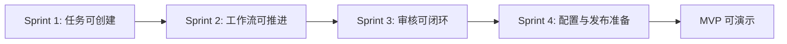

# 开发路线图

## 1. 目标

本路线图按最小可运行产品优先，先交付可创建内容任务、推进工作流、记录资产版本、完成审核闭环的 MVP，再逐步接入 Agent、MCP、公众号工作台和扩展能力。

最高约束：`docs/00-project/project-constitution.md`。

## 2. MVP 定义

MVP 必须证明 Content Factory 的核心价值：内容需求可以进入系统，按标准工作流推进，阶段产出可持久化，审核可闭环，状态可追踪。

### 2.1 MVP 必须包含

- 项目与用户基础模型。
- 内容任务创建、列表、详情。
- 标准内容工作流：选题、调研、大纲、写作、润色、配图、排版、审核、发布准备。
- 工作流定义、阶段定义、运行实例、阶段状态流转。
- 内容资产与资产版本。
- 审核记录与退回机制。
- Dashboard 基础状态视图。
- 内容中心与文章编辑页基础版本。
- Agent Profile 静态配置与模拟执行入口。
- MCP Server / Tool 静态配置与调用日志模型。
- 基础单元测试、集成测试、前端关键流程测试。

### 2.2 MVP 暂不包含

- 真实多 Agent 自动执行。
- 第三方 MCP 市场安装。
- 自动发布到微信公众号。
- 多租户团队权限：后端 MVP 已补齐 organization / member / project membership / access check、header-based session context 和全局项目业务 API enforcement；尚未接生产 auth provider、session lifecycle hardening 和组织项目归属模型。
- 生产级向量检索和完整 RAG。
- 高级成本分析与 Agent 评估。

### 2.3 MVP 验收标准

- 用户可以创建内容任务并启动标准工作流。
- 系统可以展示当前阶段和任务状态。
- 用户可以为阶段保存产出并生成版本。
- 用户可以提交审核、通过、退回并重新执行阶段。
- Dashboard 可以展示进行中、待审核、失败、已完成任务。
- 所有核心状态写入数据库，不依赖聊天上下文。

## 3. Sprint 总览

| Sprint | 目标 | 最小可运行结果 | 估算 |
| --- | --- | --- | --- |
| Sprint 1 | 建立基础工程、数据库与核心领域模型 | 可创建项目、用户、内容任务，查看任务列表 | 1.5~2 周 |
| Sprint 2 | 建立工作流与资产版本闭环 | 可启动工作流、推进阶段、保存阶段资产版本 | 2~2.5 周 |
| Sprint 3 | 建立审核、Dashboard 与编辑体验 | 可审核、退回、查看 Dashboard 和文章编辑页 | 2 周 |
| Sprint 4 | 建立 Agent / MCP / 公众号工作台 MVP 壳层 | 可配置 Agent / MCP，查看日志，完成发布准备记录 | 2~2.5 周 |

> 估算为单人全职理想工期、假设 Sprint 间串行推进（Sprint 内前后端可部分并行），实际排期需含缓冲。

## 4. Sprint 1：基础工程与任务模型

### 4.1 目标

交付最小可运行系统骨架：前端可打开 Dashboard 和内容中心，后端可创建内容任务，数据库可保存用户、项目和任务。

### 4.2 任务

- 初始化前后端工程结构。
- 建立数据库迁移机制。
- 实现用户、项目、内容任务基础模型。
- 实现任务创建、列表、详情 API。
- 实现 Dashboard 空状态和内容中心任务列表。
- 建立测试框架、Lint、类型检查和基础 CI 脚本。

### 4.3 数据库

交付表：

- `users`
- `projects`
- `content_tasks`
- `audit_events`

关键要求：

- `content_tasks.status` 支持 `draft`, `ready`, `running`, `completed`, `cancelled`, `archived`。
- 任务创建默认 `draft`，需求确认后置 `ready`（对齐 PRD §7.5）；draft→ready 流转归属任务领域服务，§4.6 须含对应单测与集成测试。
- 任务创建必须同步写入审计事件。
- 不实现复杂权限模型，只保留 `owner_id`。

### 4.4 后端

交付 API：

| 方法 | 路径 | 用途 |
| --- | --- | --- |
| `POST` | `/api/tasks` | 创建内容任务 |
| `GET` | `/api/tasks` | 查询任务列表 |
| `GET` | `/api/tasks/:id` | 查询任务详情 |
| `PATCH` | `/api/tasks/:id` | 更新任务基础信息 |

后端模块：

- API Controller。
- Application Service。
- Domain Entity：`ContentTask`。
- Repository Interface。
- Audit Service。

### 4.5 前端

交付页面：

- Dashboard 初版。
- 内容中心任务列表。
- 新建任务表单。
- 任务详情基础页。

交互要求：

- 空状态引导新建任务。
- 表单内联校验。
- 任务状态使用 `StatusBadge`。
- 列表支持状态和类型过滤。

### 4.6 测试

- 单元测试：`ContentTask` 状态初始化、字段校验。
- 集成测试：任务创建 API、任务列表 API、审计事件写入。
- 前端测试：新建任务表单、任务列表渲染。
- 覆盖率目标：核心领域逻辑 ≥90%，整体 ≥80%。

### 4.7 风险

| 风险 | 应对 |
| --- | --- |
| 技术栈选择拖慢启动 | 只选择当前最熟悉且可快速交付的栈 |
| 过早实现复杂权限 | Sprint 1 仅保留 owner_id 和审计 |
| 前端页面过度设计 | 先交付可用列表和表单，不做复杂动效 |

## 5. Sprint 2：工作流与资产版本闭环

### 5.1 目标

让内容任务可以启动标准工作流，推进阶段，保存阶段产出，并形成资产版本。

### 5.2 任务

- 实现标准工作流定义和阶段定义。
- 实现工作流实例和阶段实例。
- 实现阶段状态流转。
- 实现内容资产和资产版本。
- 实现上下文包最小模型。
- 前端展示工作流时间线和阶段详情。

### 5.3 数据库

新增表：

- `workflow_definitions`
- `workflow_stages`
- `workflow_stage_dependencies`
- `workflow_runs`
- `stage_runs`
- `context_packs`
- `content_assets`
- `asset_versions`

关键要求：

- 工作流定义版本不可覆盖。
- 阶段运行状态由领域层控制。
- 资产版本只追加，不覆盖。
- 每次阶段产出写入 `content_assets` 和 `asset_versions`。
- S2 `content_assets.status` 仅落地 `draft`、`archived`；`review_pending`/`approved`/`rejected`/`stale` 待 S3 审核与回滚闭环引入（全集见 db §5.9）。
- `workflow_stage_dependencies` 须落地承载"禁止跳阶段"：MVP 可仅 `finish_to_start` 线性依赖，但表与发布时无环校验必须实现，依赖不只存 JSON（对齐 db §5.5.1）。
- 迁移排序：`stage_runs.agent_profile_id` 在 S2 仅保留列、暂不加外键（待 `agent_profiles` 在 S4 建表后补 FK），该决策记入迁移说明以保证可回滚。

### 5.4 后端

交付 API：

| 方法 | 路径 | 用途 |
| --- | --- | --- |
| `POST` | `/api/tasks/:id/workflow-runs` | 启动工作流 |
| `GET` | `/api/workflow-runs/:id` | 查询工作流运行 |
| `POST` | `/api/stage-runs/:id/start` | 开始阶段 |
| `POST` | `/api/stage-runs/:id/complete` | 完成阶段并保存产出 |
| `GET` | `/api/tasks/:id/assets` | 查询任务资产 |
| `GET` | `/api/assets/:id/versions` | 查询资产版本 |

后端模块：

- Workflow Service。
- Stage State Machine。
- Asset Service。
- Context Pack Service。

### 5.5 前端

交付页面与组件：

- 任务详情中的工作流时间线。
- 阶段详情面板。
- 阶段产出录入表单。
- 资产版本列表。
- 内容中心工作流状态列。

交互要求：

- 用户可以启动工作流。
- 用户可以进入当前阶段。
- 用户可以保存阶段产出。
- 用户可以查看资产版本链路。

### 5.6 测试

- 单元测试：工作流状态机、阶段状态机、资产版本追加规则。
- 集成测试：启动工作流、完成阶段、生成资产版本。
- 前端测试：工作流时间线、阶段完成表单。
- 关键回归：禁止跳过未完成阶段进入后续阶段。

### 5.7 风险

| 风险 | 应对 |
| --- | --- |
| 工作流模型过度泛化 | 先内置标准内容工作流，保留定义表但不做复杂设计器 |
| 资产存储复杂 | MVP 可先用本地或对象存储抽象，数据库只保存 URI |
| 状态流转混乱 | 所有状态流转集中在 State Machine 模块 |

## 6. Sprint 3：审核、Dashboard 与编辑体验

### 6.1 目标

完成内容生产核心闭环：阶段产出可以提交审核，审核可以通过或退回，文章编辑页可以查看版本和上下文，Dashboard 可以展示真实状态。

### 6.2 任务

- 实现审核记录模型和审核状态流转。
- 实现阶段退回与重新执行。
- 实现 Dashboard 状态聚合。
- 实现文章编辑页 MVP。
- 实现版本对比基础能力。
- 实现风险提示和错误状态展示。

### 6.3 数据库

新增或完善：

- `review_records`
- `audit_events` 扩展 action 类型。
- `content_assets.status` 补齐 `review_pending`/`approved`/`rejected`/`stale`，至此为全集（`draft`/`review_pending`/`approved`/`rejected`/`stale`/`archived`，对齐 db §5.9）。
- `stage_runs.attempt_count` 重试与退回计数。

关键要求：

- 审核记录不可覆盖。
- 退回必须记录原因和目标阶段。
- 重新执行必须生成新的阶段运行或新的资产版本。

### 6.4 后端

交付 API：

| 方法 | 路径 | 用途 |
| --- | --- | --- |
| `POST` | `/api/stage-runs/:id/reviews` | 创建审核记录 |
| `POST` | `/api/reviews/:id/approve` | 审核通过 |
| `POST` | `/api/reviews/:id/request-revision` | 退回修改 |
| `GET` | `/api/dashboard/summary` | Dashboard 汇总 |
| `GET` | `/api/tasks/:id/editor-state` | 获取编辑页状态 |
| `GET` | `/api/assets/:id/compare` | 版本对比 |

后端模块：

- Review Service。
- Dashboard Query Service。
- Version Compare Service。
- Rollback / Revision Service。

> `/api/tasks/:id/editor-state` 与 `/api/assets/:id/compare` 为只读计算端点，无独立表：由 Dashboard Query / Version Compare Service 聚合 `stage_runs`/`content_assets`/`asset_versions` 实时计算返回。

### 6.5 前端

交付页面与组件：

- Dashboard KPI。
- 今日工作队列。
- 审核队列。
- 文章编辑页基础版。
- 右侧上下文面板。
- 审核面板。
- 版本历史组件。

交互要求：

- 用户可以提交审核。
- 用户可以通过或退回。
- 用户可以查看退回原因。
- 用户可以查看版本历史。
- Dashboard 可进入过滤后的任务列表。

### 6.6 测试

- 单元测试：审核状态机、退回规则、版本比较规则。
- 集成测试：审核通过、审核退回、Dashboard 汇总。
- 前端测试：审核面板、Dashboard、文章编辑页版本列表。
- E2E：创建任务 → 启动工作流 → 保存产出 → 审核通过。

### 6.7 风险

| 风险 | 应对 |
| --- | --- |
| 编辑器复杂度过高 | MVP 先支持 Markdown 或简单块编辑，不实现完整富文本 |
| Dashboard 聚合性能 | Sprint 3 使用简单查询，后续再做缓存和聚合表 |
| 审核退回影响状态一致性 | 退回操作必须在单事务中更新审核、阶段、工作流和审计 |

## 7. Sprint 4：Agent / MCP / 公众号工作台 MVP 壳层

### 7.1 目标

交付 Agent 与 MCP 的配置和观测壳层，建立公众号发布准备流程，但不做真实复杂自动化。系统达到可演示端到端内容生产平台。

### 7.2 任务

- 实现 Agent Profile 配置与状态展示。
- 实现 Agent Session 模拟执行记录。
- 实现 MCP Server / Tool 配置与日志列表。
- 实现 MCP 权限展示和风险提示。
- 实现公众号工作台：预览、封面、摘要、发布准备记录。
- 打通文章编辑页到公众号工作台。
- 完成 MVP 端到端验收测试。

### 7.3 数据库

新增或完善：

- `agent_profiles`
- 可选 `agent_sessions`
- 可选 `agent_messages`
- `mcp_servers`
- `mcp_tools`
- `tool_invocations`
- `publish_records`

非 MVP（PRD §7.3 为 P2，本 Sprint 不作验收项）：

- `skill_definitions` / `skill_invocations` / `plugin_definitions` / `plugin_invocations` 移至 MVP 后阶段；如需占位仅建空表并标注非 MVP，不纳入 S4 验收。

MVP 简化：

- 如果时间不足，`agent_sessions` 和 `agent_messages` 可先用审计日志和调用日志表达。
- `publish_records` 须至少建表以锚定 `asset_version_id`，保证"已发布版本不漂移"（db §5.21），不以 `content_assets` + `audit_events` 替代。

### 7.4 后端

交付 API：

| 方法 | 路径 | 用途 |
| --- | --- | --- |
| `GET` | `/api/agents` | Agent 列表 |
| `POST` | `/api/agents` | 创建 Agent Profile |
| `POST` | `/api/agents/:id/health-check` | Agent 健康检查 |
| `GET` | `/api/mcp/servers` | MCP Server 列表 |
| `POST` | `/api/mcp/servers` | 注册 MCP Server |
| `GET` | `/api/mcp/tools` | MCP Tool 列表 |
| `GET` | `/api/mcp/logs` | MCP 调用日志 |
| `GET` | `/api/wechat/tasks/:taskId/preview` | 公众号预览 |
| `POST` | `/api/wechat/tasks/:taskId/publish-records` | 创建发布准备记录 |

后端模块：

- Agent Profile Service。
- Agent Runtime Mock Service。
- MCP Registry Service。
- MCP Log Service。
- WeChat Workspace Service。
- Publish Preparation Service。

### 7.5 前端

交付页面：

- Agent 管理。
- Agent Session 详情基础版。
- MCP 管理。
- MCP 日志。
- 公众号工作台。
- 公众号预览。

交互要求：

- 用户可以配置 Agent Profile。
- 用户可以查看 Agent 状态和模拟 Session。
- 用户可以注册 MCP Server 和查看 Tool。
- 用户可以看到 MCP 权限和风险等级。
- 用户可以从文章编辑页进入公众号预览。
- 发布准备必须要求审核通过。

### 7.6 测试

- 单元测试：Agent Profile 校验、MCP Manifest 校验、发布准备规则。
- 集成测试：Agent 配置、MCP 注册、公众号发布准备记录。
- 前端测试：Agent 管理、MCP 管理、公众号工作台。
- E2E：创建任务 → 完成审核 → 打开公众号预览 → 创建发布准备记录。

### 7.7 风险

| 风险 | 应对 |
| --- | --- |
| 真实 Agent 集成不稳定 | Sprint 4 只做配置和模拟执行，真实执行进入后续阶段 |
| MCP 权限复杂 | MVP 只展示权限和记录日志，不做完整市场安装 |
| 公众号发布涉及外部平台 | MVP 只做发布准备记录，不自动发布 |

## 8. 跨 Sprint 技术要求

### 8.1 后端

- 分层架构：API → Application → Domain → Adapter。
- 状态流转集中在领域状态机。
- 外部能力通过 Adapter 接入。
- 所有关键操作写入审计事件。
- 错误返回结构统一。

### 8.2 前端

- 使用 `AppShell`、`SidebarNav`、`TopBar`、`ContextPanel` 建立统一布局：布局壳层在 Sprint 1 作为基线建立，后续 Sprint 复用扩展，不重复搭建。
- 页面不直接承载业务规则。
- 高风险动作必须阻断式确认。
- 状态不可只用颜色表达。
- 长列表预留分页或虚拟滚动。

### 8.3 数据库

- 所有核心表使用 UUID。
- 资产版本只追加。
- 审计事件不删除。
- JSON 字段只用于低频扩展数据，不保存核心关系和状态。
- 迁移文件必须可回滚或有清晰替代策略。

### 8.4 测试

- 单元测试覆盖领域状态机和核心规则。
- 集成测试覆盖 API 和数据库事务边界。
- 前端测试覆盖关键页面和表单交互。
- E2E 测试覆盖最短内容生产闭环。
- 核心模块覆盖率目标 ≥90%，整体覆盖率目标 ≥80%。

## 9. MVP 里程碑验收

MVP 演示路径：

1. 创建内容任务。
2. 启动标准内容工作流。
3. 完成选题、调研、大纲、写作阶段产出。
4. 生成资产版本。
5. 提交审核。
6. 审核通过或退回修订。
7. 打开公众号工作台预览。
8. 创建发布准备记录。
9. Dashboard 展示任务状态。

> MVP 必建阶段子集：选题、调研、大纲、写作、审核、发布准备为必建并纳入演示路径；润色、配图、排版作为标准工作流的阶段定义保留（可配置、可跳过），MVP 不强制其 Agent 自动化。九阶段完整建模（§2.1），执行深度按此子集收敛。

MVP 出口门槛（对接 PRD §2.3 硬性指标，未达不放行）：

- 过程可追溯率 100%：阶段产出、审查结论、状态流转均有持久化记录与审计事件，无仅存于聊天上下文的关键数据。
- 扩展零业务代码改动：新增 Agent Provider / MCP / 渠道经配置或适配器接入，不改领域层与工作流核心。
- PRD §2.3 量化指标（任务完成率、一次通过率等）在演示数据集上可被采集与展示。

## 10. 后续阶段

MVP 后再进入：

- 真实 Agent 执行。
- MCP 市场安装与热加载。
- Skill 质量门禁自动化。
- 微信公众号真实发布集成。
- 知识库检索与 RAG：后端 MVP 已补齐 knowledge source / entry / source archive/restore / entry archive/restore / inventory read API / keyword search / task candidates、context pack materialization、本地 deterministic embedding pipeline 和 embedding readiness endpoint；Web 已补齐 knowledge inventory 与 candidate review 只读 UI；尚未接真实 vector index、LLM rerank 和 context pack 自动刷新。
- 多团队权限和审计：RBAC 后端 MVP 已具备，Web 已支持成员与项目授权管理，角色变更要求 `approval_ref`，成员和 membership 变更已写入审计链，项目级 RBAC 端点已有跨项目拒绝回归矩阵；后端已接入 header-based session context 和全局项目业务 API enforcement，后续仍需生产 auth provider、session lifecycle hardening 和组织项目归属模型。
- Agent 效果评估和成本分析：后端 MVP 已补齐 execution result 评价账本、人工评分、确定性 rule evaluator runner、默认关闭 deterministic regression evaluation runner、job 级 summary 和只读 evaluation analytics；Web 已补齐只读 evaluation dashboard；尚未接 LLM judge、真实成本归因、模型对比和跨模型回归评测编排。

## 11. Sprint-5 Execution Layer 现状（Phase 1.x 冻结）

**已完成（Mock-only data plane，`fc001fb`→`32fd423`）**：execution skeleton + 可靠性（确定性退避重试 / 超时契约 / stale-lock 恢复）、outbox relay 骨架、Runtime Contract + Adapter Factory、Control Plane Bridge、只追加 result ledger、ops 运维控制面（health / recover-stale / process-batch / manual-retry）。与 Sprint-4 Control Plane 严格隔离（无 project_id / 无业务表 FK / 不 join / 不回写 / 不替代 audit 哈希链）。证据见 `docs/reviews/sprint-5-execution-phase1-release-gate.md`（裁决 GO）。

**Productization 现状**——Agent Real LLM、workflow_stage_run writeback relay、MCP Streamable HTTP runtime、Publisher HTTP release runtime 均已进入默认关闭、显式 gate、可观测账本路径。真实执行证据统一进入 `execution_results` 与 `outbox_events`；控制面回写仅限显式开启的 workflow stage writeback。

**Final RC 已收口**：`GET /api/execution/ops/final-rc-readiness` 已汇总 production activation / P1 readiness / MCP readiness / Publisher readiness / writeback executor registration / result ledger / publish version pin 等 gate。该端点只读、不发外部调用、不写控制面，用于判断当前系统是否达到生产候选安全闭合。

> **Publisher 已补齐最小产品化入口**：P2.2 新增 `publish_records`、`/api/publish-records`、`PublisherRealRuntime` 与 `/api/execution/ops/publisher-real-runtime-readiness`。它仍默认关闭，只支持最小 HTTP release，不代表完整公众号运营平台已完成。

> **MCP Marketplace Backend MVP 已补齐**：Product Gap 1 新增本地 `mcp_marketplace_entries` / `mcp_marketplace_installations`、Manifest 校验、安装/禁用/卸载 API。安装只写本项目 MCP 配置（`mcp_servers` / `mcp_tools`），不调用外部 marketplace、不执行 tool invocation、不做 UI。证据见 `docs/reviews/product-gap-1-mcp-marketplace-backend-audit.md`。

> **MCP Invocation Ledger UI 已补齐**：Web 新增 `/mcp/invocations`，只读展示 MCP server/tool inventory 与 selected tool 的 invocation ledger，包含 status、caller、risk、duration 和输入/输出摘要。它不触发 mock invoke、health check、真实 transport、replay 或写操作。

> **Execution Result Ledger UI 已补齐**：Web 新增 `/execution/results`，只读展示 execution jobs、selected job 的 `execution_results` attempts 与 result summary，包含 latest status、error_type、duration 和 request/response snapshot 摘要。它不触发 tick、retry、evaluate-rule、writeback、replay 或写操作。

> **Execution Outbox Event Ledger UI 已补齐**：Web 新增 `/execution/outbox`，只读展示 execution jobs 与 selected job 的 outbox events，包含 event_type、processed/error、retry_count、claim 状态和 payload 摘要。它不触发 process-batch、process event、relay、retry、tick、writeback、replay 或写操作。

> **Execution Writeback Ledger UI 已补齐**：Web 新增 `/execution/writebacks`，只读展示 execution jobs、selected result 与 `execution_writebacks`，包含 status、subject、idempotency_key、plan、error 和 created/updated 时间。它不触发 guard、transaction-plan、dry-run、apply-guard、transaction-prototype、retry、replay 或写操作。

> **Provider Quota / Cost Preflight UI 已补齐**：Web 新增 `/ops/provider-quota`，只读展示 provider quota/cost preflight 的 quota policy、distributed quota、cost metrics、token usage、billing disabled 与 runtime/network gate。它不消费 quota、不执行 provider 请求、不触发 staging smoke 或写操作。

> **Agent Real Provider Config Preflight UI 已补齐**：Web 新增 `/ops/agent-provider-config`，只读展示 agent real provider config preflight 的 provider kind、model、endpoint_ref、credential ref readiness、secret material boundary、timeout/quota/cost profile 与 real adapter blocked reason。它不解析 secret、不发网络探测、不执行真实 provider 请求或写操作。

> **Agent Real Provider Transport Disabled Harness UI 已补齐**：Web 新增 `/ops/agent-provider-transport`，只读展示 agent real provider transport disabled harness 的 request shape、url_ref、timeout、disabled transport readiness、fail-closed error、network/secret boundary 与 redacted request。它不执行 transport、不发网络请求、不读取 secret material、不写 execution 表。

> **Secret Injection Preflight UI 已补齐**：Web 新增 `/ops/secret-injection`，只读展示 secret injection preflight 的 resolver kind、secret store/injection readiness、allowed ref schemes、supported purposes、snapshot/DTO persistence boundary、audit metadata requirement 与 runtime/network gate。它不读取 secret material、不注入 header、不执行 transport 或写 execution 表。

> **Agent Real Adapter Registration Guard UI 已补齐**：Web 新增 `/ops/agent-registration-guard`，只读展示 agent real adapter registration guard 的 registration readiness、disabled fixture、descriptor status、config gates、readiness gates、missing requirements 与 fail-closed error。它不注册真实 adapter、不启动 worker、不执行 provider 请求或写 execution 表。

> **Secret Resolver Readiness UI 已补齐**：Web 新增 `/ops/secret-resolver`，只读展示 secret resolver readiness 的 resolver kind、available、allowed ref schemes、supported purposes、env/network/process boundary 与 runtime/adapter mode。它不读取 secret material、不返回 secret material、不写 execution/outbox 表。

> **Provider HTTP Boundary UI 已补齐**：Web 新增 `/ops/provider-http-boundary`，只读展示 provider HTTP boundary 的 fake HTTP client、network/real HTTP disabled、abort/timeout/request-id/status-code mapping、secret material injection boundary、allowed adapter modes、runtime/adapter mode 与 blocked reason。它不执行真实网络请求、不注入 secret material、不写 execution/outbox 表。

> **Publisher Platform Backend MVP 已补齐**：Product Gap 2 新增项目级 `publisher_channels`、渠道创建/列表/详情/更新/禁用/归档 API，并让 `publish_records` 创建前校验渠道处于 active。它不新增真实发布网络行为、不做 UI、不代表完整多渠道运营平台已完成。证据见 `docs/reviews/product-gap-2-publisher-platform-backend-audit.md`。

> **Multi-tenant RBAC Backend MVP 已补齐**：Product Gap 3 新增 `organizations` / `organization_members` / `project_memberships`、组织成员管理、项目成员授权/撤销、`project.read/write/admin` 权限检查 API。后续已补齐 `x-cf-actor-id` / `x-cf-project-id` header-based session context 与全局项目业务 API `project.read/write` enforcement；它仍不代表生产登录态 / IdP、完整 session lifecycle 或组织项目归属模型已完成。证据见 `docs/reviews/product-gap-3-rbac-backend-audit.md`。

> **Knowledge/RAG Backend MVP 已补齐**：Product Gap 4 新增 `knowledge_sources` / `knowledge_entries`、知识源创建/归档、知识条目创建、项目内关键词检索和任务知识候选 API。它不引入向量库、不调用 LLM、不自动写 `context_packs`、不做 UI。证据见 `docs/reviews/product-gap-4-knowledge-rag-backend-audit.md`。

> **Knowledge Context Pack Materialization Backend MVP 已补齐**：Product Gap 8 新增 `POST /api/tasks/:taskId/knowledge-context-pack`，可把关键词命中的 active knowledge entries 物化为 task 级 `context_packs`，并在 `data` / `source_refs` 中保留 entry/source 追溯信息。它不做 embedding、不调用 LLM、不做 rerank、不自动刷新 context pack、不做 UI。证据见 `docs/reviews/product-gap-8-knowledge-context-pack-materialization-audit.md`。

> **Knowledge Entry Archive Backend MVP 已补齐**：Product Gap 9 新增 `POST /api/knowledge/entries/:id/archive`，可停用单条 knowledge entry；既有 keyword search、task candidates 与 context pack materialization 会自然排除 archived entry。它不做 hard delete、不做批量归档、不自动刷新 context pack、不做 UI。证据见 `docs/reviews/product-gap-9-knowledge-entry-archive-audit.md`。

> **Knowledge Entry Restore Backend MVP 已补齐**：Product Gap 10 新增 `POST /api/knowledge/entries/:id/restore`，可将 archived knowledge entry 恢复为 active，并重新进入 keyword search / task candidates / context pack materialization；若 parent source 已 archived，则返回 409。它不恢复 source、不做批量恢复、不自动刷新 context pack、不做 UI。证据见 `docs/reviews/product-gap-10-knowledge-entry-restore-audit.md`。

> **Knowledge Source Restore Backend MVP 已补齐**：Product Gap 11 新增 `POST /api/knowledge/sources/:id/restore`，可将 archived knowledge source 恢复为 active，并让其下 active entries 重新进入 keyword search / task candidates / context pack materialization。它不自动恢复 archived entries、不做批量恢复、不自动刷新 context pack、不做 UI。证据见 `docs/reviews/product-gap-11-knowledge-source-restore-audit.md`。

> **Knowledge Inventory Read API Backend MVP 已补齐**：Product Gap 12 新增 `GET /api/knowledge/sources`、`GET /api/knowledge/sources/:id`、`GET /api/knowledge/sources/:id/entries`，支持 source status/type 与 entry status 过滤，为后续知识库 UI 提供只读管理面。它不做分页、不做更新、不做 embedding/LLM、不做 UI。证据见 `docs/reviews/product-gap-12-knowledge-inventory-read-api-audit.md`。

> **Knowledge Embedding Pipeline Backend MVP 已补齐**：Product Gap 13 新增 `knowledge_entry_embeddings`、本地 `local_hash_v1` deterministic embedding 生成、知识条目创建同事务 embedding snapshot 写入，以及 `GET /api/knowledge/embedding-readiness` 覆盖率端点。它不调用外部模型、不接真实 vector index、不做 LLM rerank、不自动刷新 context pack、不改 keyword search 语义。证据见 `docs/reviews/product-gap-13-knowledge-embedding-pipeline-audit.md`。

> **Agent Evaluation Backend MVP 已补齐**：Product Gap 5 新增 `execution_result_evaluations`、人工/规则评价 API、result 评价列表和 job 级 evaluation summary。它不调用 LLM、不做自动评测、不改 `execution_results` append-only 账本、不做 UI。证据见 `docs/reviews/product-gap-5-agent-evaluation-backend-audit.md`。

> **Rule Evaluation Runner Backend MVP 已补齐**：Product Gap 6 新增手动触发的确定性规则评估入口，可为单个 execution result 或某 job 下未评价 results 追加 `rule` 评价。它不调用 LLM、不做后台自动评测、不改 `execution_results` / `execution_jobs`、不做 UI。证据见 `docs/reviews/product-gap-6-rule-evaluation-runner-audit.md`。

> **Evaluation Analytics Backend MVP 已补齐**：Product Gap 7 新增只读 evaluation analytics 和 low-quality evaluation 查询端点，用于查看评分均值、低分数量、evaluator 分布和低分明细。它不调用 LLM、不做 dashboard UI、不改 `execution_results` / `execution_jobs` / `execution_result_evaluations` 历史记录。证据见 `docs/reviews/product-gap-7-evaluation-analytics-backend-audit.md`。

> **Deterministic Regression Evaluation Runner 已补齐**：新增 `POST /api/execution/evaluations/regression-run` 与默认关闭的 `EXECUTION_REGRESSION_EVALUATION_RUNNER_*` 配置，可对近期或指定 job 的未评价 execution results 追加 `rule` 评价。它不调用 LLM、不改 `execution_results` / `execution_jobs`、不替代 LLM judge / 模型对比 / 跨模型回归评测编排。

> **不再继续 P2.x**：后续剩余工作进入独立产品路线，例如 Publisher Platform、MCP Marketplace、多租户 RBAC、Knowledge/RAG、Agent Evaluation。

后续执行以 [`production-candidate-next-actions.md`](./production-candidate-next-actions.md) 为入口：生产启用前先完成 Secret Store、生产 allowlist、监控告警、staging smoke、回滚预案和目标环境 `final-rc-readiness` 验证；产品功能扩展按独立路线立项，不再塞回 `Phase 2.x`。
