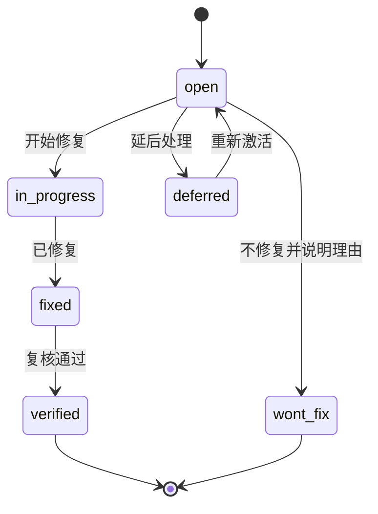

# Review 主控文档

本文件定义 Content Factory 的 Design Review 体系：审查范围、方法论、严重级别、问题生命周期、强制流程和导航。所有审查必须遵守本文件与 `docs/00-project/project-constitution.md`。

## 1. Review 目标

- 在进入开发前，验证设计文档的一致性、完整性、可实现性与合规性。
- 确保所有设计遵守项目宪法，不存在业务规则写死、模块强耦合、跨模块直接依赖、跳过文档等违规。
- 把每次审查的发现、修复建议和结论沉淀到文档，不依赖聊天上下文。

## 2. Review 范围

| 编号 | 审查域 | 审查对象 | 文档 |
| --- | --- | --- | --- |
| 01 | 架构 | 系统架构设计 | [01-architecture-review.md](./01-architecture-review.md) |
| 02 | 产品 | 产品需求 | [02-product-review.md](./02-product-review.md) |
| 03 | Agent | Agent 架构 | [03-agent-review.md](./03-agent-review.md) |
| 04 | MCP | MCP 架构 | [04-mcp-review.md](./04-mcp-review.md) |
| 05 | 数据库 | 数据库设计 | [05-database-review.md](./05-database-review.md) |
| 06 | 工作流 | 内容生产工作流 | [06-workflow-review.md](./06-workflow-review.md) |
| 07 | UI | UI 设计 | [07-ui-review.md](./07-ui-review.md) |
| 08 | MVP | 开发路线图与 MVP 拆分 | [08-mvp-review.md](./08-mvp-review.md) |
| 09 | 红队 | 跨域对抗性安全审查 | [09-red-team-review.md](./09-red-team-review.md) |
| 10 | 终审 | 全量结论与放行 | [10-final-review.md](./10-final-review.md) |

状态跟踪：[review-status.md](./review-status.md)。

## 3. 严重级别

| 级别 | 标识 | 定义 | 处理要求 |
| --- | --- | --- | --- |
| 严重 | Critical | 阻断开发；违反宪法核心约束；会导致系统性失败或重大安全风险 | 必须修复后才能进入终审与开发 |
| 高 | High | 重大设计缺陷、关键约束缺失、明显安全或一致性风险 | 终审前必须修复或给出明确缓解方案 |
| 中 | Medium | 设计不完整、边界不清、可维护性或可扩展性问题 | 记录并排期，允许带入开发但需跟踪 |
| 低 | Low | 优化建议、文档表达、命名与一致性细节 | 记录，择机处理 |

## 4. 问题生命周期

| 状态 | 说明 |
| --- | --- |
| open | 已发现，待修复 |
| in_progress | 修复中 |
| fixed | 已修复，待复核 |
| verified | 已复核确认 |
| deferred | 延后处理，需记录原因和触发条件 |
| wont_fix | 不修复，需记录理由 |

## 5. 审查域状态

每个审查域有一个总体状态，对应用户要求的四态：

| 状态 | 含义 |
| --- | --- |
| 待审查 | 尚未开始 |
| 审查中 | 正在审查或修复进行中 |
| 已完成 | 审查结束，问题与结论已记录 |
| 已修复 | 全部 Critical / High 问题已修复并复核 |

状态流转：`待审查 → 审查中 → 已完成 → 已修复`。

## 6. 问题编号规则

每个审查域使用独立前缀，三位序号递增：

| 审查域 | 前缀 | 示例 |
| --- | --- | --- |
| 架构 | ARCH | ARCH-001 |
| 产品 | PROD | PROD-001 |
| Agent | AGENT | AGENT-001 |
| MCP | MCP | MCP-001 |
| 数据库 | DB | DB-001 |
| 工作流 | WF | WF-001 |
| UI | UI | UI-001 |
| MVP | MVP | MVP-001 |
| 红队 | RT | RT-001 |
| 终审 | FINAL | FINAL-001 |

编号一经分配不复用，问题关闭后保留记录。

## 7. 强制流程

每次 Review 必须完成以下五步，缺一不可：

1. **写入对应 Review 文档**：在分域文档记录本次审查范围、清单结果。
2. **更新 `review-status.md`**：刷新审查域状态与问题计数。
3. **记录发现的问题**：填入问题表，分配编号与严重级别。
4. **记录修复建议**：为每个问题给出可执行修复方向。
5. **记录最终结论**：给出该审查域的通过、有条件通过或不通过结论。

## 8. 审查方法

每个分域审查至少覆盖：

- **一致性**：与宪法、产品、架构及相邻文档是否冲突。
- **完整性**：是否覆盖该域必需的设计要素。
- **可实现性**：是否可被 MVP 或后续阶段落地。
- **合规性**：是否触发宪法禁止事项。
- **可观测与安全**：是否具备状态追踪、审计、权限和失败处理。

## 9. 输出标准

- 结论必须明确：`通过` / `有条件通过` / `不通过`。
- `有条件通过` 必须列出放行条件与负责跟踪项。
- `不通过` 必须列出阻断性 Critical / High 问题。
- 终审以各分域结论与红队结论为输入，产出全局放行决定。

## 10. 当前状态

Review 体系已建立，所有审查域初始状态为 `待审查`。审查尚未开始。
