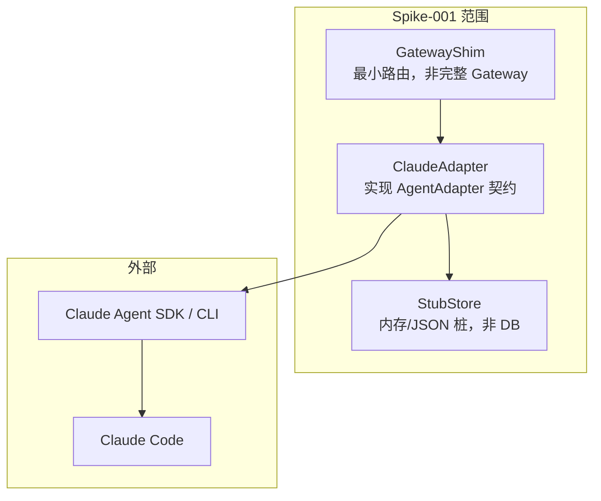

# Spike-001：Claude Adapter 链路验证

> 类型：技术 Spike（可行性验证，非业务实现）
> 日期：2026-06-04
> 验证链路：`AgentGateway → ClaudeAdapter → Claude Code`
> 上下文：兑现 `decision-log.md` **ADR-021**（真实 Provider 端到端验证）与 RC 评审 **R3**（S4 壳层→真实适配抽象泄漏，高风险）；对应 `pre-development-checklist.md` §1.4 R3 项。
> 已读设计：`docs/02-architecture/system-architecture.md`（§3/§6/§14）、`docs/04-agent/agent-architecture.md`（§4/§7/§8/§16）、`docs/04-agent/agent-roles.md`、`docs/04-agent/agent-capability-matrix.md`、`docs/09-api/api-overview.md`
> 接口事实来源：Claude Agent SDK 官方文档（context7 `/nothflare/claude-agent-sdk-docs` 核验）
>
> **边界（硬约束）**：不开发业务功能、不开发前端、不开发数据库、不写业务代码。本文档仅为 PoC **设计**；执行时的验证代码为一次性 scratch（置于临时目录，不入 `src/`、不提交），数据持久化用内存/本地 JSON **桩**，不建真实表。

---

## 1. 目标

### 1.1 验证问题

**Content Factory 设计的统一 Agent 抽象（`AgentAdapter` 契约，agent §4.2）能否在 Claude Code 上真正落地，且不发生抽象泄漏？**

这是 RC 评审标记的高风险 R3：S4 为 mock 壳层，统一抽象从未被真实 Provider 验证。本 Spike 用最小代价证伪/证实该抽象，在投入 S1–S4 前暴露契约缺口。

### 1.2 PoC 必须打通的 6 项能力

| # | 能力 | 映射 Adapter 契约（agent §4.2）| 映射数据形态（仅桩，不建表）|
| --- | --- | --- | --- |
| 1 | 启动一个 Claude Code 会话 | `startSession(request)` | `agent_sessions`（db §5.19）形 |
| 2 | 发送 Prompt | `sendMessage(session, message)` | `agent_messages`（db §5.20）形 role=user |
| 3 | 接收回复 | `stream(session)` + `normalizeOutput(raw)` | `agent_messages` role=assistant |
| 4 | 保存 Session | 捕获 `provider_session_ref` 并持久化（桩）| `agent_sessions.provider_session_ref` |
| 5 | 获取 Session 状态 | `getStatus(session)` | 映射 agent §16.2 状态机 |
| 6 | 获取消息历史 | 桩存储读取（+ SDK 重放）| `agent_messages` 按 `sequence` |

### 1.3 非目标（明确排除）

- 不实现工作流、任务、审查、上下文包构建等业务逻辑。
- 不实现 `AgentGateway` 的能力匹配、权限策略、审计落库（仅最小 `GatewayShim` 路由）。
- 不实现前端、不建数据库 schema、不接 MCP/Skill/插件。
- 不验证多 Agent、并行、回滚。

---

## 2. 方案

### 2.1 架构映射（验证哪一段）



- 验证的是 `GatewayShim → ClaudeAdapter → (SDK/CLI) → Claude Code` 的可行性，以及 `ClaudeAdapter` 是否能完整实现 agent §4.2 契约。
- `GatewayShim` 只做"接收请求 → 调 Adapter → 经 StubStore 持久化"，不含业务规则；用于证明 Gateway 之下的接缝成立。
- `StubStore` 是桩：内存 `Map` 或本地 JSON 文件，字段对齐 `agent_sessions`/`agent_messages` 形以验证**数据契约**，但**不建真实表**（DB 在 S4 落地）。

### 2.2 驱动路径（双路并验，SDK 为主）

| 路径 | 技术 | 适用 | Spike 取舍 |
| --- | --- | --- | --- |
| **主：Agent SDK** | `@anthropic-ai/claude-agent-sdk`（TS，对齐 ADR-019 推荐栈）| 进程内异步迭代，session_id/resume 原生支持 | **首选验证** |
| 备：CLI headless | `claude -p` + `--output-format stream-json` + `--resume` | 子进程模型，贴合 ProcessRunner（agent §3/§14.2）| 主路阻塞时验证；精确 flag 由 Step 0 `claude --help` 实测确认 |

> SDK 接口已核验：`query({prompt, options})` 返回异步可迭代消息流；首条 `system`/`init` 携 `session_id`；`assistant` 消息含 `message.content` 文本块；`result`（ResultMessage）含 `result` 与 `session_id`；`options.resume = sessionId` 恢复，`forkSession: true` 分叉；持久交互用 `ClaudeSDKClient`（`query()` + `receive_response()` 直到 ResultMessage）。

### 2.3 Session 类型选择

- PoC 用 **`ephemeral`**（单轮）验证能力 1–4、6，用 **`resume`** 验证"保存后可续连"（能力 4→重启续连）。
- 能力 5（状态）与 6（历史）的"持久交互"用 `ClaudeSDKClient` 流式客户端验证（对齐 agent §7.2 `persistent`/`interactive`）。

### 2.4 凭证处理（遵守 ADR-010）

- 凭证（`ANTHROPIC_API_KEY` 或 Claude Code 订阅/OAuth）经环境变量注入进程，**不写入代码、不落盘、不入桩存储**。
- Spike 仅验证"凭证经环境注入可驱动会话"，不实现凭证管理组件（S4+）。

---

## 3. 接口

### 3.1 ClaudeAdapter 契约（实现 agent §4.2）

```text
ClaudeAdapter implements AgentAdapter
├── provider(): "claude_code"
├── discover(env): 检测 claude CLI / SDK 可用性、版本、鉴权状态 → AgentDiscoveryResult
├── validateConfig(config): 校验 model / permission-mode / working_directory
├── startSession(request): 启动 SDK query 或 spawn claude；返回 handle（含 provider_session_ref）
├── sendMessage(session, message): 以 prompt 发起 query（首轮）或 resume（续轮）
├── stream(session): 归一化事件流 AsyncIterable<AgentEvent>
├── stopSession(session, reason): abort 迭代 / disconnect 客户端 / 终止子进程树
├── getStatus(session): 由生命周期追踪派生 → agent §16.2 状态
└── normalizeOutput(raw): SDK/CLI 消息 → 统一 AgentMessage
```

### 3.2 最小数据形态（桩，对齐 db 但不建表）

```text
StubSession  ≈ agent_sessions(db §5.19)
  id, provider="claude_code", session_type, provider_session_ref,
  runtime("sdk"|"cli"), status(agent §16.2), started_at, completed_at, metadata

StubMessage  ≈ agent_messages(db §5.20)
  id, agent_session_id, role(system|user|assistant|tool|event),
  content_type(text|json|...), content, sequence, visibility, trust_level
```

> `trust_level`：Claude Code 自身输出标 `trusted`；若回复内含被抓取的外部内容，标 `untrusted`（ADR-013，PoC 仅占位字段，不做注入过滤逻辑）。

### 3.3 能力 → 接口调用 → 成功信号

| 能力 | 调用 | 成功信号 |
| --- | --- | --- |
| 1 启动会话 | `startSession` → SDK `query()` init | 收到 `system/init`，捕获非空 `session_id` |
| 2 发送 Prompt | `sendMessage` → `query({prompt})` | query 接受 prompt，无鉴权/参数错误 |
| 3 接收回复 | `stream` → 迭代至 `result` | 得到非空 `assistant` 文本与 `ResultMessage.result` |
| 4 保存 Session | 持久化 `provider_session_ref` 到桩 + `resume` | 重启进程后 `resume` 续连，上下文保留（"记住数字"测试）|
| 5 获取状态 | `getStatus` | 返回 agent §16.2 合法态（running/completed/failed）|
| 6 消息历史 | 桩按 `sequence` 读取 | 有序返回 system/user/assistant 消息 |

### 3.4 SDK 调用骨架（TS，验证用 scratch，非业务代码）

```typescript
// scratch/spike.ts — 一次性验证脚本，不入 src/、不提交
import { query } from "@anthropic-ai/claude-agent-sdk"

// 能力1-4：启动→发送→接收→捕获 session_id
let sessionId: string | undefined
const turn1 = query({ prompt: "记住数字 42", options: { model: "claude-sonnet-4-5" } })
for await (const m of turn1) {
  if (m.type === "system" && m.subtype === "init") sessionId = m.session_id  // 能力1
  if (m.type === "assistant") { /* 收集文本 → StubMessage(assistant) */ }    // 能力3
  if ("result" in m) { /* ResultMessage：落 StubStore，状态→completed */ }    // 能力5
}
// → StubStore 持久化 provider_session_ref = sessionId（能力4）

// 能力4 续连验证：重启后 resume
const turn2 = query({ prompt: "我让你记的数字是几？", options: { resume: sessionId } })
for await (const m of turn2) { if ("result" in m) console.log(m.result) }  // 期望含 "42"
```

---

## 4. 风险

| ID | 风险 | 等级 | 缓解 |
| --- | --- | --- | --- |
| RK-1 | **鉴权模型**：headless 需有效凭证（API Key 或订阅 OAuth），CI/无头环境可能失败 | 高 | Step 0 先验证鉴权；凭证经 env 注入（ADR-010）；记录所用鉴权方式 |
| RK-2 | **抽象泄漏（核心，=R3）**：SDK 的 push/异步迭代模型与契约的 `getStatus`/`message-history` 拉取模型不匹配 | 高 | 本 Spike 的首要产出即评估此缺口；若 `getStatus` 无法从 SDK 直接取，须由 Adapter 自维护状态机（设计反馈）|
| RK-3 | **状态可查性**：SDK 无独立"查会话状态"接口，状态须由 Adapter 跟踪流生命周期派生 | 中 | Adapter 内维护 agent §16.2 状态；验证派生是否完备覆盖 pending/running/completed/failed |
| RK-4 | **历史可取性**：SDK 实时流式推消息，进程结束后历史依赖**我方持久化**或 `resume` 重放 | 中 | 验证两条路：①桩存储读取 ②`resume` 是否重放历史；确认 `provider_session_ref` 跨重启有效期 |
| RK-5 | **session_id 语义**：resume 跨进程重启可靠性、forkSession 行为、句柄过期 | 中 | "记住数字"跨重启测试；记录 session 留存窗口 |
| RK-6 | **WSL/进程管理**：子进程树终止、UTF-8/换行、工作目录沙箱（agent §12.5）| 中 | 在目标 WSL 环境验证；CLI 路验证进程树整树终止 |
| RK-7 | **成本/限流**：每次 query 消耗 token | 低 | 用小模型 + 极短 prompt；限定调用次数 |
| RK-8 | **版本漂移**：SDK/CLI 版本与 flag 变化 | 中 | Step 0 锁定并记录 SDK/CLI 版本；CLI flag 以 `--help` 实测为准，不臆断 |
| RK-9 | **契约-SDK 命名映射**：normalizeOutput 将 SDK 消息类型映射到统一 role/content_type 的完备性 | 低 | 枚举 SDK 消息类型（system/user/assistant/result）逐一映射并记录未覆盖项 |

> RK-2/RK-3/RK-4 是本 Spike 的**核心待答问题**——它们的结论直接决定 agent §4.2 契约是否需修订（尤其 `getStatus` 与历史检索的职责归属）。

---

## 5. 验证步骤

> 全部为 scratch 执行，置于临时目录（如 `/tmp/spike-001` 或仓库外），**不入 `src/`、不提交业务代码**。

### Step 0 — 环境与事实确认（前置）
1. 安装并锁定版本：Claude Code CLI 与 `@anthropic-ai/claude-agent-sdk`；记录 `claude --version` 与 SDK 版本（RK-8）。
2. 确认鉴权可用：设置 `ANTHROPIC_API_KEY` 或完成订阅登录；`claude -p "ping"` 能返回（RK-1）。
3. **实测 CLI flag**：`claude --help` 确认 `-p/--print`、`--output-format`、`--resume`、`--session-id` 的精确形态（不臆断）。
4. 确认运行于目标 WSL 环境（RK-6）。

### Step 1 — 能力 1+2+3（启动/发送/接收）
- 用 §3.4 骨架发起单轮 `query({prompt})`；
- 断言：捕获非空 `session_id`；收到非空 `assistant` 文本；收到 `ResultMessage`。

### Step 2 — 能力 4（保存 + 续连）
- 将 `provider_session_ref=session_id` 写入 StubStore（JSON 文件）；
- **结束进程**，新进程读取该 id，以 `resume` 发起第二轮"我让你记的数字是几？"；
- 断言：回复含 "42"（上下文跨重启保留）。

### Step 3 — 能力 5（状态）
- Adapter 在流生命周期中维护状态：init→`running`，ResultMessage→`completed`，异常→`failed`；
- 调 `getStatus` 断言返回 agent §16.2 合法态；
- **记录**：状态是否完全由 Adapter 自维护（RK-2/RK-3 结论）。

### Step 4 — 能力 6（消息历史）
- 从 StubStore 按 `sequence` 读取本会话 system/user/assistant 消息，断言有序完整；
- 另测 `resume` 后 SDK 是否重放历史（RK-4 结论：历史归属我方还是 Provider）。

### Step 5 — 契约缺口评估（核心产出）
- 对照 agent §4.2 九个契约方法，逐一标注：✅ 直接可实现 / ⚠️ 需 Adapter 补偿 / ❌ 无法实现；
- 形成对 agent §4.2 / agent-capability-matrix 的设计反馈（如需修订）。

### Step 6 — 清理与记录
- 终止所有 `claude` 子进程（验证整树终止，RK-6）；删除 scratch；
- 在本文件追加"验证结果"小节（结论 + 缺口 + 截图/日志摘要 + 版本号）。

---

## 6. 成功标准

### 6.1 能力级（6 项，逐项 Pass/Fail）

| # | 能力 | 通过判据 |
| --- | --- | --- |
| 1 | 启动会话 | 成功捕获非空 `provider_session_ref` |
| 2 | 发送 Prompt | query 接受 prompt 无错 |
| 3 | 接收回复 | 得到非空 assistant 文本 + ResultMessage |
| 4 | 保存 Session | 跨进程重启 `resume` 续连成功，上下文保留（"42" 测试通过）|
| 5 | 获取状态 | `getStatus` 返回 agent §16.2 合法态，覆盖 running/completed/failed |
| 6 | 消息历史 | 按 `sequence` 有序返回完整消息 |

### 6.2 Spike 级裁决（喂回 ADR-021 / R3）

- **✅ PASS（架构可接入）**：6 项能力全通过，且 agent §4.2 契约**无 ❌ 项**（⚠️ 补偿项可接受，但须记录为实现指引）。→ R3 风险下调，固化 ClaudeAdapter 契约，准予 S4 真实接入沿用本结论。
- **⚠️ CONDITIONAL**：能力全通过但契约存在需修订的缺口（如 `getStatus`/历史检索职责须改）。→ 输出 agent §4.2 修订建议，更新 decision-log 后再进 S4。
- **❌ FAIL**：任一核心能力（1/3/4）不可达。→ R3 升级，重新评估 Provider 抽象或 Claude Code 接入方式，阻断 S4 真实接入计划。

### 6.3 交付与回链

- 验证结果回写本文件"验证结果"小节；
- 裁决结论更新 `pre-development-checklist.md` §1.4 R3 项状态、`decision-log.md` ADR-021 状态；
- 若产生契约修订，记入 decision-log 新增 ADR，并标注待同步 agent-architecture.md（文档维护窗口处理，本 Spike 不改设计文档）。

---

## 附录：与设计的一致性锚点

| 本 Spike 元素 | 设计来源 |
| --- | --- |
| AgentAdapter 九方法契约 | agent §4.2 |
| Session 字段 / 类型 / `provider_session_ref` | agent §7.1/§7.2、db §5.19 |
| Message 模型（role/visibility/trust_level）| agent §8.1、db §5.20 |
| Session 状态机 | agent §16.2 |
| Claude Code 接入方式（CLI/SDK/harness）、能力声明 | agent §5.1、agent-capability-matrix §3 |
| ProcessRunner / 执行宿主 / WSL | arch §3/§14.2、agent §12 |
| 凭证仅引用、env 注入 | ADR-010、arch §14.3 |
| 数据/指令分离 trust_level | ADR-013、agent §8.3 |
| 验证动机（真实 Provider 端到端）| ADR-021、RC R3 |

> 本文档为 Spike 设计；执行产生的验证代码为一次性 scratch，不构成业务代码、不提交至 `src/`。
